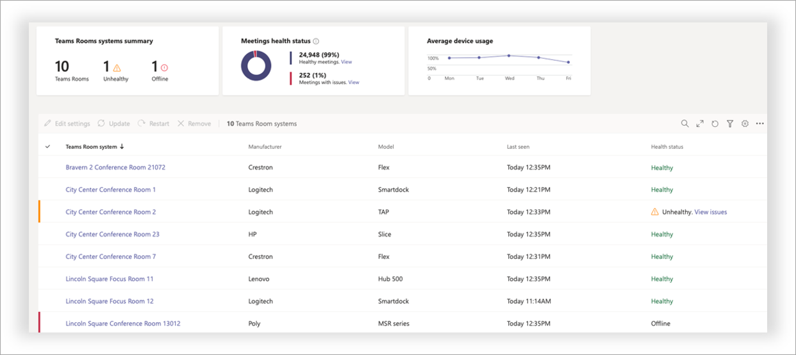
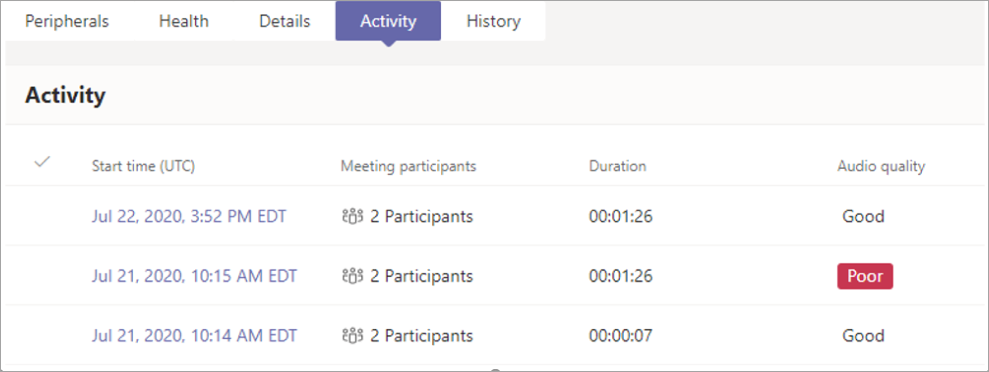
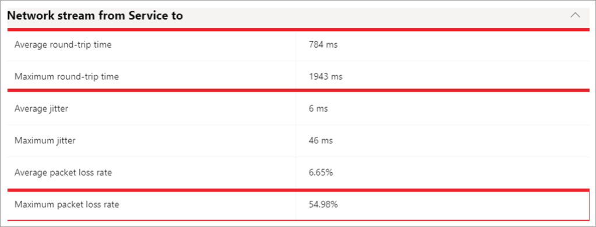
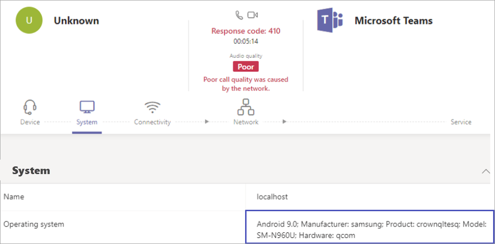

Within the Teams admin center, you can see an inventory of all your rooms, their status, performance statistics, and the ability to remotely restart Teams Rooms and collect logs.

You can see below that all the rooms are listed in the left-hand column. You can also quickly see that there's one unhealthy room and there's one that’s offline.  You can also see a healthy meetings metric. 99% of the meetings have not had any quality issues.

From this overview page, you can also select several Team Rooms and change their settings. This is an easier approach than having to manually create a SkypeSettings.xml file and copying it to each one. 

You can click directly on a device to get more information.

After you click on a Teams Room, you’ll see call metrics and the status of connected peripherals scoped to that room. You can download device logs via Teams admin center. 

You can also see actions that have been taken via Teams admin center against your Teams Rooms. In this example, Teams Rooms was remotely restarted and logs were downloaded.

You can see every call and every meeting that has happened in that room. You can also see the quality of the call and troubleshoot it from here. To troubleshoot the call in the image below, you would click on the value in the Start time (UTC) column of the row marked **Poor**.

After you click on the date and time, you get summary information on the call as well as a list of participants. You can see which participant had poor audio quality. Clicking on the Session start time column for that call lets you see diagnostic info for that participant.

You can see that the poor call was caused by the network.  Below the message are a few options to see more data on this call, such as Device and System. In this case, you should click on **Network** as that is what the error message is referencing.

After clicking on Network, you can see that the average round-trip time was 784 milliseconds and the maximum round-trip time was almost two seconds.

Almost 55 percent of all the packets were lost. This is well below Microsoft’s recommended metrics for media. How can you determine what the cause was for this poor network performance?
 
Click on the **System** icon to learn more about what hardware the participant was using. In the image below, you can see that it was an Android phone. You can now presume that the participant was either traveling and driving through tunnels or a parking garage, took the call and went into an elevator, or was just in a poor coverage area. It seems likely that the issue was not with Teams Rooms or with your network, but with the participant and their device. 

## Learn more

- [Network performance requirements from a Skype for Business client to Microsoft network Edge](https://docs.microsoft.com/skypeforbusiness/optimizing-your-network/media-quality-and-network-connectivity-performance#network-performance-requirements-from-a-skype-for-business-client-to-microsoft-network-edge)
