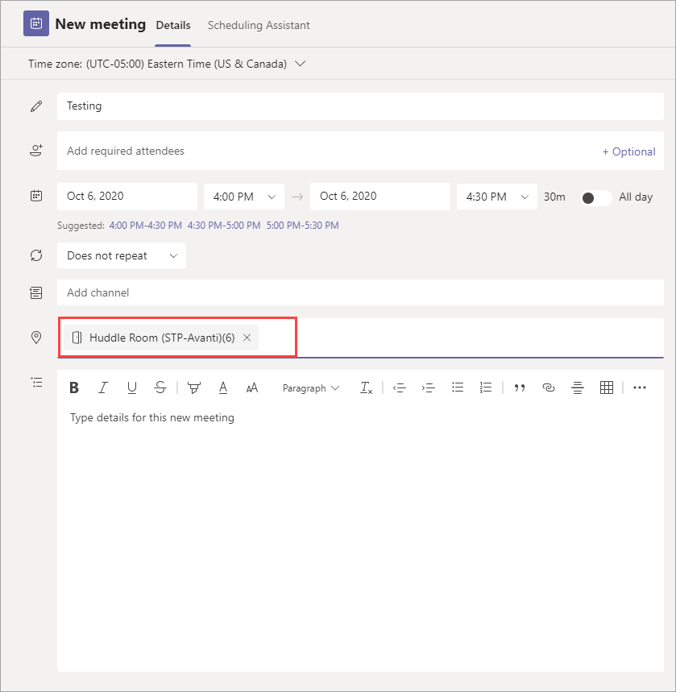

You're now ready to validate and test Teams Rooms to make sure all's working properly. The steps below will help you test all  the major features of Teams Rooms.

1. Create a new meeting. To do that, select **New Meeting** on the console. 

   

1. Type in the name of someone in your organization. In this example, Sara Perez. The address book finds Sara and she's added as an invitee. Then select **Invite** to invite her to the meeting.

   

1. We see that Sara has joined the meeting. At this point, you would work with Sara to make sure the camera and audio are working correctly and that you can see each other. You should also share a laptop into the meeting via the HDMI cable connected to the console.

1. When you're finished, select the **Hang up** icon.

**Report a problem**. On the bottom left you can see the **Report a problem** button. This would be clicked by users if they had an issue to report. You need to set up an e-mail address in the Device sections of Teams Rooms settings for this option to appear.

**Test calling out**. If your resource account is configured with a telephone number, you can test calling.
 
1. Select the **Dial pad** button. This brings up a new screen with a dial pad. You can type in the phone number you're trying to reach and then hit the **Dial** icon.
1. You only need to test audio to make sure you can reach the remote attendee and you can hear each other clearly. 
1. Once you've validated that the audio and the phone call works, you can hang up and move on to the next test.

   

**Test dial-in**. In the dial-in test, you dial the phone number of the resource account.
 
1. Take your mobile device, call the room, and you'll see a prompt on the console.
1. Choose to answer with audio only, as video won't work on a public telephone call. Make sure that the call came in and validate that audio works just as in the dial-out test.
1. After you verify that the phone call worked as expected,  you can hang up and move on to the next test.

   

**Test HDMI ingest**. The next test is to validate the HDMI ingest feature.

1. Connect the HDMI cable to a laptop.
1. If auto-sharing is enabled, the screen will change to show the **Stop presenting** icon. The front of room display will show the same thing that is being shown on the laptop. If auto-sharing is not enabled, you will have to click the **Present** icon on the console.
1. When you're done with this test, click **Stop Presenting.**

   

**Test joining a scheduled meeting**. The next test is to validate joining a scheduled meeting.

1. You need to schedule a meeting. In the example here, a meeting is being scheduled from the Teams client. You can see the location of Teams Room has been added into the meeting invite. As a reminder, this is the resource account. This resource account will auto-accept the invite and then the console will update to show the meeting.

   

1. Click the **Join** button to test the meeting. 
1. Teams Rooms joins the meeting and then you can test with Sara to make sure audio, video, and sharing works correctly.
1. After validating that the meeting join worked, you can hang up and leave the meeting. 

   

After you've completed those initial tests, there may be some additional things that need to be validated. 

- Make sure that the resource account name and phone number are shown correctly in the upper right of the console. 
- Make sure that cameras are functional and positioned optimally. If the camera supports pan, tilt, and zoom features, make sure they are working correctly. 
- When conducting your test meetings, be sure to walk around the room and make sure you can be heard in all areas where attendees are expected to speak. Be sure that you can hear the other person well throughout the room. This will validate that speaker and microphone placements are correct.
- For the console, make sure cables are secure and not pinched. They should be secure so that people don't "borrow" a cable. 
- If the console can swivel or move around the desk, make sure it can do so freely without pinching any cables. 
- Make sure the display brightness on the console and front of room displays is acceptable for the environment. No one wants to sit in a very dark room with a super bright console. Conversely, it's difficult to read a console when you're in a very bright room and the brightness is turned down too low on the console.
