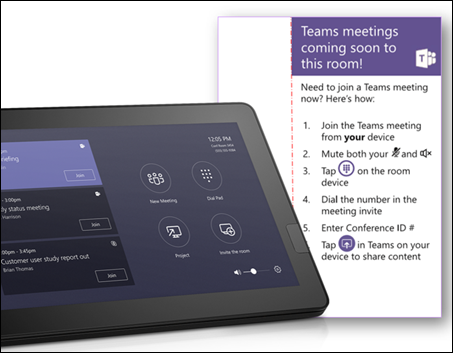

No matter how good your Teams Rooms deployment is, it's only as good as the ability of your users to use the systems you've put in front of them.

To help, here are some links that might assist you with end-user training. You can share these links with your users through an e-mail campaign and post them on your internal support sites.

| Topic  |  Link |
|---|---|
| End user help  |  aka.ms/TeamsRoomsHelp |
|  Introductory Teams Rooms video |  aka.ms/TeamsRoomsVideo |
| Interactive end-user training  | aka.ms/MicrosoftTeamsRoomsDemo |
Teams Rooms administrator video training | aka.ms/TeamsRoomsLearning |

In-room signage can be important. You can create documents like the one seen here, laminate them, and leave them in the rooms.

As users walk into their first meetings, they'll quickly see how to join a meeting and that they can share content from their desktop. This is just a sample and you can use your imagination to make your own interesting Teams Rooms signage.

Another creative idea is to make a smaller sign and secure it directly onto the console. In this sample, the sign would be folded along the red dotted line and then attached to the console. This provides additional end-user support directly on the console.

