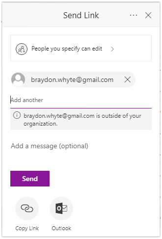
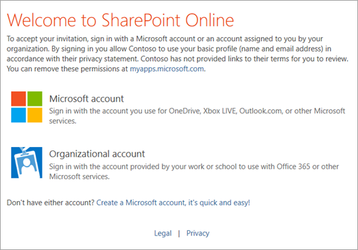
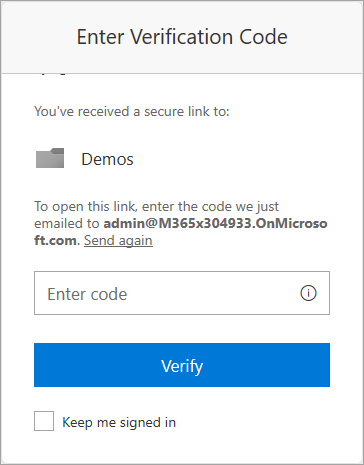

To share a file or folder, users select it in the SharePoint document library, and click **Share.** A dialog is presented where users can specify the link type and the email address of the recipient.

An invitation then is sent to the guest via email, which contains a link to the shared item.

## Guests who sign in

When users share sites, guests will be prompted to sign in with:

- A Microsoft account.
- A work or school account in Azure Active Directory (Azure AD) from another organization.

When users share files and folders, guests will also be prompted to sign in if they have a Microsoft account.

## Recipients who provide a verification code

When users share files or folders, guests will be asked to enter a verification code if they have:

- A work or school account in Azure AD from another organization.
- An email address that isn't a Microsoft account or a work or school account in Azure AD.

- If the guest has a work or school account, they only need to enter the code the first time. Then they will be added as a guest and can sign in with their organization's username and password.
- If the guest doesn't have a work or school account, they need to use a code each time they access the file or folder, and they are not added to your directory.
- Sites can't be shared with people unless they have a Microsoft account or a work or school account in Azure AD.

## Stopping sharing

You can stop sharing with guests by removing their permissions from the shared item, or by removing them as a guest in your directory. You can stop sharing with people who have an **Anyone** link by going to the file or folder that you shared and deleting the link.

## Learn more

When you're done with a link, use the **Back** arrow in your browser to come back to this page.

- [External sharing overview](/sharepoint/external-sharing-overview)
