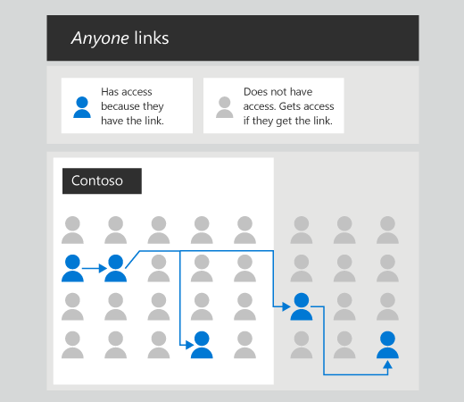
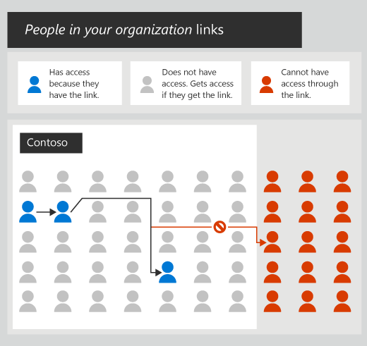

When users share files and folders (but not the site), a sharable link is created which has permissions to the item. The person you're sharing with doesn't get direct permission to the file—the link they use has permission to the file.

There are three primary link types:

## Anyone links

**Anyone** links give access to the item to anyone who has the link. People using an **Anyone** link do not have to authenticate, and their access cannot be audited.
  

An **Anyone** link is a transferrable, revocable secret key. It's transferrable because it can be forwarded to others. It's revocable because by deleting the link, you revoke the access of everyone who got it through the link. It's secret because it can't be guessed or derived. The only way to get access is to get the link, and the only way to get the link is for somebody to give it to you.

## People in your organization links

**People in your organization** links work only for people inside your organization. (They do not work for guests in the directory, only members).

Like an *Anyone* link, a **People in my organization** link is a transferrable, revocable secret key. Unlike an **Anyone** link, these links only work for people inside your organization. When somebody opens a **People in my organization** link, they need to be authenticated as a member in your directory. If they're not currently signed in, they'll be prompted to do so.

**People in your organization** links work for anyone in your organization, so users can share files and folders with people who aren't part of a team or members of a site. The link gives them access to the specific file or folder and it can be passed around inside the organization. This allows for easy collaboration with stakeholders from groups that may have separate teams or sites—such as design, marketing, and support groups.

## Specific people links

**Specific people** links only work for the people that users specify when they share the item.

A **Specific people** link is a non-transferable, revocable secret key. Unlike **Anyone** and **People in my organization** links, a **specific people** link will not work if it's opened by anybody except the person specified by the sender. This type of link can be used to share with internal or external users. In both cases, the recipient will need to authenticate as the user specified in the link. **Specific people** links can be internal or external (if you've enabled guest sharing).

### Anonymous access with Anyone links

**Anyone** links are a way to easily share files and folders with guests. However, if you're sharing sensitive information, this may not be the best option. If you want to allow **Anyone** links, there are several options for a more secure sharing experience.

- You can restrict **Anyone** links to *read-only.* 
- You can set an expiration time limit, after which the link will stop working.
- You can configure a different link type to be displayed to the user by default. This can help minimize the chances of inappropriate sharing. For example, if you want to allow **Anyone** links but are concerned that they only be used for specific purposes, you can set the default link type to **Specific people** or **People in your organization** links instead of **Anyone** links. Users would then have to explicitly select **Anyone** links when they share a file or folder.

## Learn more

When you're done with a link, use the **Back** arrow in your browser to come back to this page.

- [File collaboration in SharePoint with Microsoft 365](https://docs.microsoft.com/sharepoint/deploy-file-collaboration)
