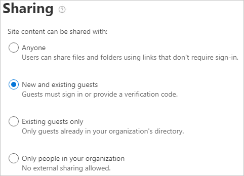
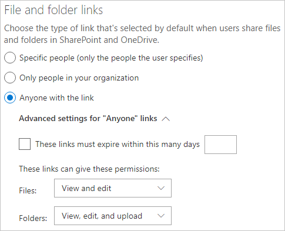
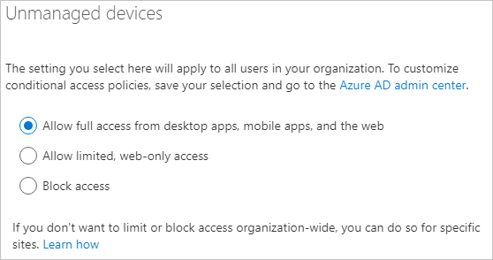

As a SharePoint or global administrator in Microsoft 365, you can control access to SharePoint content by selecting options in the SharePoint admin center.

## Control guest access

SharePoint has external sharing settings at both the organization and the site level (previously called the "site collection" level). To allow external sharing on any site, you must allow it at the organization level.

You can then restrict external sharing for sites. If a site's external and the organization-level sharing option don't match, the most restrictive value will always be applied.

Whichever option you choose at the organization or site level, the more restrictive functionality is still available. For example, if you choose to allow sharing using **Anyone** links (previously called *shareable* or *anonymous access* links), users can still share with guests who sign in, and with internal users.

Additional controls are available for the administrator to control guest sharing by:

- Choosing the type of sharing link that is sent to guests by default.
- Choosing the link permissions (view or edit).
- Choosing to have anonymous access links (**Anyone** links) expire after a specified period.

By using these controls, you can give your users the sharing option they need while maintaining a secure environment for your sensitive data.

## Control access from unmanaged devices

You can block or limit access for:

- All users in the organization or only some users or security groups.
- All sites in the organization or only some sites.

**Blocking access** helps provide security but comes at the cost of usability and productivity.

**Limiting access** is a less restrictive option that allows users to remain productive while addressing the risk of accidental data loss on unmanaged devices. When you limit access, users on most managed devices will have full access. Users on unmanaged devices will have browser-only access with no ability to download, print, sync files, or access content through apps, including the Microsoft Office desktop apps. You can choose to allow or block editing files in the browser.

## Control access to SharePoint data based on network location

You can also control access to SharePoint resources based on defined network locations that you trust. This is also known as *location-based policy.*

## Sign out inactive users

Idle session sign-out lets you specify a time at which users are warned and subsequently signed out of Microsoft 365 after a period of browser inactivity in SharePoint and OneDrive. Idle session sign-out applies to the entire organization and can't be set for specific sites or users.

## Learn more

When you're done with a link, use the **Back** arrow in your browser to come back to this page.

- [Control access from unmanaged devices](https://docs.microsoft.com/sharepoint/control-access-from-unmanaged-devices)
- [Control access to SharePoint and OneDrive data based on network location](https://docs.microsoft.com/sharepoint/control-access-based-on-network-location)
- [Sign out inactive users](https://docs.microsoft.com/sharepoint/sign-out-inactive-users)
- [Sharing and permissions in the SharePoint modern experience](https://docs.microsoft.com/sharepoint/modern-experience-sharing-permissions)
