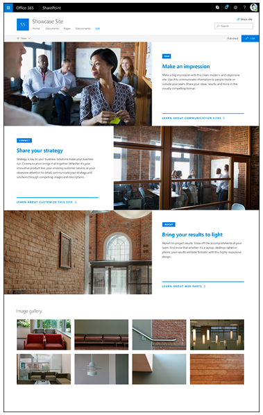

Communication sites are sites that let you share news and events across your organization. Weekly and monthly reports or status updates, product launches, and events can all be shared through a communication site.

When you create a communication site in SharePoint, you can start with a blank site or choose one of the other site designs, each of which comes with a default set of web parts. The options available are:

- **Topic** to share information such as news, events, and other content
- **Showcase** to use photos or images to showcase a product, team, or event
- **Blank** to create your own design

No matter which one you choose, you can add, remove, or reorder web parts as needed.

Each news article and page can have its own set of comments. You can use the Yammer web part for broad discussion scenarios as well as targeted responses to engage your viewers on the sole message and content on the page.

## Site pages

When you create a page on a communication site, you can embed documents and video, and dynamically pull in real-time data from across Office 365, including documents from SharePoint, Power BI reports, Microsoft Stream videos, and Yammer discussions.

## Site access

You probably don’t want a large group of people having the ability to make changes to a site that communicates information to a whole department or organization. To help you limit who has permissions to change the site, communication sites are not group-connected. This means that a communication site is not automatically connected to a group of people with edit permissions. However, you can give specific people permission to make changes to your communication sites.

A communication site can also be shared externally to those outside of your company using PowerShell commands.
