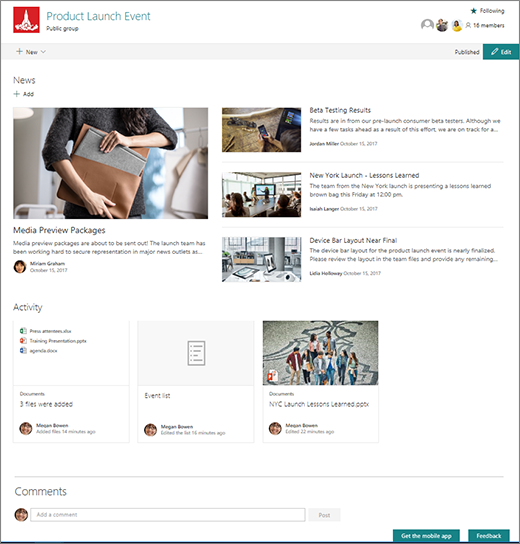

On the home page of a team site, you can view links to important team files, apps, and web pages, as well as recent site activity in the activity feed.

The team site home page contains:

- a News section where you can create and display posts about important or interesting items for your team.
- a Quick Links section where you can add a link to files or web pages to the top of the page.
- An Activity feed that lets you see when someone adds or edits a file, page, or list on the site.

There may also be a section that displays links to files on the team site home page.

## Integration with Microsoft 365 Groups

SharePoint team sites are integrated with Microsoft 365 Groups. Microsoft 365 Groups bring together conversations and calendar from Outlook, information and files from SharePoint, tasks from Planner, and a shared OneNote notebook into a single collaboration space with a SharePoint team site.

When you create a new team site in SharePoint, a Microsoft 365 Group is created along with it which includes these services.

Microsoft 365 Groups and SharePoint have separate permissions controls. If you add an owner or member to a Microsoft 365 Group, they automatically become an owner or member respectively in the associated SharePoint site. However, the reverse is not true—adding an owner or member directly to the SharePoint site does not add them to the associated group. This is important to consider when determining how you want to manage team site permissions. We recommend managing team site permissions through the associated group so that users have access to all the associated services.

Microsoft Teams also uses Microsoft 365 Groups. There is a group associated with each team, and team membership is managed through that group. When using SharePoint with Teams, we recommend managing team site access through the group as well. If you add users directly to a SharePoint site that is used with a team, those users won't have access to the team itself, but only to the site.

Microsoft 365 Groups are based in Azure Active Directory and can be managed using Azure Active Directory management tools, including dynamic membership.
