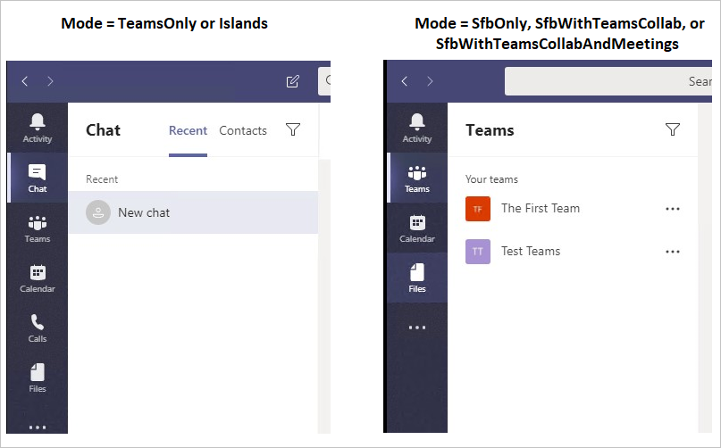

The available functionality in Teams depends on the user's coexistence mode, as set by **TeamsUpgradePolicy.** The following table summarizes the behavior:
 
|User's effective mode|Experience in Teams client|
|-|-|
|Any Skype for Business mode|Calling, Chat, and self-presence are disabled.|
|SfBWithTeamsCollabAndMeetings|Meeting scheduling is available.|
|SfBWithTeamsCollab or SfBOnly|Meeting scheduling is not available.|

The following screenshots illustrate the difference between TeamsOnly or Islands mode and all other modes. Note that the chat and calling icons are available by default with TeamsOnly or Islands mode (left screenshot), but not with the other modes (right screenshot):

 

In addition, self-presence is not available in the other modes, as shown here.

 
From a technical perspective, a user’s mode governs several aspects of the user's experience:

- **Incoming routing.** This governs in which client (Teams or Skype for Business) incoming chats and calls land.
- **Presence publishing.** This governs whether the user's presence that is shown to other users based on their activity is shown.
- **Meeting scheduling.** This governs which service is used for scheduling new meetings and ensuring that the proper add-in is present in Outlook. Note users can always join any meeting, whether it be a Skype for Business meeting or a Teams meeting.
- **Client experience.** This governs the functionality available in Teams and/or Skype for Business to initiate calls and chats in Teams, Skype for Business or both. This also governs whether Teams & Channels experience is available.

For more details on routing and presence behavior based on mode, see **Coexistence with Skype for Business.**

## Learn more

When you're done with a link, use the **Back** arrow in your browser to come back to this page.

- [Teams client experience and conformance to coexistence modes ](https://docs.microsoft.com/MicrosoftTeams/teams-client-experience-and-conformance-to-coexistence-modes)
