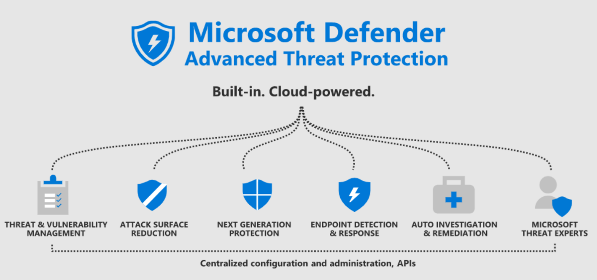

Microsoft Defender Advanced Threat Protection (ATP) is a platform designed to help enterprise networks prevent, detect, investigate, and respond to advanced threats on their endpoints.

The following capabilities are enabled with Microsoft Defender ATP:

- Threat and vulnerability management provides real-time visibility and helps identify ways to improve your security posture.
- Attack surface reduction eliminates risky or unnecessary surface areas and restricts dangerous code from running.
- Advanced protection uses machine learning and deep analysis to protect against file-based malware.
- Endpoint detection and response monitors behaviors and attacker techniques to detect and respond to advanced attacks.
- leverage artificial intelligence to automatically investigate alerts and remediate complex threats in minutes.
- Microsoft threat experts bring deep knowledge and proactive threat hunting to your security operations Center.

Microsoft Defender ATP uses the following combination of technologies built into Windows 10 and Microsoft's robust cloud service:

- **Endpoint behavioral sensors**. Embedded in Windows 10, these sensors collect and process behavioral signals from the operating system. The sensors send the data to your private, isolated cloud instance of Microsoft Defender ATP.
- **Cloud security analytics**. Leveraging big data, machine learning, and unique Microsoft optics across the Windows ecosystem, enterprise cloud products (such as Office 365), and online assets, behavioral signals are translated into insights, detections, and recommended responses to advanced threats.
- **Threat intelligence**. Generated by Microsoft hunters and security teams, and augmented by threat intelligence provided by partners, threat intelligence enables Microsoft Defender ATP to identify attacker tools, techniques, and procedures, and generate alerts when these are observed in collected sensor data.

