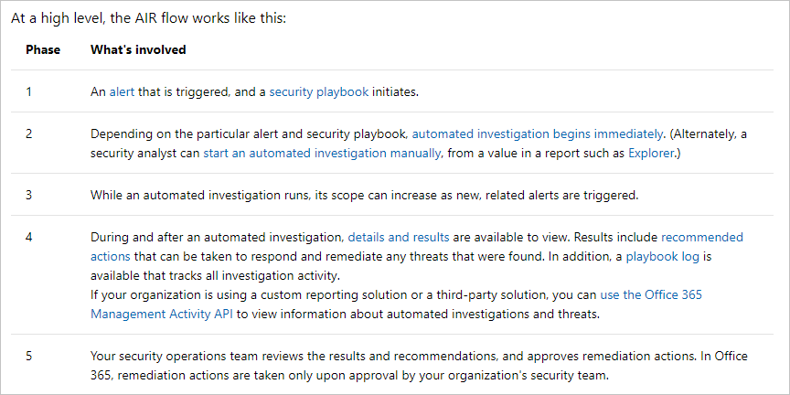
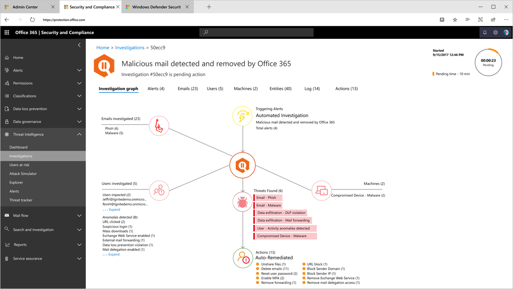
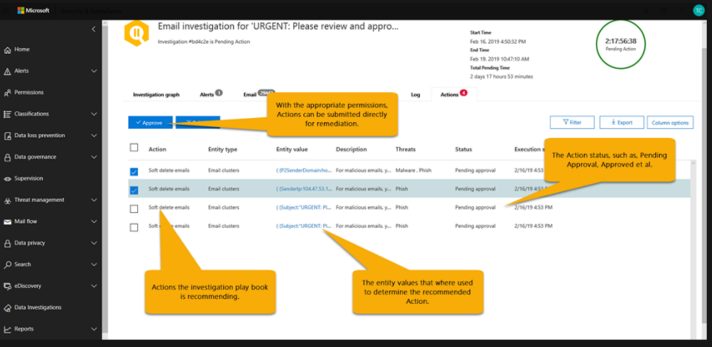

## Save time with automated investigation and response

When you are investigating a potential cyberattack, time is of the essence. The sooner you identify and mitigate threats, the better off your organization will be. Automated investigation and response (AIR) capabilities include a set of security playbooks that can be launched automatically, such as when an alert is triggered, or manually, such as from a view in Explorer. AIR can save your security operations team time and effort in mitigating threats effectively and efficiently.

Let's start with a native alert generated by Office 365. These alerts are typically investigated manually today – this is where AIR comes in. Attackers frequently send through benign URLs in emails to bypass notice from security solutions, then they weaponize them after delivery to activate their attack. Notice in the following screenshot that the alert identifies that a URL that was recently weaponized was detected by Microsoft Defender for Office 365 through Safe Links URL detonation (under **Details** on the right-hand side).

 

Microsoft Defender for Office 365 triggered an AIR playbook based on this alert and resolved the alert given the auto investigation having completed.

Clicking into the investigation deep link from the alert brings us into the Office 365 Threat Intelligence Summary Investigation Graph. This graph shows all the different entities – emails, users (and their activities), and devices that have been automatically investigated as part of the triggered alert.

Specifically, note that:

- Several emails (23) that were identified as being relevant to this investigation (based on sender, IP, domain, URL, and other email attributes) and a subset of them (6) were identified as being malicious, sent from an internal user in the organization, which itself is a strong indicator of a compromised user.
- A user pivot on this investigation also identifies anomalies for one user (Jeff) with respect to a suspicious login and mass downloads of documents.
- With the compromised user, user anomalies and compromised device threats identified in this investigation, Microsoft Defender for Office 365 has also taken some auto remediations such as blocking the URL, deleting any emails in mailboxes related to this URL, and triggering the AAD workflows for password reset and MFA for the compromised user. The ability to take automatic action or drive remediations with manual approval, based on policy, are core elements of AIR.

AIR in Microsoft Defender for Office 365 includes certain remediation actions. Whenever an automated investigation is running or has completed, you'll typically see one or more remediation actions that require approval by your security operations team to proceed. Such remediation actions include the following:

- Soft delete email messages or clusters
- Block URL (time-of-click)
- Turn off external mail forwarding
- Turn off delegation

These actions can be found in the **Actions** tab under the selected investigation, as shown in the following screenshot:

