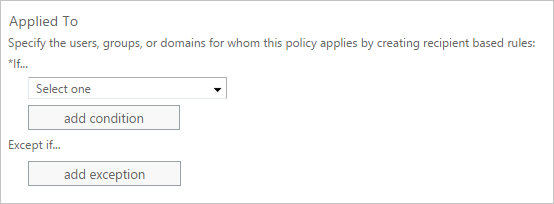

With Microsoft Defender for Office 365, your organization's security team can configure protection by defining policies in the Microsoft 365 Defender portal. The policies that are defined for your organization determine the behavior and protection level for predefined threats. Policy options are extremely flexible. For example, your organization's security team can set fine-grained threat protection at the user, organization, recipient, and domain level. It is important to review your policies regularly because new threats and challenges emerge daily.

## Safe Attachments

Microsoft Defender for Office 365 Safe Attachments protects against unknown malware and viruses, and provides zero-day protection to safeguard your messaging system. All messages and attachments that don't have a known virus/malware signature are routed to a special environment where Microsoft Defender for Office 365 uses a variety of machine learning and analysis techniques to detect malicious intent. If no suspicious activity is detected, the message is released for delivery to the mailbox.

When creating a Safe Attachments policy, the following options can be selected:
 
- Under the **Action for unknown malware** in Attachments: 
  - **Off**. Attachments will not be scanned for malware. 
  - **Monitor**. Continues delivering the message after malware is detected and track the scanning results. 
  - **Block**. Blocks the current and future emails and attachments with detected malware.  
  - **Replace**. Blocks the attachments with detected malware but continues to deliver the message body to the user. 
  - **Dynamic delivery**. Immediately delivers the message body without attachments and reattaches attachments after scanning if they are found to be safe. 
- Under **Redirect attachment on detection** you have the ability to enable one or both of the following settings:  
  - If you want to forward attachments that are blocked, replaced, or monitored to a security administrator in your organization for further investigation, check the **Enable redirect** checkbox and enter an email address.  
  - You can also have those attachments forwarded if the scanning process should time out by selecting the **Apply the above selection if malware scanning for attachments times out or error occurs** checkbox.

Once you’ve configured these settings, you can target users with that policy by specific domain, username, or group membership (or a combination). There are also exceptions that can be configured for this targeting, by users, groups, or domain.

Sometimes it is useful to allow mail to flow without delay from internal senders such as scans or faxes that send attachments that are known to be safe and from a trusted source. It is not generally recommended to skip filtering for all internal messages as a compromised account would be able to potentially send malicious content. You can create a transport rule, also known as a mail flow rule, in the Exchange admin center (EAC) to bypass safe attachments scanning. As part of the mail flow rule, modify the message properties to set a message header with the **X-MS-Exchange-Organization-SkipSafeAttachmentProcessing** as the header name to bypass the safe attachment policy.

## Safe Links

The Microsoft Defender for Office 365 Safe Links feature proactively protects your users from malicious URLs in a message or in an Office document. The protection remains every time they select the link, as malicious links are dynamically blocked while good links can be accessed.

Safe Links is available for URLs in the following apps:

- Microsoft 365 apps for enterprise on Windows or Mac
- Office for the web (Word for the web, Excel for the web, PowerPoint for the web, and OneNote for the web)
- Word, Excel, PowerPoint, and Visio on Windows, as well as Office apps on iOS and Android devices
- Microsoft Teams channels and chats

Safe links is both client and location agnostic, in that the location and device being used by the end user will not affect the behavior of wrapped links. Additionally, Safe links can be configured to support links in Office 2016 clients where the user is signed in with their Office 365 credential.

Safe links includes a default policy that controls global settings such as which links to block and which links to wrap. You can’t delete this policy, but you can edit it in your environment as needed, such as blocking a malicious link specific to your environment. It is recommended that you apply Microsoft Defender for Office 365 safe links policies to ALL users in your organization.

The following options can be configured as part of the Safe Links policy:

- For **Select the action for unknown potentially malicious URLs in messages**, selecting **On** will allow URLs to be rewritten and checked.
- **Use Safe Attachments to scan downloadable content** will enable URL detection to scan files hosted on web sites. For example, if an email contains a link such as http://contoso.com/maliciousfile.pdf, the .pdf file is opened in a separate hypervisor environment and, if the file is found to be malicious, users will see a warning page if they click the link.  
- **Apply safe links to messages sent within the organization** will provide the same level of protection when links are sent by email within the organization. 
- **Do not track user clicks** will block tracking and monitoring when users click links that are determined to be malicious. 
- **Do not allow users to click through to the original URL** will prevent users from proceeding to the target web site if it is found to be malicious.  
- If users frequently receive links from web sites that are known to be safe, you can enter those URLs under **Do not rewrite the following URL**. For example, you might add the URL to a partner’s website if users frequently receive emails from the partner that include URLs to the external organization’s website. 

Similar to bypassing safe attachments, you can also create a transport rule to bypass safe links.  The message header for bypassing safe links is **X-MS-Exchange-Organization-SkipSafeLinksProcessing**.

## Anti-phishing policies

Microsoft Defender for Office 365 anti-phishing checks incoming messages for indicators that a message might be a phishing attempt. When users are covered by Microsoft Defender for Office 365 policies (Safe Attachments, Safe Links, or anti-phishing), incoming messages are evaluated by multiple machine learning models that analyze messages. The appropriate action is taken, based on the configured policies. 

There is no default Microsoft Defender for Office 365 anti-phishing policy. When creating one, only targeting is originally configured. Impersonation settings play a large role in Microsoft Defender for Office 365 anti-phishing policies. Impersonation is where the sender or the sender's email domain in a message looks very similar to a real sender or domain:

- An example impersonation of the domain contoso.com is ćóntoso.com.
- An example impersonation of the user michelle@contoso.com is michele@contoso.com.

An impersonated domain might otherwise be considered legitimate (registered domain, configured email authentication records, etc.), except its intent is to deceive recipients. In the Microsoft Defender for Office 365 anti-phishing policy, you can configure a set of users to protect, domains to protect, actions for protected users (such as redirect messages or sending to junk folders), safety tips, trusted senders and domains and more. These settings are exclusive to Microsoft Defender for Office 365 anti-phishing. Anti-spoofing settings are also included in Microsoft Defender for Office 365 anti-phishing policies.

### Explore how to safeguard your organization with Microsoft Defender for Office 365

View a [video version](https://www.microsoft.com/videoplayer/embed/RE4GsOE) of the interactive guide (captions available in more languages).

  

Be sure to click the full-screen option in the video player. When you're done, use the **Back** arrow in your browser to come back to this page. 

