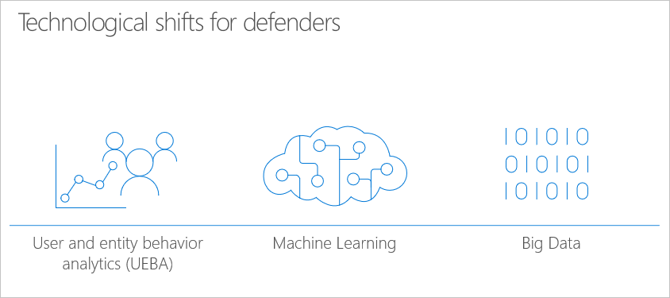

Microsoft Defender for Office 365  includes best-of-class threat investigation and response tools that enable your organization's security team to anticipate, understand, and prevent malicious attacks.

- **Threat trackers** provide the latest intelligence on prevailing cybersecurity issues. For example, you can view information about the latest malware, and take countermeasures before it becomes an actual threat to your organization. Available trackers include Noteworthy trackers, Trending trackers, Tracked queries, and Saved queries.
- **Threat Explorer** (or real-time detections) (also referred to as Explorer) is a real-time report that allows you to identify and analyze recent threats. You can configure Explorer to show data for custom periods.
- **Attack Simulator** allows you to run realistic attack scenarios in your organization to identify vulnerabilities. Simulations of current types of attacks are available, including spear phishing, credential harvest and attachment attacks, and password spray and brute force password attacks.

Threat Explorer enables you to begin delving into granular data for your organization.  Inside Threat Explorer, you are first shown the variety of threat families impacting our organization over time. Additionally, you are shown the top threats and top targeted users inside the organization.
  
You can also change the category for the graph. In this case, the malware family is shown, but you can filter the Threat Explorer graph through several options including sender email, recipient email, and even the detection technology used to stop a threat. The detection technology piece highlights the issue if an email was blocked by Microsoft Defender's sandboxing or through an EOP filter. The graph adjusts to reflect the category being examined.

 :::image type="content" source="../media/threat-explorer-graph.png" alt-text="Threat Explorer graph" lightbox="../media/threat-explorer-graph.png":::

Threat Explorer allows a deeper look into a threat, beginning with a thorough description of this malware family's behavior. Threat Explorer provides a definition of the threat, the message traces of emails delivering the threat, technical details of the threat, global details of the threat, and advanced analysis.

On the **Users** tab, you can see each instance that a user in the organization was sent an attachment containing the Nemucod malware threat. You can not only see the specific recipients and subject, but the sender domain and the sender IP as well. The **Status** column tells you if the email was caught and blocked before it ever reached the user, or if it was delivered as spam.

 :::image type="content" source="../media/malware-family-description.png" alt-text="Malware family description" lightbox="../media/malware-family-description.png":::

If a user had actually received and opened the email, that would also appear under **Status**, enabling you to reach out to the user and take the appropriate remediation steps, such as scanning their device.
