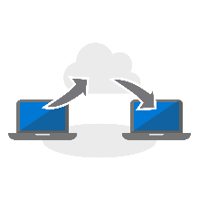

## Migrate user data manually

When it comes to deciding what to transfer and what to discard, a manual migration can be more flexible. Some users may want to keep everything, and others may want to take the opportunity to clean up their drives. Your IT department can have support teams visit users or set up support centers for users to bring their PCs to the support team. Users and the IT department will need to work together in moving the desired files and settings to the updated Windows 10 system.

Whether the manual approach is an option in your organization depends on the scale of your migration. Remember the natural limitations of the time and logistics involved in working directly with users, understanding their needs, and copying files across to their updated workspaces. Some organizations take a standardized approach for all users to make the migration as efficient as possible while meeting business requirements. If you’re opting for a manual migration from Windows 7, you may need to assess whether you can complete the task by January 2020 when support for Windows 7 ends. 

## Migrate user data with the User State Migration Tool

For large-scale deployments, you can automate much of the process using task sequence-based automation tools like System Center Configuration Manager or the Microsoft Deployment Toolkit (MDT). Both these solutions use the **User State Migration Tool (USMT)** as part of the end-to-end deployment process. USMT, part of the Windows Assessment and Deployment Kit (Windows ADK), captures user accounts, user files, operating system settings, and application settings, and then migrates them to a new Windows installation. It also gives you control of exactly what gets migrated – you can exclude unwanted file types, like audio and video files, or executables.

During the migration process, you need to have sufficient server storage capacity available to act as a temporary migration store, which is where USMT offers two important features: 

- USMT can estimate, per PC, the amount of storage you’ll need.
- USMT lets you encrypt migration stores, reducing the risk of data being compromised while being stored on file servers.

If you’re performing a PC refresh and not reformatting the primary Windows partition, you also have the option of using a hard-link migration store with USMT. This process preserves the user state on the PC while the old operating system and apps are removed and refreshed. With the restore process coming from the same local partition, this option offers significant improvements in performance and reduces network traffic.

### Try it

>Explore the User State Migration Tool with this interactive guide:
>
>   
>
>Be sure to click the full-screen option in the video player, to make it easier to see all of the great Microsoft features. When you're done, use the **Back** arrow in your browser to come back to this page. 

## Migrate user data with OneDrive known folder move

If your organization is using OneDrive or is adding OneDrive as part of a deployment, there’s a new option available for migration. Using the cloud to synchronize user files, the **OneDrive known folder move** feature provides a level of flexibility not possible with local network-based file migration options. If it’s enabled before migration, it provides secure access on new or refreshed PCs, and it eliminates the need to create temporary migration stores on your own servers. It also has the potential to be completely transparent to the user.

Within OneDrive and SharePoint, users can select the folders and locations they want to move to their updated systems, but that puts the burden on the end user. With a known folder move, you as an admin target the documents, desktop, and pictures folders within a user profile and protect it all on OneDrive using Group Policy settings.
 
Users don’t need to change their workflow – everything looks the same before, during, and after synchronization with OneDrive. Through Group Policy you can choose whether to notify users that their documents, pictures, and desktop are protected in OneDrive, as the process happens in the background. As soon as a user signs into their OneDrive account, these files are restored to their new PC. Using OneDrive also means users can access their files securely at any time from their phones and other devices.

Authentication for OneDrive is powered by Azure Active Directory, so for extra security and to limit network activity, you can enable multi-factor authentication and set policies to control the upload and download bandwidth OneDrive uses. 

### Try it

>Learn about OneDrive known folder move with this interactive guide:
>
>   
>
>Be sure to click the full-screen option in the video player, to make it easier to see all of the great Microsoft features. When you're done, use the **Back** arrow in your browser to come back to this page. 

