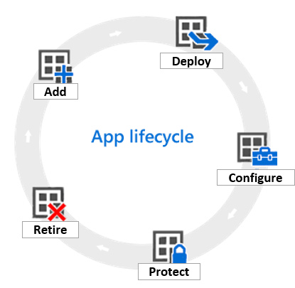

The Microsoft Intune app lifecycle begins when an app is added and progresses through additional phases until you remove the app. By understanding these phases, you will have the details you need to get started with app management in Intune.

### Add

The first step in app deployment is to identify the apps you want to manage and assign and add them to Intune. You can work with many different app types; the basic procedures are the same. With Intune you can add apps written in-house (line-of-business), apps from the store, apps that are built-in, and apps on the web.

### Deploy

After you have added the app to Intune, you can then assign it to users and devices that you manage. Intune makes this process easy, and after the app is deployed, you can monitor the success of the deployment from Intune within the Azure portal. Additionally, in some app stores, such as the Apple and Windows app stores, you can purchase app licenses in bulk for your company. Intune can synchronize data with these stores so that you can deploy and track license usage for these types of apps right from the Intune administration console.

### Configure

As part of the app lifecycle, new versions of apps are regularly released. Intune provides tools to easily update apps that you have deployed to a newer version. Additionally, you can configure extra functionality for some apps, for example:

- iOS app configuration policies supply settings for compatible iOS apps that are used when the app is run. For example, an app might require specific branding settings or the name of a server to which it must connect.

- Managed browser policies help you to configure settings for the Intune managed browser, which replaces the default device browser and lets you restrict the websites that your users can visit.

### Protect

Intune gives you many ways to help protect the data in your apps. The main methods are:

- Conditional Access, which controls access to email and other services based on conditions that you specify. Conditions include device types of compliance with a device compliance policy that you deployed.
- App protection policies that work with individual apps to help protect the company data that they use. For example, you can restrict copying data between unmanaged apps and managed apps, or you can prevent apps from running on devices that have been jailbroken or rooted.

### Retire

Eventually, the apps that you deployed will likely become outdated and need to be removed. Intune makes it easy to retire apps from service.

## Learn more

- [Plan for Mobile Application Management](/microsoft-store/distribute-apps-with-management-tool?azure-portal=true)
- [App protection policies](/mem/intune/apps/app-protection-policy?azure-portal=true)
