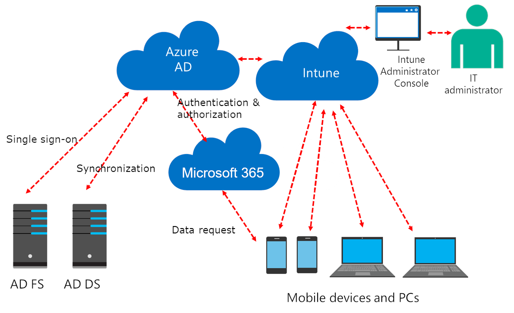

A key task of any IT Administrator is to protect and secure an organization's resources and data, wherever that data may reside. These days, users have many devices on which they open and share personal files, visit websites, and install apps and games. At the same time, they need to access work and school resources, such as email and OneNote. Device management enables organizations to protect and secure their resources and data.

Using a device management provider, organizations can make sure that only authorized people and devices get access to proprietary information. Similarly, users can feel at ease accessing work data from their device, because they know it meets their organization's security requirements.

This module will introduce you to the modern device management options for Windows 10 from Microsoft 365, including **co-management** and **Microsoft Intune**.

In this module, you will learn to:

- Describe the available options for device management in Microsoft 365
- Explain how Intune can be used to manage device and user profiles

Moving to a modern management approach can sometimes be a challenging task considering the complexity of planning and switching from existing IT systems, organizational structures, and processes. Most organizations are still using some combination of on-premises Windows Server Active Directory (AD) and System Center Configuration Manager (ConfigMgr) to manage their Windows devices.

Mobile device management (MDM) is an industry standard for managing all types of mobile devices, such as smart phones, tablets, laptops, and desktop computers and is implemented by using MDM authority and MDM clients. Microsoft's MDM authority solution is Microsoft Intune. Android, iOS, and Windows 10 devices all include MDM client functionality, so they can be properly managed by an MDM authority.

## Co-management

To help IT professionals simplify the transition to modern management, Microsoft designed a new feature called co-management. Co-management offers a simplified and manageable way to transition from either on-premises Active Directory, or Configuration Manager and Active Directory, to a modern management approach with Intune and Azure AD. Since the two solutions work together, organizations don't have to completely abandon their old management practices and can instead move to a modern approach when it makes sense for them.

## Microsoft Intune

Intune is a cloud-based service that helps enable your workforce to be productive while keeping your corporate data protected by managing mobile devices and apps. It integrates closely with Azure Active Directory (Azure AD) for identity and access control and Azure Information Protection for data protection. When you use it with Microsoft 365, you can enable your workforce to be productive on all their devices while keeping your organization's information protected.

With Intune, you can:

- Manage the mobile devices and PCs your workforce uses to access company data.
- Manage the mobile apps your workforce uses.
- Protect your company information by helping to control the way your workforce accesses and shares it.
- Ensure devices and apps are compliant with company security requirements.

Intune integrates closely with Azure AD for identity and access control, and Azure Information Protection for data protection. You can also integrate it with System Center Configuration Manager to extend your management capabilities.

In the following diagram, you can see how Intune interacts with other components in both your on-premises and cloud infrastructure:

## Learn more

- [Planning for Mobile Device Management](/intune/fundamentals/planning-guide?azure-portal=true)
- [Configure Mobile Device Management integration with Azure AD](/windows/client-management/mdm/azure-active-directory-integration-with-mdm?azure-portal=true) 
- [Mobile Device Management Authority](/intune/fundamentals/mdm-authority-set?azure-portal=true)
- [Device enrollment restrictions](/intune/enrollment/enrollment-restrictions-set?azure-portal=true)
