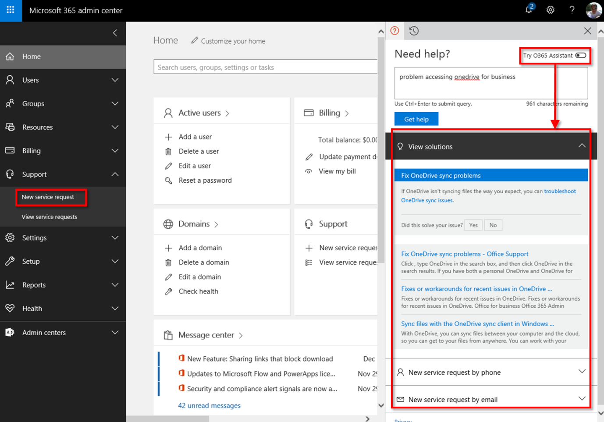

A **service request** creates a formal case to Microsoft Support for help. You can create requests through telephone support, online chat support, and email. Each customer case is identified by a unique code that helps track it through the support process until the issue is resolved and the case is closed. You can reopen a case using the same number in a new request call, but only if it’s for the exact same problem or error. It's important that each service request be about a specific issue or error message. Bundling more than one issue into a request causes issues when support engineers need to build a history of what’s happened in your environment and makes it harder to track larger issues. Bundling also hides trends that may be affecting an entire product.

## Creating a service request
You can create a new service request in the Microsoft 365 admin center and view the status of any existing requests. As shown in the following image, first toggle off the O365 Assistant bot in the Support pane, and then type in a description of your issue and search for solutions. If that doesn't help you solve your problem, create a new service request by phone or by email.

*search for solutions to issues and if you are unsuccessful, open a new service request*

## Viewing existing service requests
You can view the status of all your existing service requests. Either click **View service requests** under the Support blade, or if you already have the pane open, select the circular arrow icon in the **Need help** tab to see a list of your service requests.

*view your existing service requests*