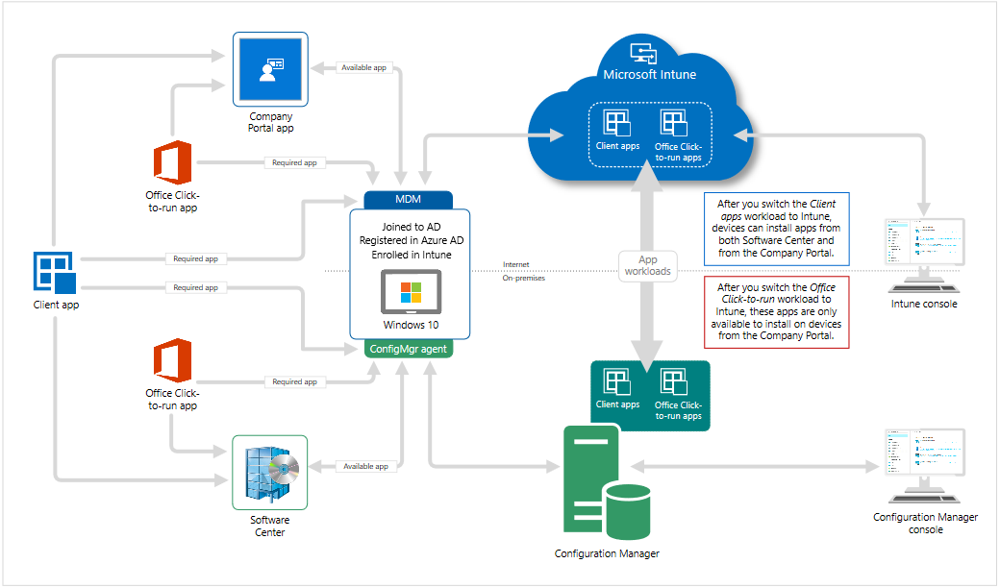

Before switching over to co-management, you need to figure out what workloads you want to switch over. You don't have to switch all workloads at once. You can do them individually when you're ready. Configuration Manager will continue to manage all other workloads, including those workloads that you don't switch to Intune, and all other features of Configuration Manager that co-management doesn't support.

Co-management supports the following workloads:
|||
| :--- | :--- |
| **Compliance policies**| Compliance policies define the rules and settings that a device must comply with to be considered compliant by conditional access policies. Also use compliance policies to monitor and remediate compliance issues with devices independently of conditional access.|
| **Windows Update policies**| Windows Update for Business policies let you configure deferral policies for Windows 10 feature updates or quality updates for Windows 10 devices managed directly by Windows Update for Business.|
| **Resource access policies**| Resource access policies configure VPN, Wi-Fi, email, and certificate settings on devices.|
| **Endpoint Protection**| The Endpoint Protection workload includes the Windows Defender suite of antimalware protection features:<ul><li>Windows Defender Antimalware</li><li>Windows Defender Application Guard</li><li>Windows Defender Firewall</li><li>Windows Defender SmartScreen</li><li>Windows Encryption</li><li>Windows Defender Exploit Guard</li><li>Windows Defender Application Control</li><li>Windows Defender Security Center</li><li>Windows Defender Advanced Threat Protection (now known as Microsoft Defender Threat Protection)</li><li>Windows Information Protection</li></ul> |
| **Device configuration**| Starting in Configuration Manager 1806, the device configuration workload includes settings that you manage for devices in your organization. Switching this workload also moves the Resource Access and Endpoint Protection workloads.|
| **Office Click-to-Run apps**| This workload manages Office 365 apps on co-managed devices.<ul><li>After moving the workload, the app shows up in the Company Portal on the device</li><li>Office updates may take around 24 hours to show up on client unless the devices are restarted</li><li>There's a new global condition, Are Office 365 applications managed by Intune on the device. This condition is added by default as a requirement to new Office 365 applications. When you transition this workload, co-managed clients don't meet the requirement on the application. Then they don't install Office 365 deployed via Configuration Manager.</li></ul> |
| **Client apps**| Use Intune to manage client apps and PowerShell scripts on co-managed Windows 10 devices. After you transition this workload, any available apps deployed from Intune are available in the Company Portal. Apps that you deploy from Configuration Manager are available in Software Center.|

### Diagram for app workloads

## Paths to co-management

There are two primary ways for you to set up co-management. It's important to understand the prerequisites for each path. They each require some combination of Azure Active Directory (Azure AD), Configuration Manager, Microsoft Intune, and Windows 10.

There are two main paths to reach to co-management:
|||
| :--- | :--- |
| **Path 1: Auto-enroll existing clients**| You have Windows 10 devices that are already Configuration Manager clients. You set up hybrid Azure AD and enroll them into Intune.  Taking this path can get your existing Configuration Manager-managed devices quickly enrolled into Intune. The management of these devices from Configuration Manager is no different from before you enable co-management. Now you get all the cloud-based benefits. This path is transparent to your users.|
| **Path 2: Bootstrap with modern provisioning**| You have new Windows 10 devices that join Azure AD and automatically enroll to Intune. You install the Configuration Manager client to reach a co-management state.|

## Auto-enrolling existing clients

With co-management, you can keep your well-established processes for using Configuration Manager to manage PCs in your organization. At the same time, you're investing in the cloud through use of Intune for security and modern provisioning.

To set up co-management of your Windows 10 devices that are already enrolled in Configuration Manager, you'll need to complete these high-level steps:

1. Review prerequisites for Azure and your on-premises environment
2. Set up hybrid Azure AD
3. Configure Configuration Manager client agents to register with Azure AD
4. Configure Intune to auto-enroll devices
5. Assign Intune licenses to users
6. Enable co-management in Configuration Manager

## Bootstrap with modern provisioning

With co-management, you can keep your well-established processes for using Configuration Manager to manage PCs in your organization. At the same time, you're investing in the cloud through use of Intune for security and modern provisioning.

To set up co-management of Windows 10 devices in an environment where you use both Azure Active Directory (AD) and an on-premises AD but don't have a hybrid Azure Active Directory (AD), you'll need to complete these high-level steps:

1. Review prerequisites for Azure and your on-premises environment
2. Request a public SSL certificate for the cloud management gateway (CMG)
3. Enable Azure services in Configuration Manager
4. Deploy and configure a cloud management gateway
5. Configure the management point and clients to use the CMG
6. Enable co-management in Configuration Manager
7. Configure Intune to install the Configuration Manager client
8. Assign license for cloud services

