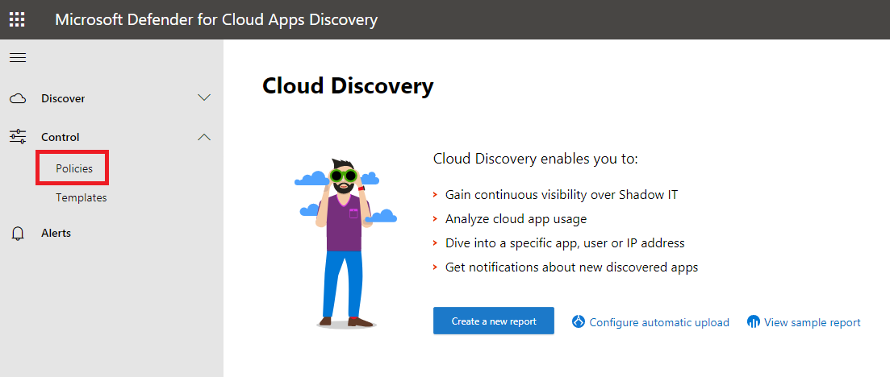
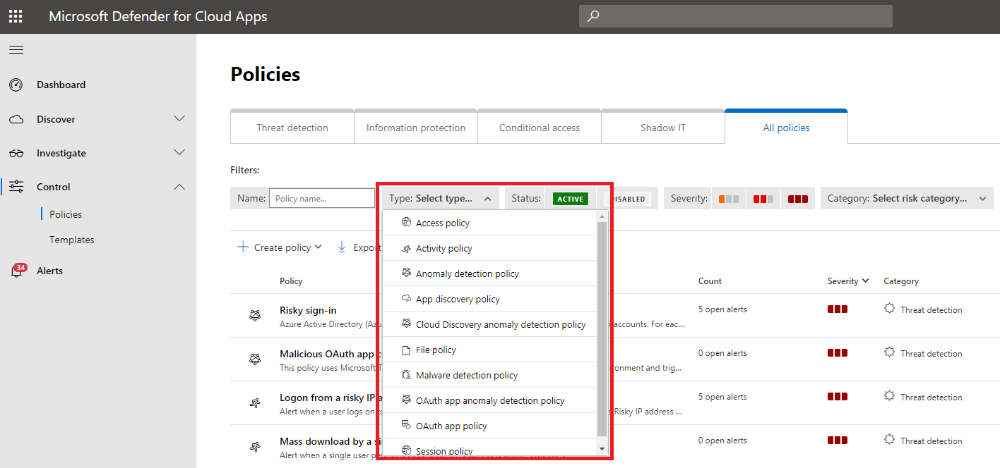
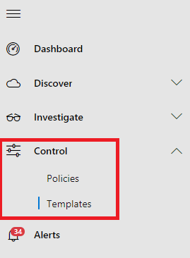
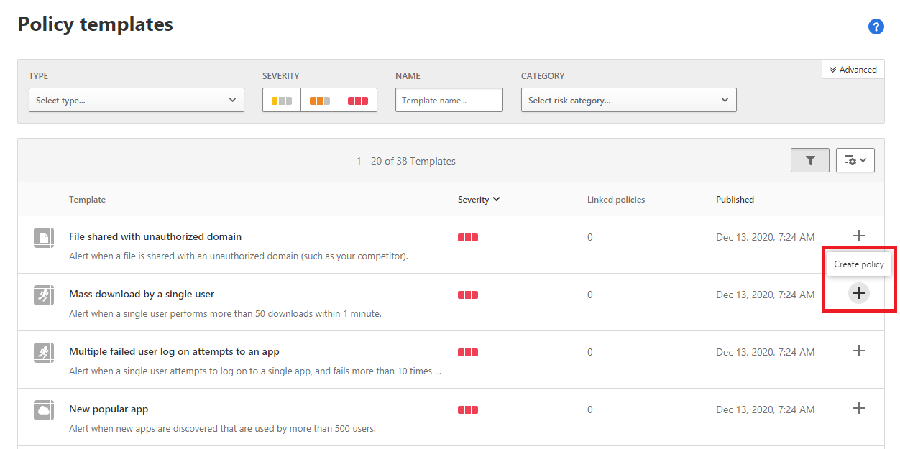
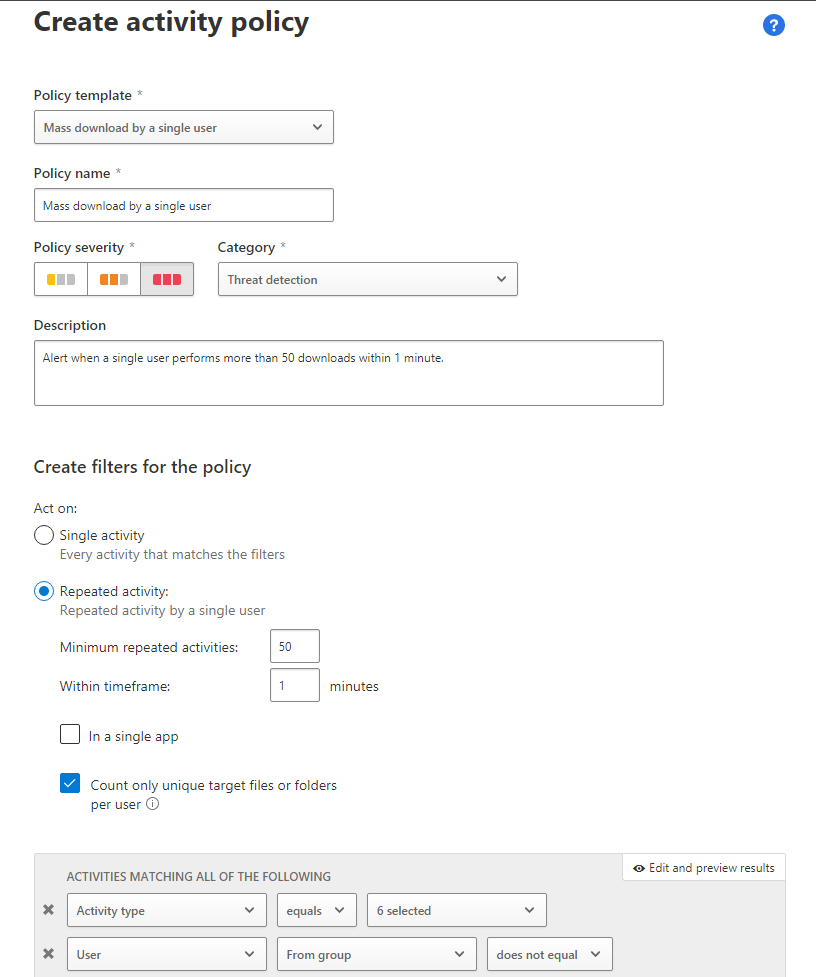

Many attacks are now cloud-only and many sensitive resources are stored in the cloud. For this reason, it is important to understand the types of threats and the capabilities of Cloud Access Security Brokers (CASBs).

## Threats to cloud apps

Threats to cloud apps are wide-ranging. As well as attackers who seek financial gain, attackers might include nation states deploying complex and ever-changing methods.

Because attacks are sophisticated and constantly evolving, a traditional list of known malware is no longer sufficient to protect an organization.

## Microsoft Defender for Cloud Apps threat detection

Microsoft Defender for Cloud Apps includes threat detection capabilities across all phases of an attack. These capabilities provide user and entity behavioral analytics (UEBA) combined with machine learning (ML) to assess threats based on ongoing user behavior.

In the Defender for Cloud Apps Portal, if you select **Control** and then **Policies**, you can see a list of policies.

If you select **Type**, you can see the threat detection policies grouped by type. Furthermore, you can create policies from the **Policies** page.

Here is a list of policy types:

### Access policy

Real-time monitoring and control of logins to your cloud apps.

### Activity policy

Using the app provider's APIs you can monitor actions performed by specific users or unusually high rates of specific activities.

### Anomaly detection policy

Anomaly detection policies look for behavior that is unusual for your organization, or for a user. This behavior can include activity such as sign-in failures or sign-ins that occur in geographically distant locations that would be impossible to travel between in the intervening time.

### App discovery policy

App discovery policies alert you when new apps are installed within your organization.

### Cloud Discovery anomaly detection policy

Cloud Discovery anomaly detection policy look for unusual behavior in app logs. Unexpectedly uploading large amounts of data to a third-party cloud storage site might trigger a Cloud Discovery anomaly detection alert.

### File policy

File policies search for specific files, file sharing, and files that contain sensitive data such as corporate secrets or credit card data.

### Malware detection policy

This policy detects malicious files in your cloud storage.

### OAuth app anomaly detection policy

OAuth app anomaly detection policies detect OAuth apps that have misleading names, misleading publishers, are potentially malicious, or have suspicious download activity.

### OAuth app policy

OAuth app policies look for suspicious behavior in OAuth apps such as requiring a high level of permissions.

### Session policy

Session policies provide you with real-time monitoring and control over user activity in your cloud apps.

## Creating a policy

By creating policies, you can detect wide ranges of suspicious activity and choose to be notified of this behavior or implement instant remediation.

You can create a policy from the **Policies** page, but it is normally more straightforward to either create a policy based on a template or create a policy based on a search.

To Create a policy based on a template, from the **Defender for Cloud Apps** portal, select **Control**, and select **Templates**.

You can then select the appropriate template and select **Create policy**.

You can now set a policy severity and create filters for the policy. Single activities could be filtered out, by only acting on repeated activity that happens a given number of times in a timeframe.

To create a policy based on a search, from the Defender for Cloud Apps portal, select **Investigate** and then choose the search type, for example, **Activity Log.**

You can now specify the criteria for the search and select **New policy from search**.

You can finalize the policy with the same **Create activity policy** page as a template policy.

The following video gives you an overview of Microsoft Defender for Cloud Apps threat protection capabilities:

> [!VIDEO https://www.microsoft.com/videoplayer/embed/RE4MGoX]
