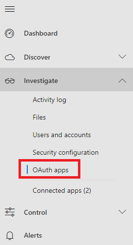
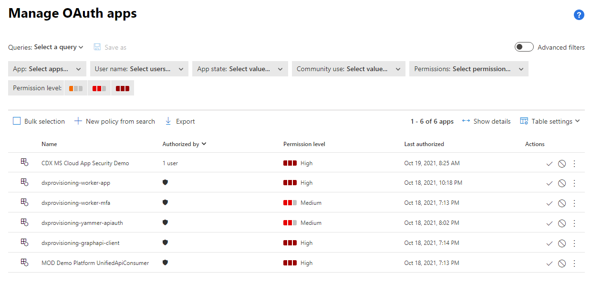
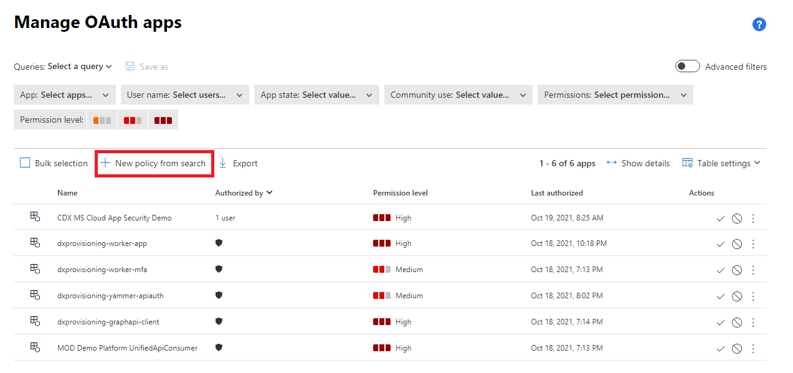

## What are OAuth apps?

OAuth 2.0 is an open standard used to grant access to user information to apps without giving the app the users' passwords. The app is given an access token with the approval of the user on first use of the app to grant the app access to protected resources, which would normally be limited to the user.

With so many apps in use, OAuth 2.0 reduces the need for multiple accounts and can provide secure delegated access, but OAuth apps will continue to have access to the resources that they were granted even if the user is logged out, or the user has changed their password.

If a user is tricked into authorizing a malicious OAuth app, their data could be accessed.

## Manage OAuth Apps with MCAS

To manage OAuth apps in Cloud App Security, go to the Cloud App Security portal, select **Investigate**, and select **OAuth apps**.

From the Manage OAuth apps page, you can manage all of the OAuth apps that were authorized by users in your organization.

Each app has further details, if selected, and you can list the permissions that have been delegated to the app and how common the app is in the global community. Common apps are typically less risky.

You can filter the list of apps, for example, to find apps with a high permission level that are rarely used in the community. If you find an app that you want to block, you can select **Mark app as banned**. This action blocks the app for all users and presents users with a custom notification.

## OAuth app policies

New apps are continually created, and it would be nearly impossible to assess every app for a large organization. To proactively assess and, potentially, revoke apps automatically, you can create OAuth app policies.

The most straightforward method for creating an OAuth app policy is to create a policy based on a search.

Follow the steps from the previous section to create a filter that displays apps that you want to block. Once you have finalized the filter, select **New policy from search**.

You can then choose to be alerted by email, text message, or a Microsoft Flow alert and choose to automatically revoke an app.

You can create multiple policies allowing you to have one policy to alert you if there is a medium risk app, and another policy to automatically revoke high risk apps.

The following video walks through the steps to manage OAuth apps in Microsoft Cloud App Security:

> [!VIDEO https://www.microsoft.com/videoplayer/embed/RE4MANe]
