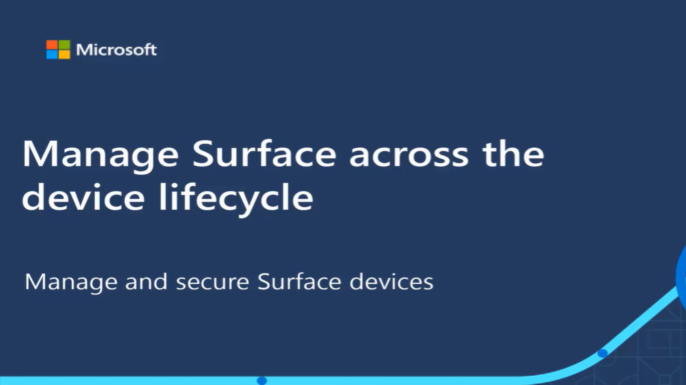

You can enroll Surface devices into Microsoft Intune in two ways. If you're purchasing your device from a supported Microsoft Cloud Solution Providers, they're provided with tools in Partner Center to enroll devices at time of purchase. The partner can then ship the new device, already enrolled with Microsoft Endpoint Manager, directly to your employees. The device will then be configured entirely through a zero-touch process when the user signs in to Azure Active Directory on the device.

You've chosen to purchase Surface devices directly and need to enroll them before sending them to your employees.

In this unit, you'll see how to manually register Surface devices with Windows Autopilot and add additional security features.

## Manually enroll Surface devices with Windows Autopilot

> [!CAUTION]
> Devices manually registered for Windows Autopilot are not allowed to use Device Firmware Configuration Interface (DFCI). By design, DFCI management requires external attestation of the device's commercial acquisition through an OEM or a Microsoft Cloud Solution Provider (CSP) partner registration to Windows Autopilot. When your device is registered, its serial number is displayed in the list of Windows Autopilot devices.

Before you begin the process of registering Surface devices, make sure they have the correct permissions. You'll need to have either the *Intune Administrator* or *Policy and Profile Manager* permission.

The steps to enroll a Surface device are:

1. Create a hardware hash.
1. Check the details are in the correctly formatted CSV file.
1. Import the CSV file into the Microsoft Endpoint Manager.
1. Manage devices with device group.

### Create a hardware hash

You have options for how to create a hardware hash. Microsoft recommends creating a hash before the device connects to the internet. This limits the options to using PowerShell or, for Windows 11 devices, the diagnostics page during the out-of-box experience (OOBE) boot process. The most widely available option is to run custom PowerShell commands. To create a hardware hash on a Surface device, follow these steps:

1. Start the Surface device.
1. To reboot the device into Audit mode, press **Ctrl+Shift+F3**.

    If the **Ctrl+Shift+F3** keyboard combination doesn't work, verify your keyboard's function keys are enabled.

    You may need to press an **Fn** or **Function lock** key before trying the keyboard combination.

1. Right-click **Start**, then select **Windows PowerShell (Admin)**.
1. At the PowerShell prompt, enter the following command:

    ```powershell
    Set-ExecutionPolicy -Scope Process -ExecutionPolicy RemoteSigned
    ```

1. At the prompt, enter **Y** and then press **Enter**.
1. Install the Windows Autopilot script with this command:

    ```powershell
    Install-Script -Name Get-WindowsAutoPilotInfo
    ```

1. At each prompt, enter **Y**, and then press **Enter**.
1. Create a temporary directory to store the hardware hash with this command:

    ```powershell
    md c:\\Temp
    ```

1. Run the PowerShell script to create the hash with this command:

    ```powershell
    Get-WindowsAutoPilotInfo.ps1 -OutputFile C:\\Temp\\autopilot.csv
    ```

You can now copy this **autopilot.csv** file to import it into the Microsoft Endpoint Manager portal.

### Check the CSV format

If you choose to create the hash with other methods, or just wish to check that the PowerShell commands worked correctly, the format of the file should be:

- Serial number
- Windows product ID
- Hardware hash
- Optional group tag
- Optional assigned user (must be a valid User Principal Name (UPN))

The file can be used to import up to 500 devices, one line for each. The header in the CSV file must follow this format:

Device Serial Number, Windows Product ID, Hardware Hash, Group Tag, Assigned User

Using the PowerShell command won't add the group tag or user information. This will need to be added manually after the file is created. Because the file needs to be ANSI format, you only edit the file in notepad-don't open and save it in Excel.

### Import the CSV file

To import the Surface device in the Microsoft Endpoint Manager, follow these steps:

1. In your browser, go to the Microsoft Endpoint Manager admin center at <https://endpoint.microsoft.com>.
1. In the left navigation, select **Devices**.
1. In the **Devices | Overview** pane, under **Device enrollment**, select **Enroll devices**.
1. In the **Enroll devices | Windows enrollment** pane, under **Windows Autopilot Deployment Program**, select **Devices**.
1. In the **Windows Autopilot devices** pane, on the menu, select **Import**.
1. In the **Add Autopilot devices** pane, under **Specify the path to the list you want to import**, choose **Select a file**.
1. In the Open window, go to where the CSV file is stored.
1. Select **autopilot.csv**, and then select **Open**.
1. Select **Import**.
1. You may need to wait 2-3 minutes while the device is being imported. It might take additional time before devices are shown in the devices list.
1. In your browser, go to the Azure Active Directory admin center at [https://aad.portal.azure.com](https://aad.portal.azure.com/).
1. In the left navigation, select **Azure Active Directory**.
1. In the **Overview** pane, under **Manage**, select **Devices**.
1. In the **Devices | Overview (Preview)** pane, select **All devices**.
1. The device is listed if it has been successfully imported.

## Interactive Guide

Now that you've learned the steps to enroll a Surface device using Microsoft Endpoint Manager, you can follow this interactive to do them for yourself.

[](https://edxinteractivepage.blob.core.windows.net/edxpages/Security%20fundamentals/LP03M02%20-%20Use%20Azure%20secure%20score%20to%20improve%20your%20security%20posture/index.html?azure-portal=true)
