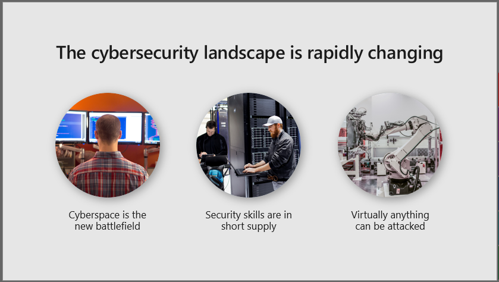

The sophistication and capabilities of cyberattacks are evolving at a rapid pace. While it may be tempting to think of hackers as basement-dwelling teens looking to cause mischief, cyberattacks are now a weapon of choice for both large-scale organized crime and nation states. Attacks are no longer targeted just at governments and enterprises, but also at civilians, private property, and public infrastructure. Coupled with these emerging threats, the proliferation of devices in our connected world increases the surface area of attacks. Cyberattacks can be devastating—and the people with the security skills to meet the challenge are in short supply. 

When it comes to defending against cyberattacks, companies need to consider their digital estate. This represents all the assets they need to help protect. This is a bit different now than it was five or 10 years ago. IT organizations now find themselves responsible for protecting a set of technologies they may not own, such as user-owned mobile devices that are used to access corporate data. It also includes systems and devices that your partners and customers use to access your information. And any one of these points can be a point of vulnerability for your overall estate. When it comes to security today, you can no longer draw perimeters around your organization. This is the challenge that many IT departments struggle with. 