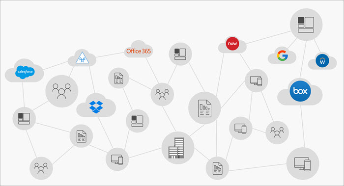
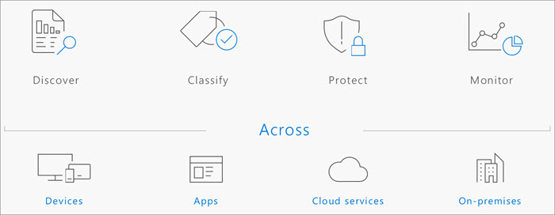
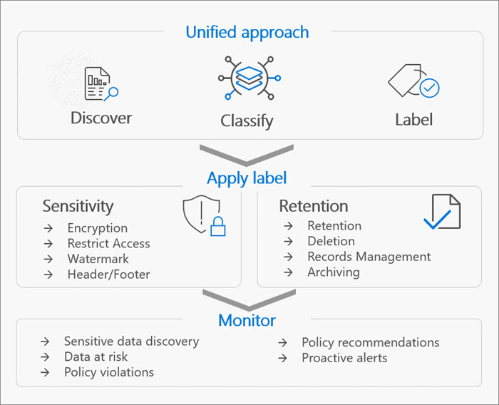
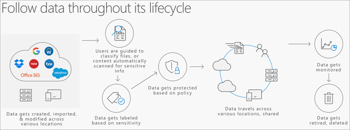
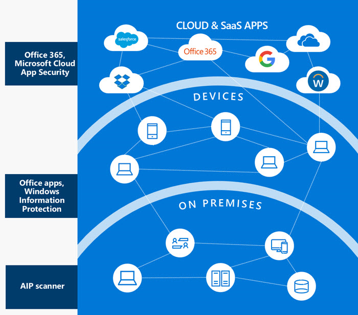
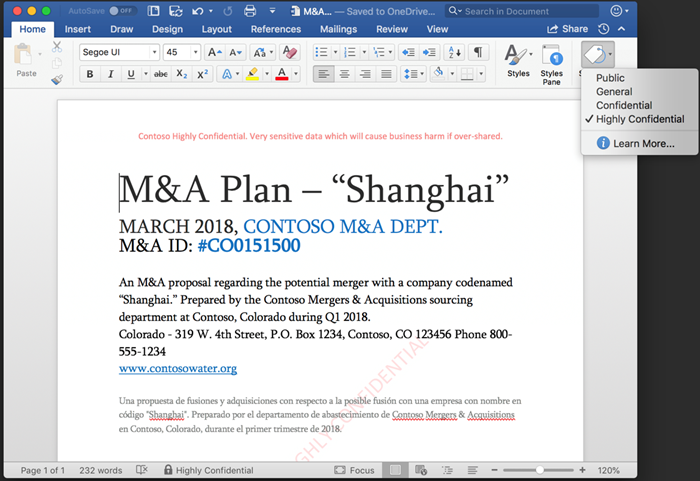
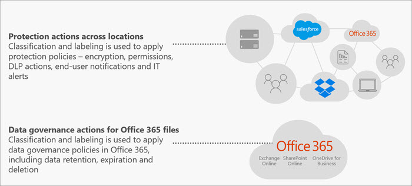
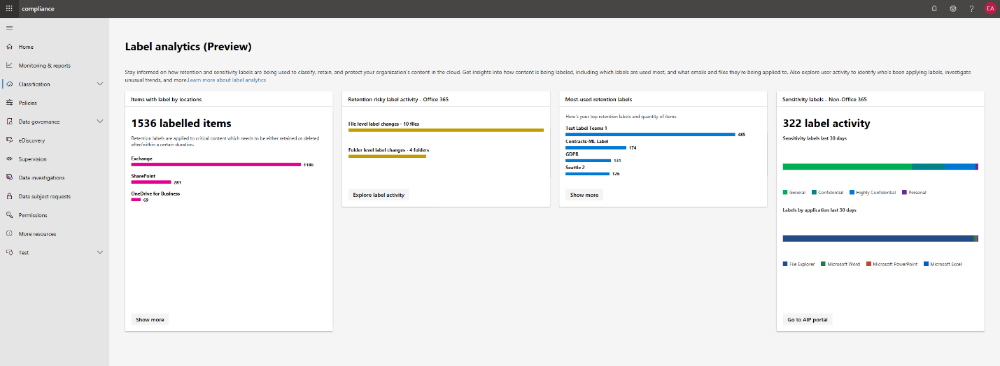

In a mobile-first, cloud-first world, important business data lives and travels everywhere. 

Organizations need to balance productivity and security. How do you create and share information across boundaries, while preventing the unauthorized disclosure, modification, or destruction of that data? What can you do to reduce the risk that employees share sensitive information accidentally or use sensitive information inappropriately?

To balance productivity and security effectively, you need strategy for protecting and managing your sensitive information. You need to know where your sensitive information is located. And you need to be able to control it as it travels within and outside your organization. You also need to have a way to classify, label, and apply appropriate protections to this information.

It can be helpful to think about your information protection strategy in terms of these four key activities:  
- Discover
- Classify
- Protect
- Monitor

The Microsoft Information Protection solutions in Microsoft 365 help you protect sensitive data throughout its lifecycle—across devices, apps, cloud services, and on-premises locations.

## Integrated capabilities protect and manage data throughout its lifecycle
The unified labeling experience in Microsoft 365 provides organizations with a more integrated and consistent approach to creating, configuring, and automatically applying comprehensive policies to protect and govern data – across devices, apps, cloud services, and on-premises. The information protection capabilities also support your overall data governance strategy. Classifying and labeling data enables you to apply policy-based protections and/or retention actions. Advanced monitoring and analytics provide visibility and insights into your organization’s data. You can understand where important data resides, receive proactive alerts on policy violations, and view recommendations on policy enhancements based on your environment.

The following image shows how these integrated capabilities work together over the course of the data lifecycle to keep information protected and managed.

The following units will explain in greater detail how these capabilities work at each phase of the data lifecycle.

## Discover and classify sensitive information
The Discover and Classify phases of information protection involve scanning and detecting sensitive data – all based on the policies defined and configured by your organization. 

Key considerations:
- Is there an automated way to discover important data?  
- Which regulations and compliance factors matter? 
- Is my data spread out across devices, the cloud, and on-premises servers? 
- Is my data spread out geographically? 
- Are certain employees or groups more relevant for discovery? 
- Do I know the characteristics of sensitive or important data?

## Discover sensitive information
In order to protect your organization’s information, you need to be able to discover sensitive information no matter where it is created or lives. That means having sensitive data discovery capabilities across your on-premises file shares or datacenters, on individual devices, as well as across cloud services and SaaS applications. 

What counts as “sensitive data” for your organization will be determined by things like your industry (e.g., healthcare, financial services), governmental regulations and policies, as well as your organization’s internal policies.
- You can start by using **Content Search** to search for in-place items such as email, documents, and instant messaging conversations.
- Microsoft has many built-in **sensitive information types** (part of Data Loss Prevention) that can be used to detect common sensitive information types, such as financial information, healthcare related information, PII and other information types. 
- If you need more granular control beyond the built-in sensitive information types, you create your own **custom sensitive information types**, or add your own unique dictionary of terms to detect against. 
- Beyond detecting sensitive information in documents and emails, you can also use **Microsoft Cloud App Security** to detect content in cloud storage services, based on policy. You can discover sensitive data across third-party SaaS apps. You can also apply labels and protection to sensitive files with Microsoft Information Protection.
- The **Azure Information Protection Scanner** enables you to discover, classify, and protect files on on-premises servers, network shares, and on-premises SharePoint Server sites.

For more information, see:
https://docs.microsoft.com/Office365/SecurityCompliance/content-search
https://docs.microsoft.com/office365/securitycompliance/what-the-sensitive-information-types-look-for
https://docs.microsoft.com/cloud-app-security/what-is-cloud-app-security
https://docs.microsoft.com/azure/information-protection/deploy-aip-scanner

## Classify content with sensitivity labels
After you have identified the sensitive data you want to protect, you can apply sensitivity labels to help your organization monitor the transmission and usage of documents that are potentially sensitive. 
Sensitivity labels are metadata tags within a document that are:
- **Customizable**. You can create categories for different levels of sensitive content in your organization, such as Personal, Public, General, Confidential, and Highly Confidential.
- **Clear text**. Because the label is in clear text, it’s available for third-party apps and services to apply protective actions to labeled content.
- **Persistent**. After a sensitivity label is applied to content, it persists in the metadata of that email or document. This means the label roams with the content, including the protection settings, and becomes the basis for applying and enforcing policies.

In the Office apps, a sensitivity label simply appears as a tag on an email or document. The Sensitivity drop-down menu makes it easy to view and select the appropriate label. The screenshots below illustrate the end-user experience in Office apps on Mac. The experience is similar across Word, PowerPoint, Excel and Outlook.

### How sensitivity labels protect content
Sensitivity labels in documents and emails can also be understood by other apps and services. For example, if a “Highly Confidential” document resides on a Windows device, Windows Information Protection and Windows Defender ATP can work together to block the copying or sharing of content from that document to other locations on the device, such as personal email accounts or social accounts. 

You can use sensitivity labels to:
- **Enforce protection settings such as encryption or watermarks on labeled content**. For example, your users can apply a Confidential label to a document or email, and that label can encrypt the content and apply a Confidential watermark.
- **Protect content in Office apps across different platforms and devices**. Sensitivity labels work in Office apps on Windows, Mac, iOS, and Android. 
- **Prevent sensitive content from leaving your organization on devices running Windows, by using endpoint protection in Microsoft Intune**. After a sensitivity label has been applied to content that resides on a Windows device, endpoint protection can prevent that content from being copied to a third-party app, such as Twitter or Gmail, or being copied to removable storage, such as a USB drive.
- **Extend sensitivity labels to third-party apps and services**. With the Microsoft Information Protection SDK, third-party apps on Windows, Mac, and Linux can read sensitivity labels and apply protection settings. Support for apps on iOS and Android is coming soon.
- **Classify content without using any protection settings**. You can also simply assign a classification to content (like a sticker) that persists and roams with the content as it's used and shared. You can use this classification to generate usage reports and see activity data for your sensitive content. Based on this information, you can always choose to apply protection settings later.

You have flexibility in how you choose to apply sensitivity labels. You can configure a policy to automatically apply a sensitivity label to a document based on the detection of sensitive information. For example, policy could be defined to automatically mark a document as “confidential” if it contains social security numbers. 

Alternatively, you can set things up so that a recommended classification and sensitivity label can be provided to users. You can also give users the ability to override an automatic classification, while requiring a justification for the override.

Because individual users may be most familiar with the data in your organization, you can also enable users to classify and apply a sensitivity label themselves. For example, if they are working on a document that contains privileged information, they can apply a sensitivity label of “highly confidential” right within the app. 

### Labels enable policy-driven actions
Classification and the application of sensitivity labels are a powerful part of the information protection process because they are the means by which organizations can apply and enforce policy actions. Using classification and labeling, you can apply specific **protection actions**, such as encryption, Data Loss Prevention actions, end-user notifications, and IT alerts. You can also apply specific **data governance actions**, including data retention, expiration, and deletion.

In the next unit, we’ll look more closely at the specific protection policies that can be applied using labels.
For more information:
https://docs.microsoft.com/en-us/Office365/SecurityCompliance/sensitivity-labels
https://docs.microsoft.com/en-us/Office365/SecurityCompliance/apply_sensitivity_label_automatically

## Protect information and prevent data loss
Sensitive data may initially be created on an individual device, but it is then frequently shared or stored in other locations, such as cloud-based storage, on-premises file shares, or email. There are several complementary protection measures you can take to protect this sensitive information wherever it lives or travels: 

- As a starting point, both Microsoft 365 has data encryption built into the service – for both data at rest and data in transit. 
- To protect individual files, you can apply rights-based permissions so that only intended recipients can access and view the information.
- You can apply Data Loss Prevention actions, such as blocking the sharing of a file that is detected to have sensitive information, such as credit card information or social security numbers.
- You can limit or block access to cloud apps present in your environment, or revoke app access among specific individuals.
- To help end-users make more informed decisions, you can enable policy tips that notify users that the document they are working with contains sensitive information, or you can even automatically apply a visual marking to documents, such as a header or footer. 
- To help prevent sensitive information from staying around longer than necessary and potentially posing a risk, you can automatically retain, expire or delete documents, based on data governance policies defined by your company. 

Here’s a closer look at a few specific protections you can apply.

### Apply encryption using a sensitivity label
When you create a sensitivity label, you can restrict access to content that the label will be applied to. For example, with the encryption settings for a sensitivity label, you can protect content so that:
- Only users within your organization can open a confidential document or email.
- Only users in the marketing department can edit and print the promotion announcement document or email, while all other users in your organization can only read it.
- Users cannot forward an email or copy information from it that contains news about an internal reorganization. 
- The current price list that is sent to business partners cannot be opened after a specified date.

When a document or email is encrypted, access to the content is restricted, so that it:
- Can be decrypted only by users authorized by the label’s encryption settings.
- Remains encrypted no matter where it resides, inside or outside your organization, even if the file’s renamed.
- Is encrypted both at rest (for example, in a OneDrive account) and in transit (for example, a sent email).

More info: https://docs.microsoft.com/en-us/Office365/SecurityCompliance/encryption-sensitivity-labels

### Send protected email
Because email is one of the most common ways employees share information, it poses a high risk for unintended disclosure of sensitive information. Office 365 Message Encryption (OME) enable people in your organization to share protected email with anyone on any device. Users can send and receive protected messages with other Office 365 organizations as well as non-Office 365 customers using Outlook.com, Gmail, and other email services.

Video: Office 365 Essentials: Office Message Encryption: 

>[!VIDEO https://www.youtube.com/embed/CQR0cG_iEUc]

### Prevent inappropriate sharing with Data Loss Prevention policies (DLP)
By configuring Data Loss Prevention (DLP) policies, you can help prevent sensitive information from being leaked outside your organization. Sensitive information might include financial data, health records, or personally identifiable information (PII) such as credit card numbers or government identification numbers. DLP detects sensitive information by using deep content analysis (not just a simple text scan). This deep content analysis uses keyword matches, dictionary matches, the evaluation of regular expressions, internal functions, and other methods to detect content that matches your DLP policies. Potentially only a small percentage of your data is considered sensitive. A DLP policy can identify, monitor, and automatically protect just that data, without impeding or affecting people who work with the rest of your content.

DLP includes many sensitive information types that you can use in your DLP policies. You can customize these built-in sensitive information types or create new custom sensitive information types.

With a DLP policy, you can:
- **Identify sensitive information across many locations, such as Exchange Online, SharePoint Online, and OneDrive for Business**. For example, you can identify any document containing a credit card number that's stored in any OneDrive for Business site, or you can monitor just the OneDrive sites of specific people.
- **Prevent the accidental sharing of sensitive information**. For example, you can identify any document or email containing a health record that's shared with people outside your organization, and then automatically block access to that document or block the email from being sent.
- **Monitor and protect sensitive information in the desktop versions of Excel, PowerPoint, and Word**. Just like in Exchange Online, SharePoint Online, and OneDrive for Business, these Office desktop programs include the same capabilities to identify sensitive information and apply DLP policies. DLP provides continuous monitoring when people share content in these Office 2016 or 2019 programs.
- **Help users learn how to stay compliant without interrupting their workflow**. You can educate your users about DLP policies and help them remain compliant without blocking their work. For example, if a user tries to share a document containing sensitive information, a DLP policy can both send them an email notification and show them a policy tip in the context of the document library that allows them to override the policy if they have a business justification. The same policy tips also appear in Outlook on the web, Outlook 2013 and later, Excel 2016, PowerPoint 2016, and Word 2016.
- **View DLP reports showing content that matches your organization's DLP policies**. To assess how your organization is complying with a DLP policy, you can see how many matches each policy and rule has over time. If a DLP policy allows users to override a policy tip and report a false positive, you can also view what users have reported.

### Protect data when it travels outside your org
Most organizations use SaaS apps from multiple providers, and their employees may additionally have personal social media accounts or data storage solutions. How do you keep track of whether sensitive data is leaking out of your SaaS cloud apps accounts, or whether sensitive data is being inappropriately shared to third-party apps or social media accounts?

Microsoft Cloud App Security is a Cloud App Security Broker (CASB) solution. It gives you visibility into your cloud apps and services, provides analytics to identify and combat cyberthreats, and enables you to control how your data travels.

In other words, it helps you manage and see what information goes to the cloud and what information can be downloaded from the cloud, as well as the devices, users, or locations that can access it. The following image provides a visualization of the functions of a Cloud App Security Broker solution.

Broadly, Microsoft Cloud App Security can help your organization: 
- Discover and manage Shadow IT in your organization: 
- Protect your sensitive information
- Detect and remediate cyberthreats across cloud apps
- Ensure the compliance of cloud apps in your organization

From an information protection and data governance perspective, Microsoft Cloud App Security provides some of the following capabilities:
- **Granular data loss prevention (DLP) policies**: Set granular policies to control data in the cloud—either automated or based on file label—using out-of-the-box policies or you can customize your own.
- **Policy enforcement**: Identify policy violations, enforce actions such as quarantine and permissions removal
- **Understands classification & labeling**: Reads classification and labeling in the document – so you can gain visibility into sharing of sensitive files and create policies
- **Revoke access for 3rd party apps**: Detect and manage 3rd party app access

For more information: https://docs.microsoft.com/cloud-app-security/what-is-cloud-app-security

## Monitor and respond to threats
There are two key activities in the “Monitor” phase of the information protection lifecycle. First, you need to **gain visibility** into all the events impacting your environment. Second, you need to **take action** or remediate, based on the event.

You can attain visibility into relevant activity and events comes in several ways. You can review reports and alerts on policy violations, sensitive document access & sharing. You can also review cloud app usage and anomalous activity, such as a large download of data from a specific cloud app within a certain period of time. 

It’s important to have visibility, but it’s just as important to be able to take immediate action in order to better protect your sensitive information. For example, if you are finding end-user productivity is being negatively impacted because of restrictive DLP policies, you can tune your policies to find the right balance. Or, if you become aware of anomalous activity or inappropriate sharing, you can immediately revoke app access, quarantine a file or a user. 

For customers that use a security incident and event management system (SIEM), you can also feed certain events, such as DLP events, into these systems in order to give customers a centralized reporting and monitoring experience.
Here’s a closer look at some of the monitoring capabilities in Microsoft 365.

### Microsoft Information Protection label analytics

The Label Analytics dashboard aggregates label insights so that you can see how sensitivity and retention labels are being used for both Office 365 and non-Office 365 data.

Additional reports that help you monitor information protection:

|Type of information|Where to go to learn more|
|-|-|
|**Data loss prevention**  Data loss prevention policy matches, false positives and overrides, and links to create or edit policies |[View the reports for data loss prevention](https://docs.microsoft.com/office365/securitycompliance/view-the-dlp-reports)|
|**Data governance** Information about how labels are applied, labels classified as records, label trends, and more|[View the data governance reports](https://docs.microsoft.com/office365/securitycompliance/view-the-data-governance-reports) |
|**Threat management dashboard** (this is also referred to as the Security dashboard and the Threat Intelligence dashboard) Threat detections, malware trends, top targeted users, details about sent and received email messages, and more|[Security dashboard overview](https://docs.microsoft.com/office365/securitycompliance/security-dashboard) |
|**Mail flow** Information about sent and received email messages, recent alerts, top senders and recipients, email forwarding reports, and more|[Mail flow insights in the Office 365 Security & Compliance Center](https://support.office.com/article/beb6acaa-6016-4d54-ba7e-3d6d035e2b46.aspx)| 
|**GDPR compliance** Information about GDPR compliance, including links to data subjects, label trends, and active & closed cases|[Office 365 Information Protection for GDPR](https://docs.microsoft.com/office365/enterprise/office-365-information-protection-for-gdpr)|
|**Audit log** Information about Office 365 activities, users, files or folders, and more|[Search the audit log in the Office 365 Security & Compliance Center](https://docs.microsoft.com/office365/securitycompliance/search-the-audit-log-in-security-and-compliance) |
|**Compliance reports** FedRAMP reports, governance, risk and compliance reports, ISO information security management reports, and Service Organization Controls audit and assessment reports||