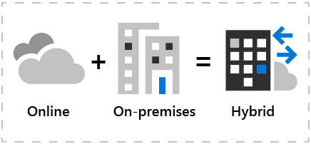

The cloud-only model saves you from having to build and maintain your own infrastructure. But what if your company has invested heavily in on-premises hardware, line-of-business systems, custom apps, and so on? Do you have to abandon all of your resources and customizations to gain the benefits of cloud computing? That's where the hybrid model comes in.

*hybrid is a combination of cloud services with on-premises services to support your IT needs*

A *hybrid cloud* migration lets you keep critical resources on-premises while also working with cloud services. It connects on-premises resources to the cloud, effectively making the new cloud services an extension of your on-premises infrastructure. The hybrid cloud model lets you extend capabilities or features that aren't available in your existing on-premises systems (like mobility and productivity) to your infrastructure.

So how do you choose which model is best for you?