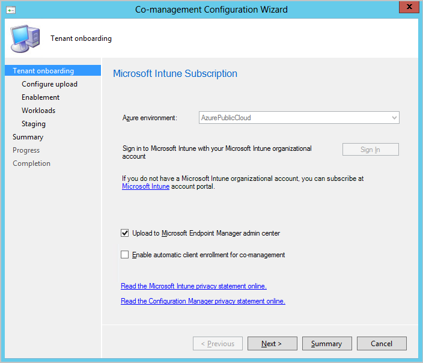

When you don't already have co-management enabled, you can use the **Co-management Configuration Wizard** in the Configuration Manager console to enable device upload as part of tenant attach, but you don’t need to enable co-management. You can upload your devices without enabling automatic enrollment for co-management or switching workloads to Intune. The default setting for device upload is **All my devices managed by Microsoft Endpoint Configuration Manager**. If needed, you can limit upload to a single [device collection](/mem/configmgr/core/clients/manage/collections/introduction-to-collections).

> [!NOTE]
> If co-management is already enabled in your environment, you must [edit the co-management properties](/mem/configmgr/tenant-attach/device-sync-actions#bkmk_edit) to enable device upload.

When co-management isn't enabled in your environment, use the instructions below to enable device upload:

1. In the Configuration Manager admin console, click **Administration** > **Overview** > **Cloud Services** > **Co-management**.
2. In the ribbon, select **Configure co-management** to open the wizard.
3. On the **Tenant onboarding** page, select **AzurePublicCloud** for your environment. Azure Government Cloud and Azure China 21Vianet aren't supported.
4. Select **Sign In**. Use your *Global Administrator* account to sign in.
5. Ensure the **Upload to Microsoft Endpoint Manager admin center** option is selected on the **Tenant onboarding** page. 
   Also, make sure the option **Enable automatic client enrollment for co-management** isn't checked, to avoid enabling co-management now.

   

6. Choose **Next** and then **Yes** to accept the **Create AAD Application** registration. 
   This action provisions a service principal and creates an Azure AD application registration to facilitate the sync. Service principals define who can access the application and what resources the application can access.
7. On the **Configure upload** page, select the recommended device upload setting for **All my devices managed by Microsoft Endpoint Configuration Manager**.  
   If needed, you can limit upload to a single device collection.
8. Check the option to **Enable Endpoint analytics for devices uploaded to Microsoft Endpoint Manager**.  
   Selecting this option will allow you to get insights into optimizing the end-user experience using [Endpoint Analytics](/training/modules/compliance-endpoint-manager) later.
9. Select **Summary** to review your selection, then choose **Next**.
10. When the wizard is complete, select **Close**.  
