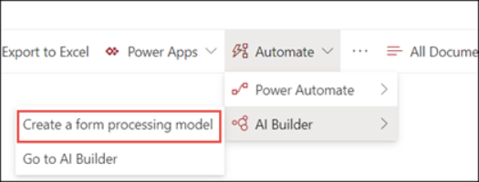

With any business process, it's important to define key tasks and who will be responsible for them.

You want to build a proposal for deploying SharePoint Syntex to your company's SharePoint libraries. You have a basic sense of what SharePoint Syntex is; now you need to understand the roles needed to administer it. There are four main SharePoint Syntex roles:

- **SharePoint/Knowledge admin**: Enables AI Builder, creates content centers, and maintains SharePoint Syntex, including user permissions and access.
- **Power Platform admin**: Configures the data service environment for form processing and purchases and allocates AI Builder (AIB) credits.
- **Knowledge manager**: Establishes best practices and use cases for using SharePoint Syntex.
- **Model owner**: Owns, creates, and oversees document understanding and/or form processing models.

It's possible that existing roles in your organization align with the responsibilities necessary to set up and administer SharePoint Syntex.

## SharePoint/Knowledge admin role and responsibilities

The SharePoint/Knowledge administrator establishes your organization's SharePoint Syntex instance and maintains it. They'll configure form processing in individual SharePoint document libraries and set up content centers for the document understanding models, as needed. The SharePoint admin is also responsible for assigning and controlling permissions for who can access each content center.  

As you build your SharePoint Syntex proposal, you might make suggestions about which people in which departments could serve the SharePoint/Knowledge admin role. The role is a little technical, so you might want to choose an IT specialist for this role. On the other hand, you might want to choose someone with a high-level view of the company's overall content. Maybe someone whose role already deals with administrative or organizational tasks and understands what different roles within the organization need from their document libraries. For instance, a technical writer might be ideal for this role since they understand documentation. No matter who is named the SharePoint/Knowledge admin, you need buy-in from that person and from the teams they'll serve.  

## Power Platform admin role and responsibilities

A Power Platform administrator manages the Power Apps AI Builder capabilities within each SharePoint document library, enabling form processing. They're responsible for configuring the data service environment for form processing, and purchasing and allocating AI Builder (AIB) credits.  

The skills needed for this role are similar to your SharePoint/Knowledge admin. They need organizational knowledge to provide the necessary access to AI Builder and technical understanding of the Power Platform environment and AIB credits.

Considering this, a technical writer may be ideal as your Power Platform admin since they know the documentation process. You could also consider the IT admin, who already handles the IT operations of your organization.

## Knowledge manager role and responsibilities

The knowledge manager role oversees the models. They pinpoint and aggregate specific use cases for content understanding that apply to your organization's needs and pain points. They establish the best practices and guidelines for using SharePoint Syntex. The knowledge manager also reviews the models regularly, checking the model analytics to ensure that models are working properly and evaluating the information they are returning.

You want to appoint someone who works closely with the model owners and with your document libraries on a day-to-day basis. You could consider a customer service or sales representative. Both roles manage contracts and other important customer information. They'd have a good sense of the current state your information. Since they deal with the content libraries daily, they likely have insight into how to improve organization and compliance.

## Model owner role and responsibilities

The model owner owns the use of the models. They create and oversee the document understanding and form processing models. They advocate for the models and their use, so they should be closely tied to the input and output of the models. To build meaningful, useful models, the model owner needs to gather real business use cases within your organization. They'll need to transform use cases into document understanding models and form processing models. The model owner can then apply models to existing libraries.

Consider whether a single person in your company should act as model owner, or whether each department has their own. A single model owner offers centralized control over how documents are processed. Company information policies are easier to enforce. You might consider a content specialist who's comfortable creating models. This may be a technical writer or an administrative person with company-wide content knowledge. Alternatively, you could recommend that each department identify a model owner. Opting for different model owners for different sectors of the business enables you to create targeted models that focus on what each department needs from their content libraries.

In addition to these roles and responsibilities, you need to think about who will manage security and permissions for SharePoint Syntex.

## Global admin

The global admin manages access for SharePoint Syntex users. They control levels of access and what users have access to. The global admin is likely a security specialist with IT understanding since tenant-level settings require more backend work and an understanding of how to administer IT settings. The global administrator needs to be comfortable with both establishing tenant-level settings and updating them on a regular basis, as needed,l including when new model owners and other admins are onboarded to your organization.
