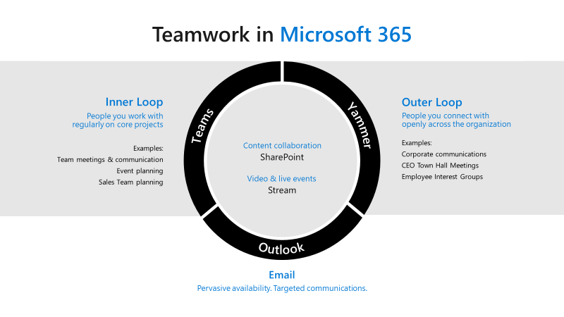

Which tools are best for your organization's teamwork needs? It generally depends on your team members roles in the project and how you intend to communicate and collaborate with them. Team members can typically be categorized as either part of the *inner loop* or *outer loop* of people that you collaborate with:

The inner loop is made up of the people you actively work with on a regular basis. Use **Microsoft Teams** to let the inner loop members stay tightly connected on project updates and related content and files no matter where they are located. 

The outer loop is made up of the people you may not work with regularly on a project or in the team, but who have a vested interest, like a project stakeholder or common goal. Use **Yammer** to openly share information, find expertise, and share ideas across your organization. Groups and conversations are open and viewable to everyone. If you prefer working in email, **Outlook** is an ideal way to start the conversation. 

When it comes to managing team content and files, **SharePoint** is the tool that brings together content from Microsoft Teams, Yammer, and Outlook to keep track of critical project information no matter where the conversation starts.
