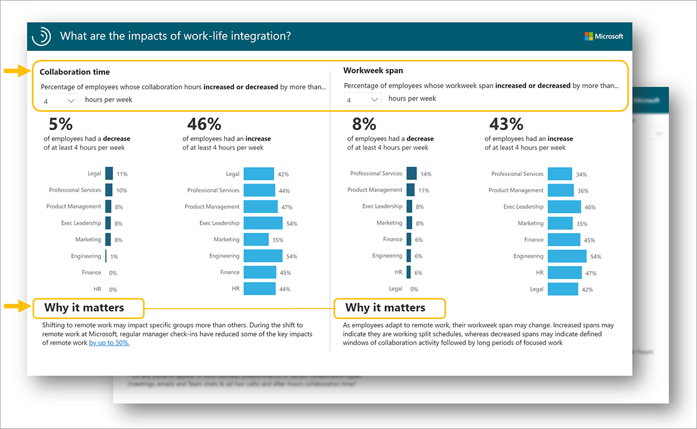
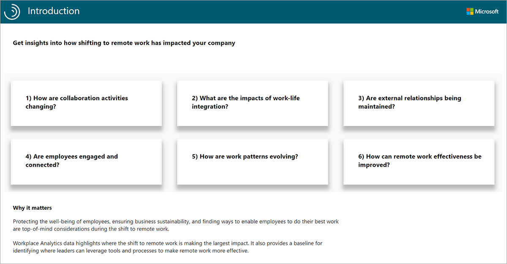
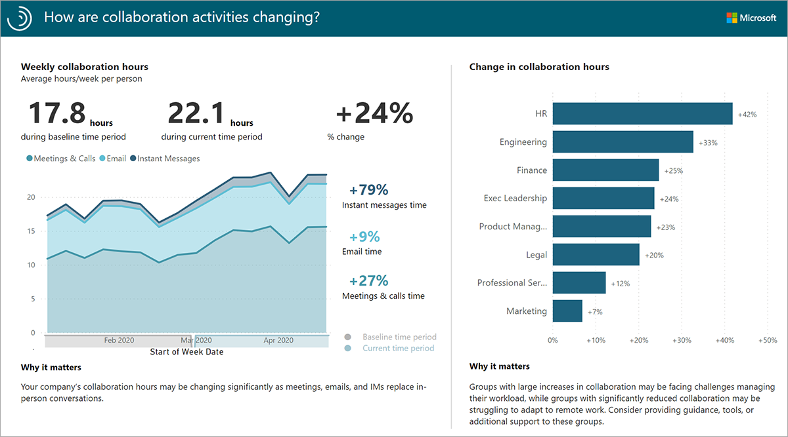
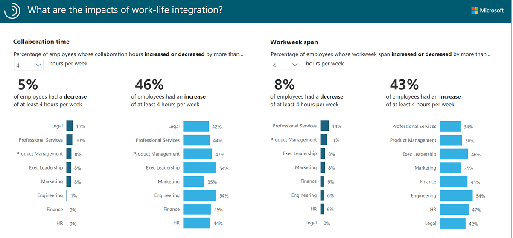
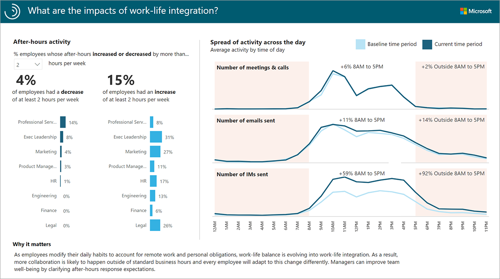
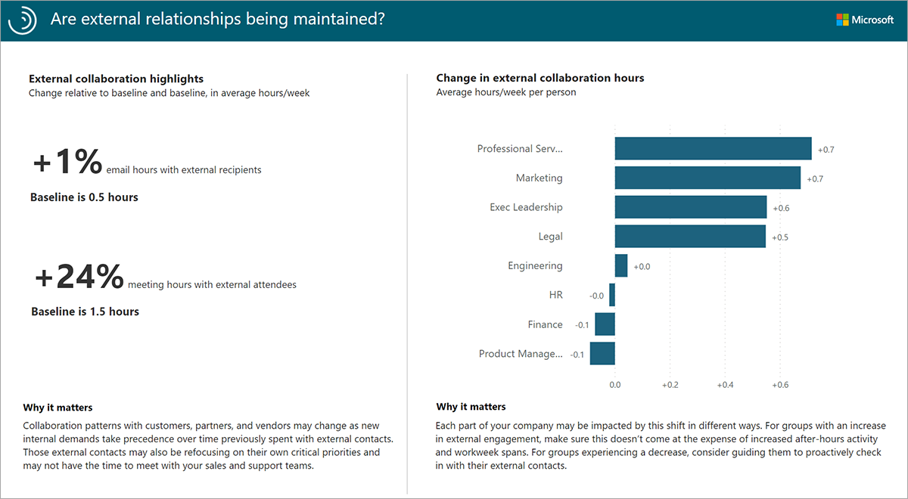
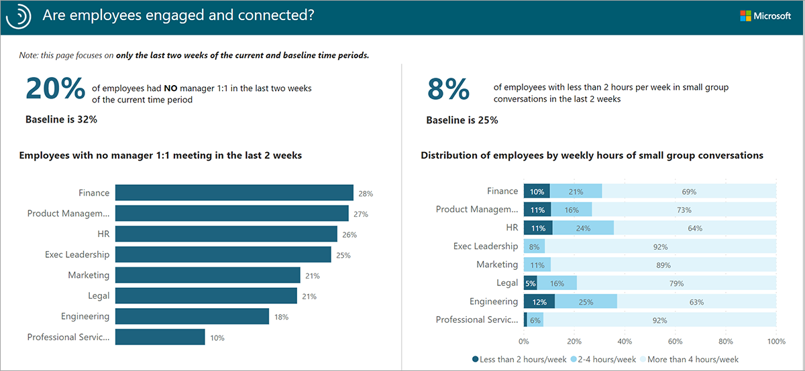
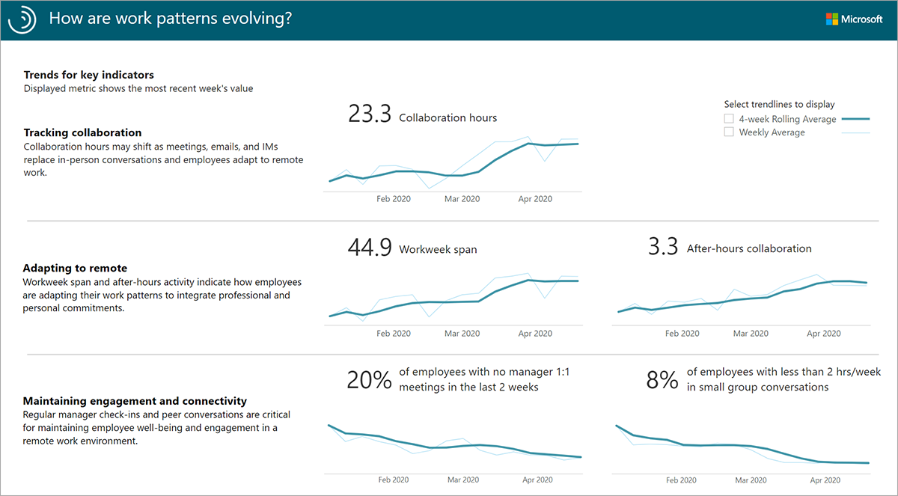

The Business continuity Power BI template provides a quick and easy way to understand how teams and employees have been impacted by business shifts.

So how does it work? Each report page provides insights into one of the themes laid out on the introduction page. Dynamic filtering and embedded guidance empower users to uncover actionable insights quickly:
 
- Filtering data by the change in the amount of collaboration enables analysts to drill down to groups in the organization that are most impacted.
- Broader contextual guidance within each page helps users ground their findings in a business context.

## The Introduction page

The Introduction page of the report helps set up the context around what questions the Business continuity Dashboard will address, as well as why it matters. 

The Business continuity Dashboard is often converted into a PDF and distributed within a company, so this Introduction page helps set the stage for dashboard recipients who are unfamiliar with insights generated from Workplace Analytics.

### Report: How are collaboration activities changing?

The *Collaboration activity report* shows how collaboration patterns are changing in response to shifting work patterns, and which tools people are substituting for in-person interactions.

- The chart on the left shows the average level of collaboration for the measured employees on a per-employee per-week level. 
- The chart on the right breaks out the change in collaboration between the baseline and current time periods, across your selected organizational attribute

> [!TIP]
> Click any bar in the column chart on the right to filter the timeline chart on the left (this filter is only applied to this report page).
> 

- Increased collaboration can indicate a shift from face-to-face time to digital collaboration. An increase in meetings in particular can indicate a lengthening of work cycles as interactions that once happened informally now have to be scheduled in advance. 
- If collaboration is lower than before, check how the collaboration mix is changing. Is a drop in meetings offset by an increase in emails and chats? If so, it may be that activities that previously required a meeting are shifting to a mix of meetings, email, calls, and chats.
- Decreased collaboration that continues to stay low across all channels can indicate challenges transitioning to virtual work. Examples of underlying causes are poor connectivity, discomfort with remote meetings, lack of familiarity with tools, and the inability to take work home.
- Ensure teams are getting support to balance work and life. For teams with low virtual collaboration, check in on their remote work experience to identify specific challenges. It may be helpful to share remote work best practices with the team as part of a live discussion.

### Report: What are the impacts of work-life integration? Part 1

Part 1 of the *Work-life integration report* helps you determine the share of employees whose collaboration time and work week span have increased or decreased by at least 0, 4, or 8 hours per week.

- The percentages at the top of the page show the share of employees in the population with an increase or decrease in collaboration hours and work week span at or above the selected number of hours (4+ hours a week in the above example).
- The chart on the left shows the share of employees by group with the selected change in collaboration hours. In the example above, collaboration hours decreased 4+ hours for 11% of Legal and increased by 4+ hours for 42% of Legal.
- The chart on the right shows the share of employees by group with the selected change in work week span hours. In the example above, work week span decreased by 4+ hours for 14% of Professional Services and increased by 4+ hours for 34% of Professional Services. 

> [!TIP]
> 
> Use the hours-per-week drop-down menu at the top of each pane to adjust the desired collaboration and work week sp an hours value comparison points to at least zero, two, or four hours per week.
> 

- If you see team collaboration patterns revert to near-normal levels, employees may still be impacted due to managing work demands with family or community, technology-related blockers, or prioritizing non-collaborative work to make the most of decreased connectivity. 
- Workweek spans can change depending on how employees adapt to remote work and how they use increased flexibility to accommodate the needs of family or community. For teams accustomed to working in the same location and with the same working hours, increased flexibility may cause some friction. 
- Low workweek spans do not necessarily indicate lower productivity or less time working – rather, employees may be handling collaborative activity in fewer hours, and performing focused work outside of that window.
- If some employees are sending messages early or late in the day, and others are sticking to their prior schedules, it may be valuable for teams to align their expectations on how “after-hours” messages should be handled, and how quickly to respond or expect a response. 

### Report: What are the impacts of work-life integration? Part 2

Part 2 of the *Work-life integration report* shows the share of employees whose after-hours activity has increased or decreased by more than 0, 2, or 4 hours. You can also assess activity by time of day for each collaboration channel to understand how the workday is changing.

- The chart on the left shows the share of employees by group for the selected change in after-hours. In the example above, after-hours activity decreased by more than 2 hours for 14% of Professional Services and increased by more than 2 hours for 8% of Professional Services.
- The chart on the right shows how activity for each communication mode is distributed across the day, along with a note on the change in both the 8am – 5pm change in activity and the change in activity outside the 8am – 5pm work hours.

> [!TIP]
> Use the drop-down menu at the top of the pane to adjust the desired after-hours value comparison point to more than zero, two, or four hours per week.
>

- For employees adapting to remote work, “work” and “life” are less likely to be separated by clear time bounds. Increasing after-hours collaboration can indicate employees are balancing work and non-work obligations. It can also signal employees are becoming overloaded, and don’t have time to complete tasks during the workday.
- As more collaboration shifts to chats and emails, messages may come in at all hours. Employees on the receiving end may be compelled to respond immediately. Teams seeing a significant volume of emails and chats shifting into after-hours could benefit from having a shared conversation around new norms and expectations for their workday.
- Teams that see larger increases or decreases in after-hours activity are good candidates for investigating activities that may be driving the change. It's a good practice to validate with employees how it impacts their well-being and ability to work effectively.
- For customers with MyAnalytics, Focus Plans can empower employees to take better control of their working hours to reduce the workload that spills into after-hours.

### Report: Are external relationships being maintained?

The *External relationships report* quantifies changes in communication with customers, partners, and others outside the organization. 

- The metrics on the left provide a consolidated view of email and meeting hours changes compared to the baseline time-period.
- The chart on the right drills down by group within the organization to see how engagement with external customers and partners has changed since the baseline time-period. In the example above, the average weekly external collaboration hours for marketing employees has increased 0.7 hours.

Teams with significant decreases in external collaboration may be struggling to maintain connectivity with customers. When companies respond to business shifts, they often become more inwardly focused. It may be difficult for sales teams to schedule time with customers that are focusing on other priorities. On the other hand, functions that provide support to customers could see an uptick in customer external collaboration.

> [!NOTE]
> External collaboration hours include collaboration with personal domains (gmail.com, yahoo.com, etc.). To exclude personal domains, customize the “external email hours” and “external meeting hours” metrics in the query.
> 

### Report: Are employees engaged and connected?

The *Engagement and connectivity report* helps identify areas that may be struggling with employee connectivity and community by showing recent manager one-on-one and small group conversation activity. 

- The chart on the left shows the share of employees by group with no manager one-on-one meetings.  
- The chart on the right shows the amount of time in small group conversations (8 people or less) employees are partaking in on a weekly basis.

> [!NOTE]
> These metrics reflect the last two weeks of the current time frame only. 
> 

- Manager one-on-one meetings are an indicator of support and development opportunities. In a remote work environment, it is important for managers to check in with employees on a regular basis to see how they are doing, identify barriers, and ensure workloads are manageable. Such check-ins demonstrate compassion and empathy and establish trust. 

- Small group conversations in meetings, calls, and chats can reduce feelings of isolation (while email may push a workstream, it is impersonal and does not promote engaged connectivity). Employees experiencing low connectivity (< 2 hours per week) may be struggling to adapt to virtual work and may need more training and assistance. 
- Both visuals in this report can be used together to form a story. For example, employees with low connectivity and limited manager one-on-one sessions are likely at the highest risk of isolation and disengagement.
- Customers with MyAnalytics may benefit from Manager Nudges that help remind managers to take actions that foster a sense of community and engagement across their teams.

Engage with teams that are doing well in terms of manager one-on-ones and small group conversations and share their best practices with the broader organization. Encourage managers to check on well-being, connectivity, and workload in one-on-ones, and encourage team members to connect in virtual meetings, calls and chats to avoid isolation.

### Report: How are work patterns evolving?

The *Evolving work patterns report* shows how key collaboration behaviors have been changing over time for the measured population in three categories: *Tracking collaboration*, *Adapting to remote*, and *Maintaining engagement and connectivity*.

This view shows population level metrics over time, including:

- Collaboration hours
- Workweek span
- After-hours collaboration
- Percent of employees with no manager one-on-one meetings in the last 2 weeks
- Percent of employees with less than 2 hours a week in small group conversations

Use this view to spot trends against the backdrop of 4-week rolling average data, to see changes in the metrics themselves, and changes in the directionality of trend lines.
As employees acclimate to new ways of working, the trend lines should begin to stabilize.  If employees return to the office, use these trend lines to track the new normal. As managers connect and provide guidance, and facilitate community continuity, the percentages in the Maintaining engagement and connectivity category should trend downward.
