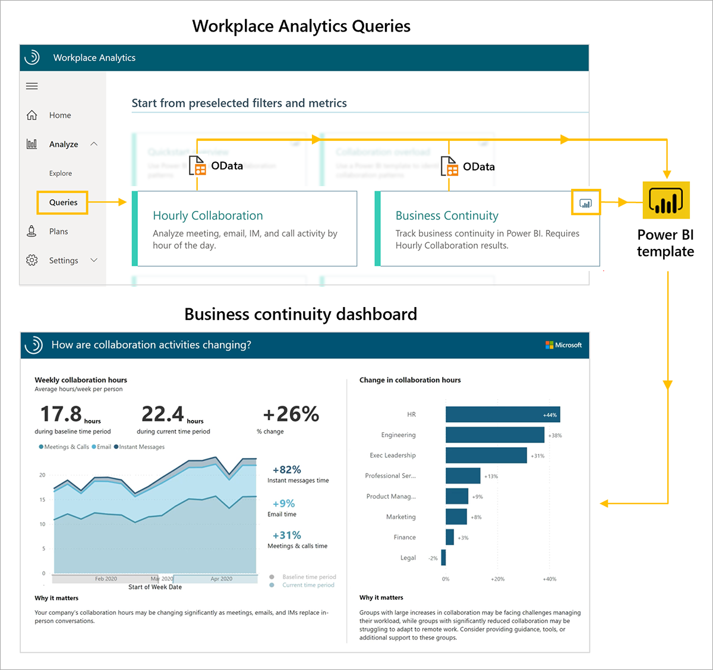
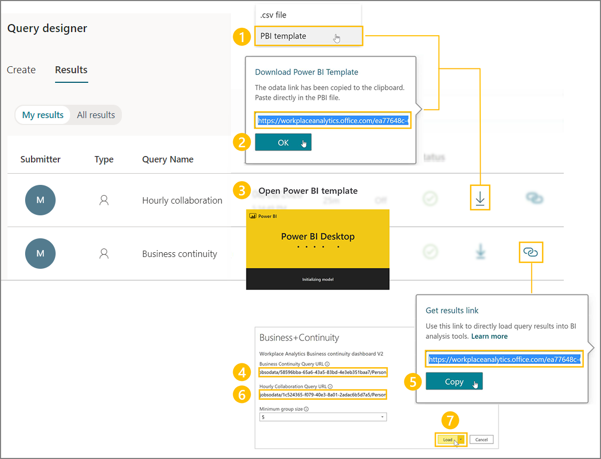
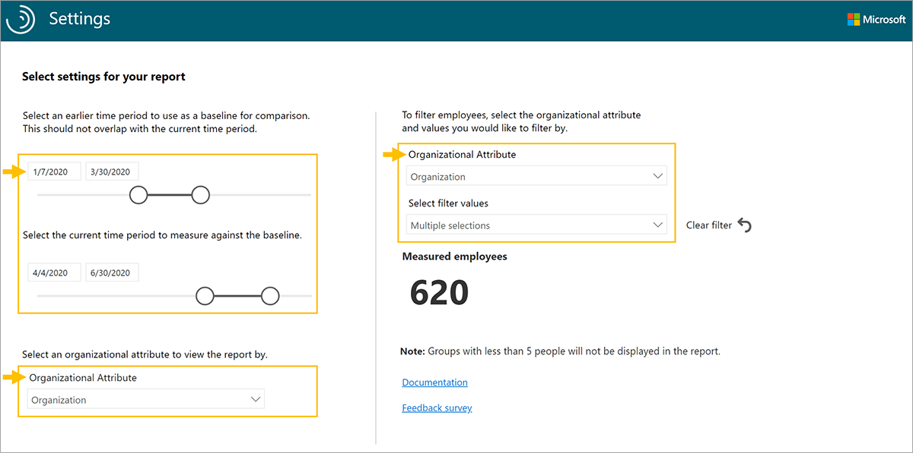

The Business continuity dashboard uses a prebuilt Power BI template populated by output (OData) from two Workplace Analytics queries, Business Continuity and Hourly Collaboration.

To set up the Business continuity dashboard, you:

1. Run the Business Continuity and Hourly Collaboration queries.
2. Download the Business Continuity Power BI (PBI) template and load the query output.
3. Select your settings in the Business continuity dashboard.

After the data is loaded the dashboard reports will generate automatically, resulting in multiple pages of Workplace Analytics insights, called reports. These reports can empower your organization to better support employees in new ways of working. 

**1. Run the Business Continuity and Hourly Collaboration queries**. The Business continuity dashboard reports require output from two Workplace Analytics queries. On the Queries page, under **Start from preselected filters and metrics**, begin by running the Business continuity and Hourly Collaboration queries.

In the upper right corner of the Business Continuity query card, you'll notice a Power BI icon. This indicates there's a download option for a Power BI template that you can use to generate the reports in the dashboard.

> [!IMPORTANT]
> 
> Be sure to download and install the most recent version of Power BI to avoid issues setting up and loading data into the dashboard.
> 

As you run each query, give it a descriptive name and select your date range and meeting/attendee exclusions. To create a report that updates weekly, you can choose to enable **Auto-refresh** for each query. 

Some tips to keep in mind when running the queries:

- For best results, select **Last 1 year** so that you include the time period before and after any shifts in work patterns
- Under **Select metrics**, keep all preselected metrics (don’t delete any). The dashboard uses them to create the charts, graphs, and insights in the report pages. 
- Under **Select filters**, select **Active only** for "Which measured employees do you want to include?" Optionally, use additional filters to further refine the population for your analysis. 
- Under **Organizational data**, leave the default attributes (Organization, LevelDesignation, TimeZone) selected. Optionally, select additional attributes that you'd like to include in the reports. 
- Use these same parameters and filters in both the Business continuity and Hourly collaboration queries.

**2. Download the Business Continuity Power BI template and load the query output**. After the queries have finished running, you can access the Business Continuity Power BI template and data through the OData URL by selecting the **Results** tab on the Queries page.

To load the data into the Business Continuity Power BI template:

1. Download the Power BI template from the Business Continuity query result.
2. When prompted that the OData link has been copied, select **OK**.
3. Open the downloaded Power BI template.
4. In Power BI, paste the Business Continuity OData link into the Business Continuity Query URL field.
5. Return to your results in Workplace Analytics. In the Hourly Collaboration result, copy the OData link to the Hourly Collaboration output.
6. Return to Power BI and paste the Hourly Collaboration OData link into the Hourly Collaboration Query URL field.
7. Select **Load** to load the data.

The dashboard visualizations on each page of the report populates with Workplace Analytics data, starting with the Settings page. 

**3. Select your settings in the Business continuity dashboard**. After you have loaded the data and the report is generated in Power BI, the dashboard opens to the **Settings** page, where you have the option to adjust some settings for your analysis.

- Select time periods for comparison. These are the time periods you’ll use to compare how workplace behavior has changed. The baseline period contains the collaboration you'll compare the current time period against.
- Select from the list of organizational attributes you chose to include in your query. Default attributes are **Organization**, **LevelDesignation** and **TimeZone**, but the list will include any organizational attributes selected when queries were run.
- To filter the reports further, select any of the available organizational attributes and filter values for the data you would like to include.

After you've selected the settings for the group you'd like to analyze, you can start using the dashboard. The populated Business continuity dashboard includes report pages on changing collaboration, work-life integration, external relationships, engagement and connectivity, evolving work patterns, and areas of improvement. 

For a more detailed list of step-by-step instructions on Business continuity dashboard setup and troubleshooting see the link below under **Learn more**. There you'll find template updates, setup instructions with video, things to remember when sharing the dashboard, FAQs, errors and troubleshooting, and support.

## Learn more

- [Business continuity dashboard](/Workplace-Analytics/tutorials/power-bi-bc?azure-portal=true)
