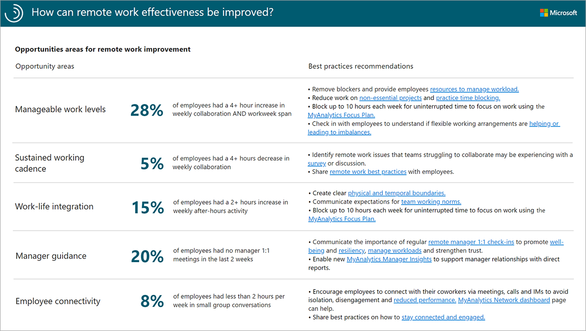
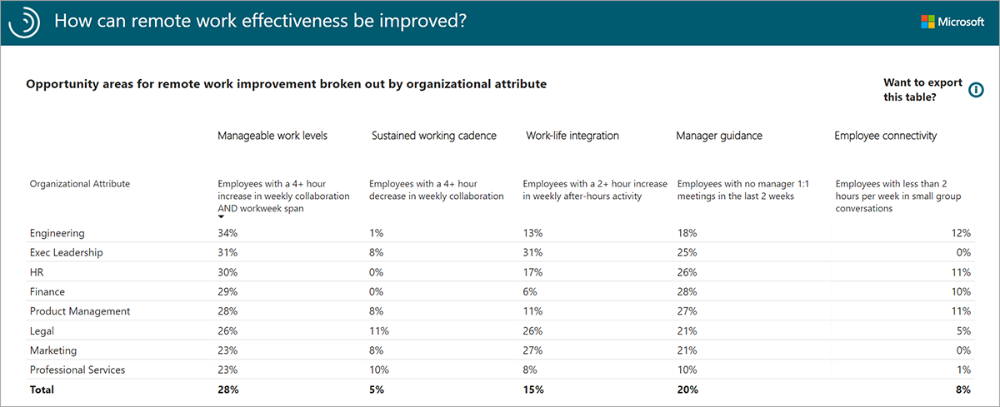
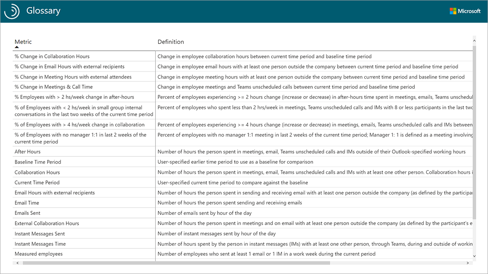

The Business continuity Power BI template provides quick insight on opportunity areas to improve remote work.

### Report: How can remote work effectiveness be improved? View 1

View 1 of the *Areas of improvement report* gives a population-level look at five areas for potential remote work improvement.

**Manageable work levels**: Employees with an increase of 4+ hours in both collaboration hours and workweek span might be experiencing difficulty managing their workloads and might benefit from task prioritization and workload balancing.

**Sustained working cadence**: Employees with a significant decrease in virtual collaboration might not be equipped with the tools (laptop, internet, or VPN) or resources and direction required to get their work done remotely. They might benefit from better tools, training, and guidance.

**Work-life integration**: Employees might find it difficult to create boundaries between work and home when both are taking place in the same environment. Creating team expectations around virtual collaboration norms and sharing best practices on creating boundaries might help maintain wellbeing. 

**Manager guidance**: Regular manager one-on-ones are critical for establishing rapport, creating an environment of empathy and trust, and managing workloads. Employees with regular one-on-ones may see less increase in collaboration hours and workweek span in the shift to  remote work.

**Employee connectivity**: Studies show that remote workers are at a significant risk of isolation. Ensuring peer connectivity through small group conversations increases employee engagement and reduces the risk of isolation.

Opportunities with high percentages of your employee population suggest high impact areas for remote work improvement. The Workplace Analytics metrics selected for each of these areas can indicate potential opportunity but are not definitive.

Use surveys, focus groups, and employee discussions to identify whether the changes in collaboration behaviors are truly indicative of an underlying issue. 

Take a look at the *Best practices recommendations* (on the right side of the report) for training videos, tips, and tool usage recommendations to improve remote work effectiveness.

### Report: How can remote work effectiveness be improved? View 2

View 2 of the *Areas of improvement report* summarizes the key metrics that were identified in the previous report by group.  

- Use the break-outs by organizational attribute in this report to identify pockets of the organization most impacted by the opportunity areas.

- To filter the reports by a different organizational attribute, return to the Settings page and select a new attribute from the dropdown menu. All report pages will automatically group the data by the newly selected attribute.

- Select each column heading to sort the values in the table by decreasing/increasing order. Consider applying the best practice recommendations (on the right side of the previous report) to organizations with high values in each opportunity area.

### Report: Glossary

This final report, the *Glossary*, provides a reference for the metrics and terminology used across the Business continuity Dashboard. 

## Learn more

- [Workplace Analytics metrics](/Workplace-Analytics/use/metric-definitions?azure-portal=true)
- [About the reports](/Workplace-Analytics/tutorials/power-bi-bc#about-the-reports)
- [Workplace Analytics Plans](/Workplace-Analytics/tutorials/solutionsv2-task?azure-portal=true)
- [Article: How Managers Can Support Remote Employees](https://hbr.org/2020/04/how-managers-can-support-remote-employees?ab=hero-subleft-1?azure-portal=true)
