Workplace Analytics provides insights around three key pillars of customer focus: External collaboration, Internal collaboration, and Coaching and onboarding.

> [!div class="centered"]
> 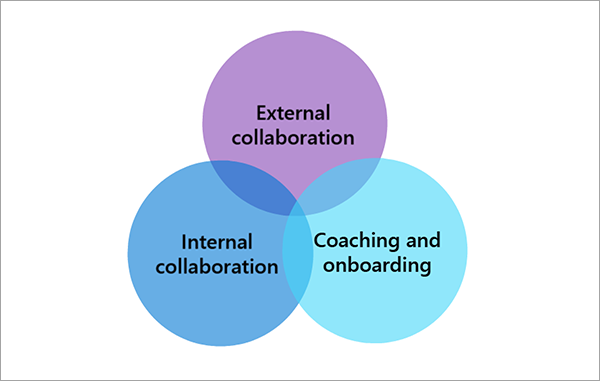

## What questions about customer focus can you answer with Workplace Analytics?

When beginning your customer focus analysis, it is important to know your business priorities and identify business questions to guide your analysis. The following are some examples of questions you might ask for each pillar:

- **External collaboration** - Are sales employees spending the right amount of time with the right customers to effectively drive high-value activities?
- **Internal collaboration** - Are sales employees getting sufficient support from internal teams who can help drive high-value, external activities and spending the minimum time possible in internal processes?
- **Coaching and onboarding** - Are sales employees getting enough empowerment from the management and building the knowledge and skills that can set them up for success?

These are just a few of the questions a Workplace Analytics customer focus analysis can help answer. There are multiple analyses in each category that you can perform to help boost customer focus for sales effectiveness.

## External collaboration

More time spent with the best customer opportunities is key to sales effectiveness. With Workplace Analytics, there are multiple ways to analyze external collaboration to improve customer focus and ensure success.

### External time allocation

**Do employees spend most of their time with customers or other external parties?** With Workplace Analytics, you can analyze internal and external collaboration and email by group to understand who your external-facing employees spend time with.  

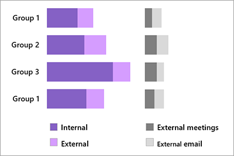

**Why does this matter?** How an employee allocates their time across communication channels, such as meetings and emails, can indicate communication preference and provide visibility into how customer relationships are being maintained.

### Account portfolio management

**How many accounts do external-facing employees actually talk to?** Sales employees often manage a portfolio of accounts. With Workplace Analytics, you can identify the number of accounts low, medium, and high performers connect with to understand how many accounts your most effective employees manage.  

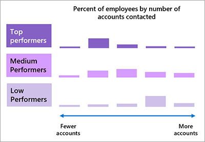

**Why does this matter?** The number of accounts employees are connected to can indicate how employees are managing their territory, and are maintaining their accounts. This can help guide resource and territory planning.

### Teaming model

**How do employees team up to ensure success and value?** With Workplace Analytics, you can understand how the best sales teams are structured to help ensure team success.

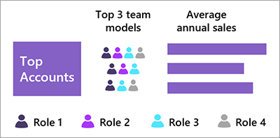

**Why does this matter?** Having the right team on each account enables effective communication and productive internal collaboration and can show how sales employees in different roles and levels work together to generate sales and maintain relationships.

### External contact analysis

**How many sales contacts do employees talk to, and are they the right contacts?** You can use CRM data to identify the number of contacts employees have by contact role to determine if sales employees are connecting with the right people.

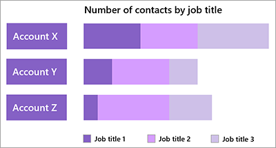

**Why does this matter?** Locating and maintaining relationships with the right contacts, based on the nature of the product or service, leads to more effective sales conversations.

> [!NOTE]
> The External contact analysis described above requires detailed CRM and customer contact data. To perform this analysis, additional data extraction capabilities are required.

### CRM augmentation

**Is our CRM database up-to-date?** You can identify the number of contacts from your CRM database by contact type to ensure your CRM is up-to-date.

**Why does this matter?** An up-to-date CRM database is the foundation for effective sales planning, sales projections, and coaching conversations. It is critical for smooth operations and keeping the team informed.

> [!NOTE]
> The CRM augmentation analysis described above requires detailed CRM and customer contact data. To perform this analysis, additional data extraction capabilities are required.

## Internal collaboration

Getting the right internal support without unnecessary internal hurdles allows external-facing employees to focus and spend more time with customers and partners. Visibility into internal collaboration empowers leaders to help employees reduce unnecessary collaboration and focus on customers. With Workplace Analytics, there are multiple ways to analyze internal collaboration.

### Cross-team collaboration

**How are teams collaborating on internal activities?** With Workplace Analytics, you can learn how much time sales teams invest in collaborating with other internal organizations and assess whether they have the right allocation of internal connections.

**Why does this matter?** The proportion of time internal employees spend collaborating with each other determines how much time is left to connect with customers. Effective internal collaboration provides more time for these activities and maintains internal support and connections.

### Internal meeting culture

**What do meeting patterns look like for internal activities?** With Workplace Analytics, you can see time spent in meetings by length or number of attendees to learn if employees are spending too much time in unnecessarily long and large meetings.

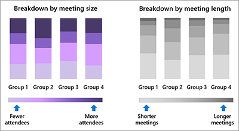

**Why does this matter?** Meetings are a significant part of collaboration. Meetings of the right size and length promote efficient communication and accelerate decision making. Long and large internal meetings can drain employee energy and limit time for external activities.

### Topic analysis

**How much time is allocated to specific meeting topics?** With Workplace Analytics, you can analyze the time employee groups allocate to meetings by topic category, and find opportunities to reduce unnecessary collaboration.

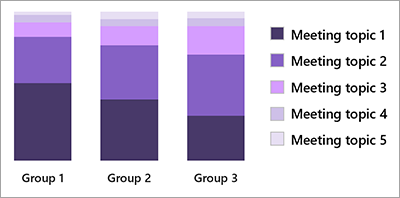

**Why does this matter?** Employees spend time on many business topics. How they allocate time can help identify overly complex interactions. Removing unnecessary collaboration so employees can spend time in the most important activities can improve employee productivity and engagement.

### Process analysis

**How are employees spending time in a specific process?** You can use email and meeting subject line keywords in Workplace Analytics to analyze collaboration hours on internal processes over time. This information helps you determine if specific internal processes can be streamlined.

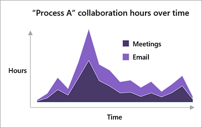

**Why does this matter?** Streamlining lengthy or redundant internal processes can free up employee time and leave more time for external activities such as connecting with customers.

## Coaching and onboarding

Knowledge and skills are essential for sales success. A robust onboarding program and regular coaching are key components of sales effectiveness. With Workplace Analytics, you can analyze coaching and onboarding to improve customer focus.

### Manager coaching one-on-one

**Do employees get enough one-on-one time with their manager?** With Workplace Analytics, you can look at manager one-on-one time or meeting frequency by group to determine if employees are getting enough one-on-one time with their manager.

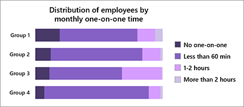

**Why does this matter?** Regular check-ins between employees and their managers play an important role in driving employee engagement. Research shows these meetings provide the most value when they take place at least 60 minutes every month and occur at least once every other week.

> [!NOTE]
> A similar analysis is available in the Workplace Analytics Ways of working assessment dashboard.

### Coaching and engagement

**How does manager one-on-one coaching correlate with employee engagement?** By using Workplace Analytics, you can analyze the impact of one-on-one time on employee engagement scores and other behaviors, such as the number of meaningful connections to internal individuals, or time in external collaboration.

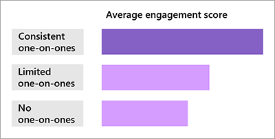

**Why does this matter?** Effective one-on-one coaching helps employees prioritize higher-value tasks and provides them with resources and tips on how to expand their networks and accelerate deals.

### Coaching and performance

**How do coaching behaviors vary by employee performance?** With Workplace Analytics, you can analyze the difference in coaching time received by performance level.

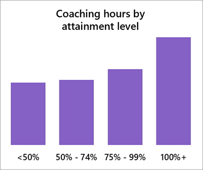

**Why does this matter?** Understanding the relationship between manager coaching and employee performance can provide insight for future manager training and coaching initiatives.

### Onboarding and coaching time

**Do new hires receive enough coaching time from their managers?** You can use Workplace Analytics to analyze one-on-one time by tenure and understand if new hires are getting the coaching time they need.

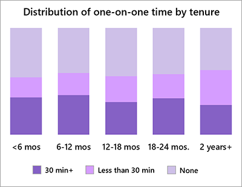

**Why does this matter?** Effective coaching during onboarding can help get new hires up to speed with seasoned hires much more quickly and plays a critical role in enhancing employee engagement and performance.

### Onboarding and collaboration

**From a collaboration perspective, how long does it take to onboard a new hire?** With Workplace Analytics, you can track collaboration metrics by quota attainment level to understand what it takes to fully onboard a new hire.

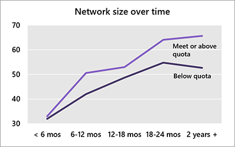

**Why does this matter?** Successful onboarding extends beyond new hire training. Exploring different collaboration behaviors between top performers and other employees can reveal factors that lead to faster and more effective onboarding.

## Know your priorities for customer focus

Identifying the core business issues and defining your business questions are key to an impactful project with insights-driven data analysis. Use the business questions introduced in this unit to begin team conversations on which priorities to address.

> [!NOTE]
> See the Workplace Analytics Customer Focus Playbook for more detailed information on the analyses presented in this module. To access the playbook, use the Resource playbooks link in **Learn more**, or do the following in Workplace Analytics.

To access the Customer Focus Playbook from Workplace Analytics:

1. Select the **Help** (?) icon.
1. Select **Resource playbooks**.
1. Select the **Workplace Analytics Customer Focus Playbook** to download it.

In the next unit, you'll learn how to scope your analysis, use the business questions you've identified, understand the data requirements to perform each analysis, and understand how you can track and manage the results to create value.

## Learn more

- [Workplace Analytics glossary](/workplace-analytics/use/glossary?azure-portal=true)
- [Workplace Analytics metrics](/workplace-analytics/use/metric-definitions?azure-portal=true)
- [Learn about the Ways of working assessment](/workplace-analytics/tutorials/power-bi-collab-assess?azure-portal=true)
- [Workplace Analytics Resource playbooks](/workplace-analytics/use/playbooks?azure-portal=true)
