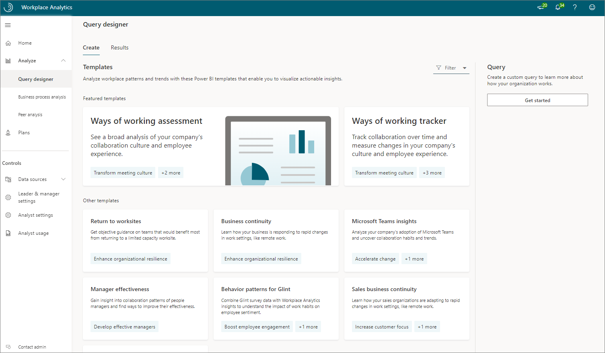
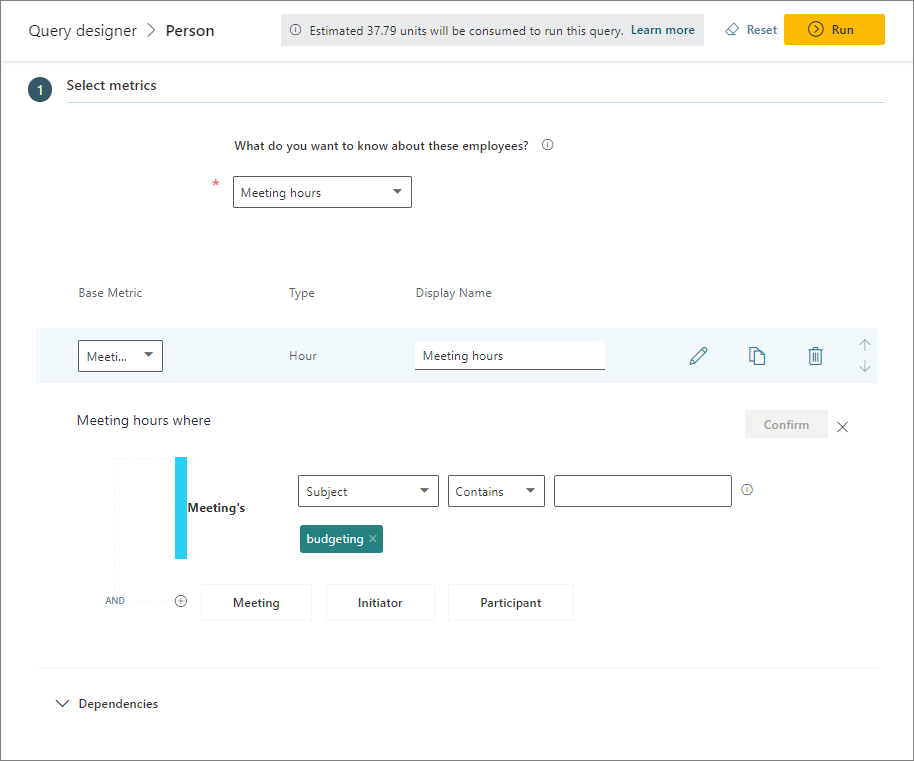
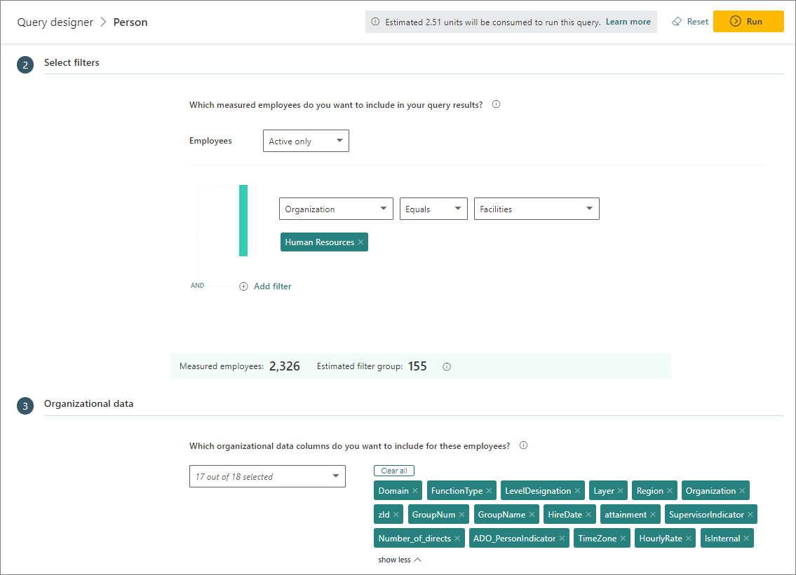
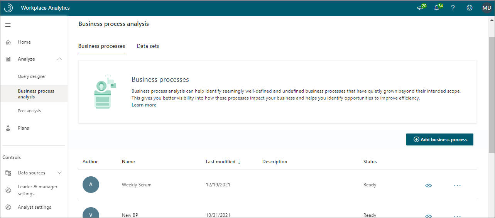
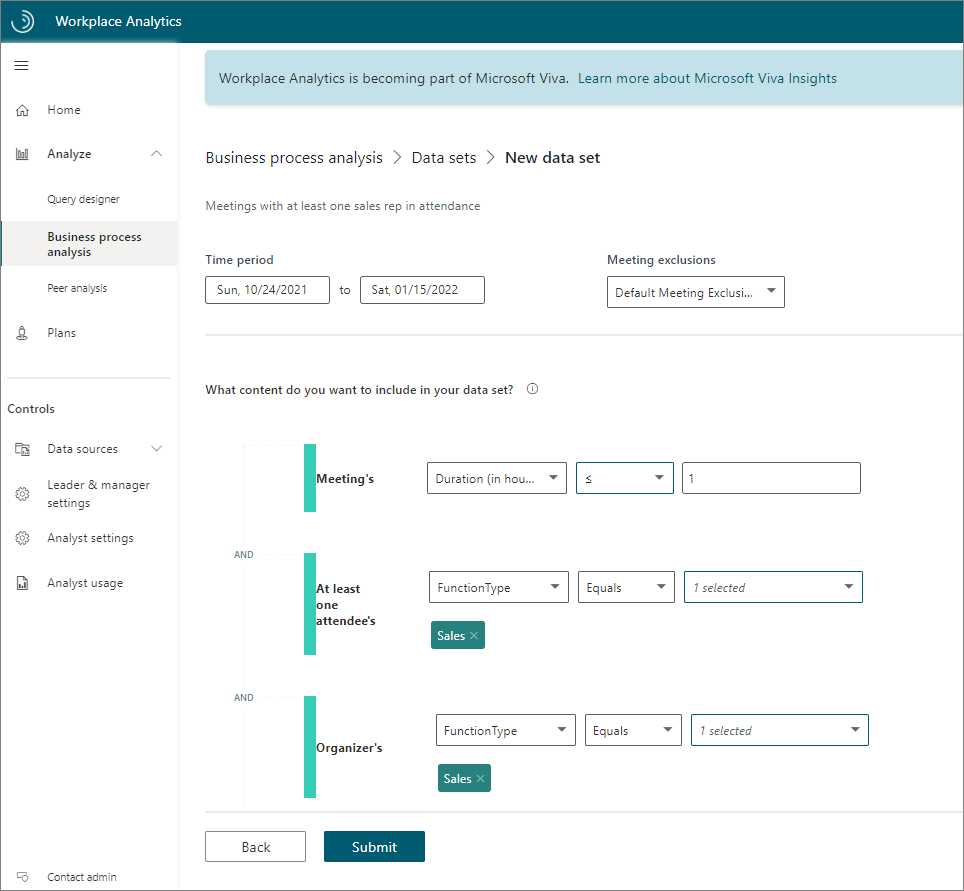
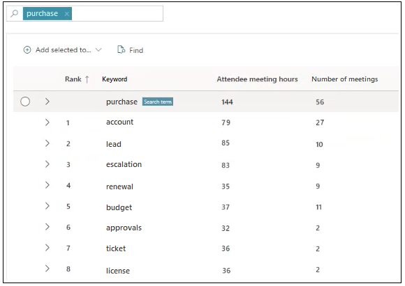
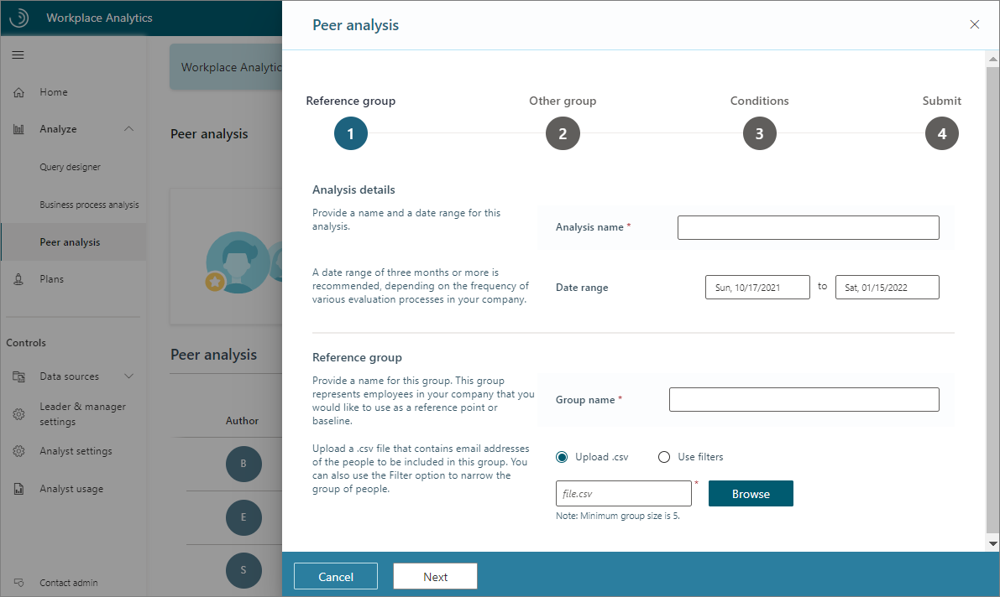
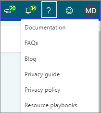

You can customize analysis in a multiple of ways with Workplace Analytics.

## Workplace Analytics Analyze page

In addition to the business outcomes and associated insights on the Home page, there are two main ways of analyzing data in Workplace Analytics: Peer analysis and Query designer.

### Query designer

In **Templates**, you can select from a list of predefined templates with preselected filters and metrics. These are a great starting point for specific analysis, yet give you the flexibility to add new metrics and customize them, as needed.

Most of the templates are designed for Power BI with a download option to set up automatically refreshed reports in Power BI through an OData link. The setup for the predefined templates vary depending on what's required for setting up its Power BI dashboard. Select the template you'd like to use in [Power BI dashboards](/viva/insights/tutorials/power-bi-intro#power-bi-dashboards) for more details about setup and how to use them in Power BI.

**Queries** in the Query designer give you access to row-level data and customizable metrics. You can import the row-level data into other analysis tools to create custom analyses, models, and dashboards.

The most common query types include:

* **Person query** - Extract person metrics for analysis of aggregated **employee** data.
* **Meeting query** - Extract meeting-related metrics for analysis of aggregated **meeting** data.

Queries report the same underlying data, but the type of query determines the structure of the output. For example, each observation in a Person query represents a person, their measured collaboration, and their descriptive attributes. Each observation in a Meeting query represents a meeting, its attributes, and the total collaboration associated with the meeting attendees.

### Query steps

1. Open the [Query designer](https://workplaceanalytics.office.com/Analyze/QueryDesigner/NewQuery).
2. Select **Get started** under **Query**, and then select the query type, such as **Person** for this example.
3. Select **Start a new query**, and then select **Set up query**.
4. Enter a name and description for the query.
5. Select the **Group by** timeframe (day, week, or month), the applicable **Time period**, and if you want the query to **Auto-refresh**.
6. In **Exclusions**, select the meeting and attendee exclusions to exclude any irrelevant calendar activity from this analysis.

   

7. In **Select metrics**, select what metrics you want to include from the list. You can also customize one or more metrics by using filters. For example, the following shows how to filter for meeting hours with the word "budgeting" in the subject line.

   

8. In **Select filters**, you can change the scope of the data you'd like to analyze by limiting it to active employees and applying additional filters to organizational attributes. In this view, we've applied a filter to look at the Human Resources group at Contoso. (Active employees are defined as employees who sent at least one email or Teams chat in a given week.)

   

9. In **Organizational data**, select which organizational attributes to include in your output, and then select **Run** (top right) to run the query.
10. In **Query designer** > **Results**, you can select to view only your results (My results) or all query results. Select the **Download** icon to download a query's results as a .csv file or to copy the OData link for loading the data into other business intelligence apps (such as Power BI). For queries that show the **Visualization** icon, you can also visualize the results directly from this page.

### Business process analysis

Business process analysis can help you identify seemingly well-defined and undefined business processes that have quietly grown beyond their intended scope. This gives you better visibility into how these processes impact your business and helps you identify opportunities to improve efficiency.

To analyze a business process:

1. [Define a dataset](#define-a-dataset) that only analyzes the data that's relevant, such as organizationally and geographically.
2. [Define a business process](#define-a-business-process) to analyze within the dataset that you defined in the preceding step.
3. [Analyze a business process](#analyze-a-business-process) through a query where you select the business process as a parameter.

#### Define a dataset

Before you can analyze a business process, you need to create a dataset for it. Use the Query designer to create a query that includes only the organizational data required for this analysis. For example, the following steps define a query for meetings of a particular length that were attended by at least one sales representative.

1. Open [Business process analysis](https://workplaceanalytics.office.com/Analyze/BusinessProcessAnalysis/BusinessProcesses).
2. Select **Data sets**, and then select **Add data set**.
3. In **New data set**, enter a name (for example, Sales data) and a description, and then select **Continue**.
4. For **Time period**, select the start and end dates. For this example, all meetings that occurred outside of this time period are excluded from the dataset.
5. For **Meeting exclusions**, specify a meeting exclusion rule or accept the default.
6. For **Which meetings do you want to include in your query results**, define the filters to scope the dataset for the analysis. For example, to filter out specific meetings, select **Add filter**, and then select **Meeting** with a **Duration** of less than or equal to one hour. Or specify the duration you want to analyze or don't define this filter if you want to include all meeting hours regardless of their duration.
7. Select **Attendee**, and then select the group (such as Sales) for the meeting attendees.
8. Select **Organizer**, and then select the group (such as Sales) for the meeting organizer.

   

9. Select **Submit** to create the dataset that matches these criteria (and no other data). The process time for the dataset varies depending on its size.

#### Define a business process

Before you can analyze a business process, you need to define it. You do this by assembling a list of keywords that are typically found in the dataset that are associated with the process you want to analyze, such as in meeting subject lines. This list defines the business-process filter.

>[!NOTE]
>Currently, you can only use English keywords for defining a business process, even when your instance of Workplace Analytics is in a language other than English.

1. Open [**Business process analysis**](https://workplaceanalytics.office.com/Analyze/BusinessProcessAnalysis/BusinessProcesses).
2. Select **Add business process**.
3. In **New Business process**, enter a name and an optional description for it, such as **Sales interactions**, and then select **Continue**.
4. In **Data set**, select what to use for this analysis.
5. For **Content type**, keep **Meetings** selected, and then select **Continue**.
6. In **Enter a search term**, enter a keyword that represents a common term about this business process. The system then uses this to show you related words found in the dataset. For example, the following shows words related to **purchase**.

   

7. Optionally, you can sort the keyword columns by selecting a header in the table, such as **Rank**.

   >[!NOTE]
   >The **Rank** column indicates relevance ranking. In the preceding image, a rank of **1** indicates the "account" keyword is the most relevant to the specified search term "purchase," which is similar to the ranking in a browser search.

8. Scan the words in the **Keyword** column to find what closely relates to this business process, such as "Sales activities." To confirm relevance, do the following:

   * **Find related keywords** - Expand the keyword by selecting the **>** (greater-than) sign to see multiple-word phrases that include it. For each keyword, you can see the **Number of meetings** with this word in the subject line and the amount of time spent in those meetings (Attendee meeting hours).
   * **View the meeting metadata** - Select a keyword to see a list of meetings with this word in the subject line, the number of attendees, and whether the meeting is recurring. If these meetings are relevant, select them.

9. After you decide that a keyword is relevant, hover your cursor over the keyword's row to see and select the checkbox to the left of the word. Then select **Add selected to**, and then select **Included keywords**.
10. After you include a term, you'll see it in the **Included keywords** list to the right of the results table.
11. Optionally, you can explicitly exclude terms from the keyword list by repeating these steps and select **Excluded keywords** in the previous step.

    >[!NOTE]
    >As you add keywords, the system becomes more context-aware and will automatically start uncovering more content that's relevant to the keywords that you've added and will show them in the results list.

12. You might already know the keywords your company uses for a business process. To manually enter them, select **Included keywords** > **Add**, and then enter the keyword (or multiple words separated with a semicolon), and then select **Enter**. Similarly, for keywords you want to explicitly exclude, use the **Excluded keywords** option.
13. Confirm the totals at the top of the page that reflect meeting hours and meetings in the entire dataset. The smaller totals reflect the number of meeting hours and meetings in the data that are associated with the currently selected keywords. These smaller numbers change as you add or delete keywords. If you are familiar with the hiring process, these numbers could indicate that your defined keywords are too narrow (too few meetings and hours) or too broad (too many), after which you can adjust accordingly by adding or deleting keywords.

    >[!NOTE]
    >If you're not finished, but want to save what you've entered so far, select **Save draft** to return later and resume where you left off.

14. Select **Submit**, which is only available when at least one keyword is listed in **Included Keywords**, to start the processing. You'll see **In progress** status during this phase.

#### Analyze a business process

You analyze real-world business processes by creating a query with metrics that filter by a digital business process  to focus it on a set of collaboration activities, such as relevant meetings.

You can filter by business processes wherever the **Meeting** is available as a filter or a customizable metric. For example, the following steps use **Meeting** as an available filter.

1. Open the [Query designer](https://workplaceanalytics.office.com/Analyze/QueryDesigner/NewQuery).
2. Select **Get started** under **Query**, and then select **Meeting** > **Next**.
3. Select **Set up query** and enter the initial information about it, such as a name, time period, and which exclusions to use.
4. In **Select filters**, select **Meeting**.
5. Select **Business process**, and then select an available business process. Only business processes with a **Ready** status are available.
6. In **Organizational data**, select **BusinessProcesses** as an attribute to include in the query.
7. Finish defining your query, and then select **Run**.

#### Interpret the results

The meeting query results will include a **BusinessProcesses** column where each meeting row that matches the business process name will show it. If multiple business processes match a single meeting, this column will contain a comma-delimited list of matched business process names for the meeting.

For general information about query results, see [View, download, and export query results](/viva/insights/use/view-download-and-export-query-results).

### Peer analysis

You can use **Peer analysis** to compare the collaboration behaviors of two different groups within your organization. This can help you understand how two teams in the same function work differently, or how work-life activities differ across the organization.

To create peer analysis:

1. Open [Peer analysis in Workplace Analytics](https://workplaceanalytics.office.com/Analyze/PeerAnalysis).
2. Select **New analysis**, select your **Reference group**, enter a name and date range for this analysis, and then enter a name for the reference group.
3. Identify the group members, as follows:

   * **Upload a .csv file** with the email addresses of the people you want to include in the reference group.
   * **Use filters** to filter by the HR (organizational) attributes in the uploaded .csv file (with the group's email addresses) or by applying filters to the organizational data attributes within Workplace Analytics.

4. Choose the **Other group** as the comparison group and enter a name for that group.
5. Identify the group members, as follows:

   * **Upload a .csv file** with the email addresses of the people you want to include in the other (comparison) group.
   * **Use filters** to filter by the HR (organizational) attributes in the uploaded .csv file (with the group's email addresses) or by applying filters to the organizational data attributes within Workplace Analytics.

6. Apply **Conditions** (optional) with filters that specify the attributes that should be similar for comparing the groups. For example, to compare Reference group's managers to the Other group's managers, add a conditional filter to include only managers in the output.
7. Select **Submit**. When the analysis is ready, select the **View** (eye) icon to see the results on the **Peer analysis** page.

**Peer analysis** results include the date range, a **Highlights** section with differences in the three most variant metrics between the groups, and charts that compare raw averages for multiple metrics.

### Peer analysis example scenario

You would like to understand the difference in collaboration patterns between the corporate finance office and regional finance offices at Contoso. In **Peer analysis**, create a new analysis with **Corporate finance** as the **Reference group**, and **Regional finance groups** as the **Other group**, and then select **Submit**.

The results show that Corporate finance employees have 22 percent larger internal networks, but their external network connections are 17 percent smaller.

## Plans

You can gain a lot of information about how employees in your organization get work done from the other Analyze features. With **Plans**, you can transform these insights into actions.

Enrollment in a Plan requires that an employee has access to Personal insights in Viva Insights. A Plan combines the team goal setting and tracking with useful suggestions through their personal insights with Viva Insights to help them shift their ways of working.

The following plans are currently available:

* **Focus plan** - Helps participants get more time to do deep-dive work and reclaim their calendar for work that matters most.
* **Collaboration plan** - Helps participants reduce the number of excessive meetings that the group schedules.
* **Wellbeing plan** - Helps participants unwind and protect their personal time by disconnecting outside of work.
* **Seller success plan** - Helps participants prioritize time, increase network quality and size, and connect with the right roles.

For each plan type, you can select **Analyze** and get answers to questions involving relevant metrics. Then select **Start plan** to create, manage, and track a specifically targeted plan for employees in your organization.

Plans help give managers and employees visibility into how they are spending time to increase their focus and improve collaboration and wellbeing.

## Data sources

Workplace Analytics enables analysts and admins to check the quality of the data sources.

In **Data sources**, view the Microsoft 365 collaboration data for your measured population over time. Use this view to identify any dates or date ranges you should include or exclude from your analysis, such as scheduled holidays.

You can also assess the quality and completeness (coverage) of the uploaded organizational data (HR attributes) for your measured population as the following shows.

Additionally, if your admin has uploaded CRM data, you can also confirm the quality of join coverage (the percentage of CRM contact and sales assignment data associated with CRM accounts).

### Example scenario for Data sources

You want a high-level look at some fourth-quarter custom metrics by using a query and you probably need to exclude specific dates as outliers.

Go to **Data sources** and look at the collaboration data over time for the measured population. For this example, you see two dips in the data, both national holidays. So when you run the query, you can filter out the holiday dates from the query results for more accurate analysis.

## Exclusions

Not all scheduled meetings are business-related. People often have personal appointments or holidays scheduled in their work calendars. For analysis in Workplace Analytics, you might also want to exclude excessively long or large meetings, or attendees who haven't responded or have responded as "tentative."

Workplace Analytics has a built-in solution to address these issues called **Exclusions**. Analysts can use meeting or attendee exclusions to create specific rules for which meetings or attendees to exclude while adding each rule to a dropdown list of rules for specific analyses.

With meeting exclusions, you can:

* Exclude canceled meetings.
* Exclude appointments (time schedule with only one attendee).
* Set thresholds for attendance size and duration of meetings to include.
* Exclude meeting subjects by topic.

Workplace Analytics has a default meeting exclusion rule that excludes meetings with only one attendee, meetings longer than eight hours, meetings with 250 or more participants, and canceled meetings. This rule is used if no other meeting exclusion is selected.

With attendee exclusions, you can:

* Exclude invitees who did not respond to meeting invitations.
* Exclude invitees who accepted meeting invitations as tentative.

You can use meeting and attendee exclusions to exclude meetings or attendees you don't want to include in your analysis (or include meetings excluded in the default meeting exclusion rule).

### Example scenario for exclusions

You want to analyze when people are working remotely from home. People at Contoso let their managers know they are working from home with a one-person meeting that's titled **Remote day**.

Because the default meeting exclusion rule excludes these meetings, you need to create a new rule. To do so, go to **Analyst settings** > **Meeting exclusions** and select **Add exclusion** to create a new meeting exclusion rule that includes meetings with only one person and with that meeting title.

## Additional resources

You'll find the following additional resources in the upper right of the Workplace Analytics app.

* Select the **New features** (megaphone) icon to get information on new feature updates and releases.
* Select the **Notifications** (bell) icon for notifications and alerts about recent activity in Workplace Analytics. These show dates for recent data refreshes, organizational data uploads, newly created exclusions, and query auto-refreshes. They also alert you when a query finishes running.
* Select the **Help** (?) icon for the following:

  * **Documentation** - Links to product documentation with more extensive information about Workplace Analytics and Viva Insights.
  * **FAQs** - Find frequently asked questions with the answers you are looking for.
  * **Blog** - Learn about past feature updates and product releases. See the new [Viva Insights Community](https://community.vivainsights.microsoft.com/) that's replacing the blog for the latest news about feature updates, new releases, industry articles, learning paths, and community forums.
  * **Privacy guide** - Links to in-depth information about data protection, how you can control your data, and who has access to that data.
  * **Privacy policy** - Shows the general privacy policy.
  * **Resource playbooks** - Links to a list of available playbooks for more in-depth information about how to use the features in Viva Insights and Workplace Analytics.

* **Feedback** - Use to send Microsoft your comments and questions.
* **User icon** - Shows your account information, including what roles you're assigned, and the **Sign out** option.

## Learn more

* [Viva Insights Community](https://community.vivainsights.microsoft.com/)
* [Query designer](/viva/insights/tutorials/query-designer)
* [Business process analysis](/viva/insights/tutorials/analyze-business-processes)
* [Peer analysis](/viva/insights/use/peer-analysis)
* [Plans](/viva/insights/tutorials/solutionsv2-intro)
* [Data sources](/viva/insights/use/data-sourcesv2)
* [Exclusions](/viva/insights/tutorials/exclusions-introduction)
