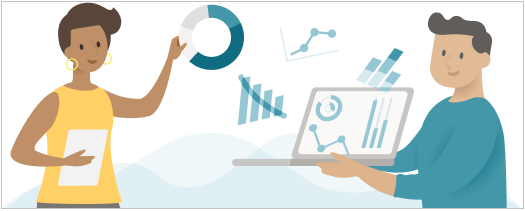

There are multiple ways to measure business outcomes, but how do you measure the day-to-day actions that got you there? Collaboration is a key component of knowledge worker success, but what does “good” look like? Identifying organizational behaviors and connecting them to employee engagement, efficiency, and success outcomes are key. 

Knowledge workers work through networks, interacting with coworkers, and leaders. But how can we measure this? One way is with Office 365 data. Signals from meetings, email, calls, and messaging activities are captured to form the largest data set ever created on how people spend time at work, providing a rich data source on interactions and how much time employees spend with each other.

This data is what we like to call “digital exhaust,” and it comes naturally from everyday work.

Visibility into this data can provide insights into:

- How time is used.
- How people communicate and share information.
- How teams function across lines of business, geographies, and externally.

Wouldn’t it be useful if we could capture that data and roll it up at the organizational level to identify workplace behaviors? It would help organizations and their employees understand how they spend their time and guide them to better work habits and team norms, as well as help them to do their jobs more effectively.

Luckily, Microsoft has a solution: **Workplace Analytics**.

## What is Workplace Analytics?

Workplace Analytics (WpA) is a cloud-based solution that uses the power of Office 365 collaboration data to provide rich, actionable insights into how your organization spends its time, the way people network internally and externally, and the effectiveness of collaboration across teams. With Workplace Analytics, you can start to understand some of the building blocks that go into a knowledge worker’s day.

You can analyze behaviors such as:

- **Collaboration overload**. Time spent collaborating after hours or time in meetings.
- **Manager effectiveness**. Time spent coaching or in co-attendance in meetings.
- **Sales productivity**. Time spent collaborating with customers (using optional CRM data).
- **Employee engagement**. Measuring employee engagement with collaboration metrics.

Combining Workplace Analytics output with organizational context and other relevant data (such as employee engagement scores, performance ratings, and other business outcomes), enables you to pinpoint which specific behaviors result in success in these areas.

Workplace Analytics harnesses these insights and enables you to help create whole new levels of engagement and productivity for employees in your organization, providing decision-makers with a powerful tool to identify business, and cultural opportunities to effectively execute change.

## Learn more

[Workplace Analytics home page](https://docs.microsoft.com/workplace-analytics/use/home-page?azure-portal=true)
