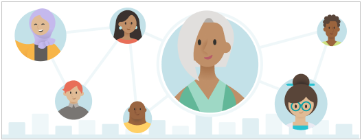

Successful organizations track their business outcomes, but how do you measure the day-to-day actions that create those outcomes? Collaboration is a key component of knowledge worker success.

> [!div class="centered"]
> 

Knowledge workers work through networks, interacting with coworkers, and leaders. With Microsoft 365 data, we can measure these interactions. Microsoft 365 captures signals from meetings, email, And Teams calls and messaging activities. It’s the largest existing data set of how people spend time at work, passively generated from everyday work activities.

Workplace Analytics provides visibility insights into:

- How people invest their time in different types of activities.
- How they share information with other individuals in their team and beyond.
- How teams interact with other teams, geographies, lines of business, and external contacts.

These insights can help organizations and their employees develop stronger work habits and team norms and do their jobs more effectively. But to turn the data into insights, the raw signals need to be converted into useful information.

- Translate interactions into aggregate measures of time and relationships.
- Join collaboration information with context about employee and customer organizations, roles, geographies, and outcomes.
- Provide options and controls to protect individual privacy while getting insight from the data.

Workplace Analytics turns data into useful insights by providing measures, context, and privacy controls, as well as dashboards and other tools for users to access those insights. It's a cloud-based solution that uses the power of Microsoft 365 collaboration data to provide actionable insights into how your organization spends its time.

> [!div class="centered"]
> 

Workplace Analytics provides decision makers with a powerful tool to identify opportunities to effectively execute change and improve organizational outcomes such as:

- Collaboration overload.
- Manager effectiveness.
- Sales productivity. 
- Employee engagement. 

## Learn more

[Workplace Analytics home page](https://docs.microsoft.com/workplace-analytics/use/home-page?azure-portal=true)
