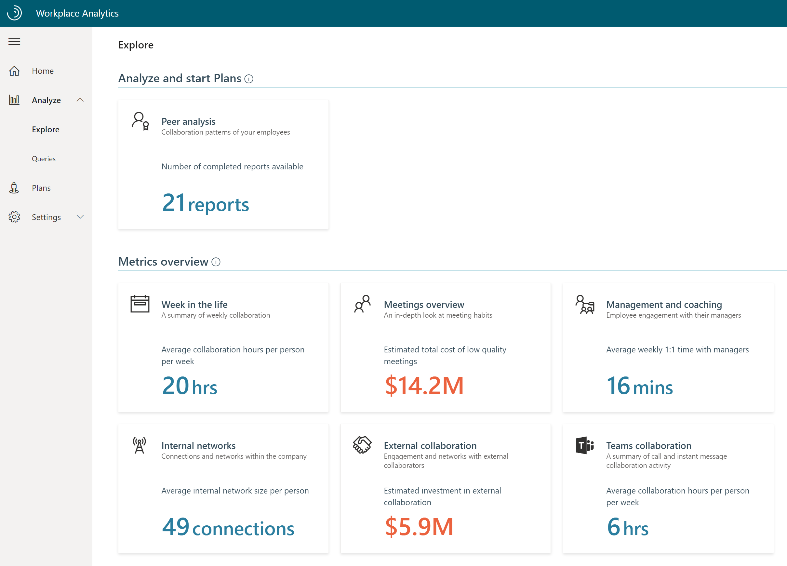
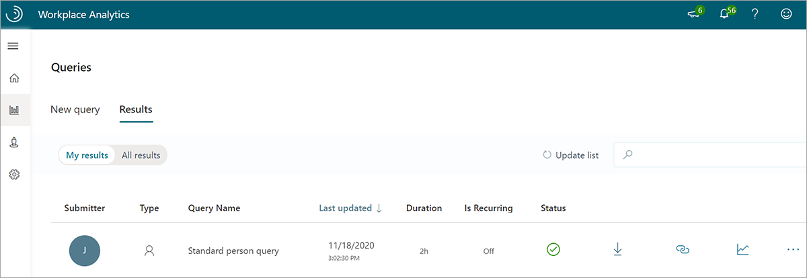
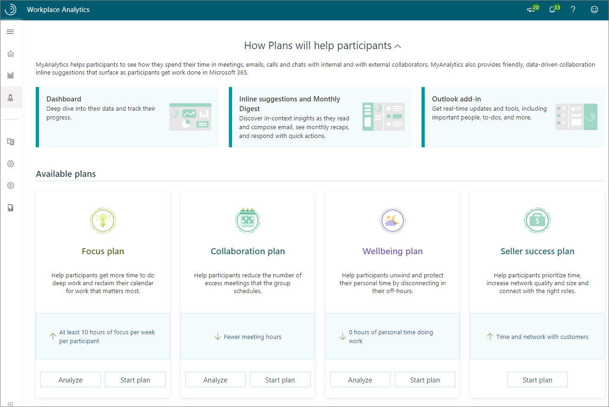

The Workplace Analytics app provides you with a streamlined menu of features with four primary ways to analyze and explore your data.

- The **Home** page provides the scope of your Workplace Analytics data along with three areas of research-based behavioral insights into how things get done.
- The **Analyze** page contains two valuable tools: Explore dashboards and Flexible queries. Dashboards help you analyze out-of-the-box insights while Queries allow you to download row-level data for more in-depth analysis.
- The **Plans** page provides targeted change plans to improve focus, collaboration, well-being, and seller success.
- The **Settings** page allows you to validate collaboration data, organizational data, optional CRM data, and define which meetings, if any, to exclude in your analysis. 

> [!TIP]
> Click the **menu** icon at the top of the panel. It compresses the menu so you can see a full screen view. Click again to reveal the entire menu.

## Workplace Analytics Home page

Use the Home page to get a quick look at the date range and **measured employees** you can include in your analysis, as well as quick insights into how work gets done. (**Measured employees** means employees with a Workplace Analytics license.)

**My organization’s data** gives you a high-level look at your organization’s Workplace Analytics data, including the date range and a count of measured employees.

In addition to the Explore dashboards, Workplace Analytics offers out-of-the-box insights in three areas of the collaborative experience:

- **Employee experience**. Understand employee engagement trends by investigating employee one-on-one time with their manager, email load, and time spent collaborating after hours.
- **Organizational agility**. Assess your organization’s ability to quickly adapt by exploring how employees collaborate (such as too many inefficient meetings, focus time, and how they are connected and share information).
- **Customer focus**. Explore external connections and time spent in external collaboration.

> [!TIP]
> Click when you see the **+ # more**. Each instance reveals additional insights for each solution area.

> [!TIP]
> Here’s a way to use the **Home page** functionality.
> 
> Kevin is a HR business analyst at Contoso Corporation. His manager recently asked him to determine if employees are getting enough time with their managers. Using Workplace Analytics, from the Home page, he clicks the **View insights** button under Employee Experience. There, Kevin finds that nearly sixty percent of employees get less than 15 minutes of one-one-one time with their manager in a month, indicating a need for more coaching.
> 

Explore the statistics and **View Recommended Plans** for quick links to the Explore dashboards and management plans (covered in the next two units). You’ll also find links within each solution area that provide supporting evidence and best practices for each behavioral metric.

## Workplace Analytics Analyze page

In addition to the solution areas mentioned on the Home page, there are two main ways of analyzing data in Workplace Analytics: Explore dashboards and Flexible queries.

### Analyze Explore summary page

The Explore dashboards are prebuilt summary pages that use Workplace Analytics metrics to provide themed out-of-the-box insights. The Home page is a great place to get a look at specific metrics related to employee experience, organizational agility, and customer focus, but the Explore summary pages cover a wider range of metrics for your analysis. Use these dashboards to gain quick insights into how employees in your organization collaborate, and to identify data you want to investigate further.

On the Explore page under **Metrics overview**, you’ll see six available dashboards as shown below:

The six available dashboards are:

- **A Week in the life**. Get a high-level look at weekly collaboration in your organization.
- **Meetings overview**. Evaluate the behaviors associated with low quality meetings.
- **Management and coaching**. Look at how much time employees are spending with managers.
- **Internal networks**. Uncover how employees and groups are connecting within the organization.
- **External collaboration**. Explore how employees collaborate with contacts outside your organization.
- **Teams collaboration**. Discover how your organization uses Microsoft Teams for collaboration.

The data that populates the Explore dashboards reflects a rolling six-month window. With each weekly refresh, the six months of data populating the dashboards advances by one week.

Within the Explore dashboards, you have the option to filter the data. In the upper right corner of the browser, you can click on **Settings and filters** which will open the **Page settings**. In Page settings, you can adjust the date range of the data, change how measured employees are grouped, add additional filters, and choose the maximum number of groups you’d like to see in the output.

Explore dashboards in Workplace Analytics are powerful tools to gain quick insights for the measured employees in your organization. Use the Explore dashboards for a high-level look at collaboration behavior in your organization, or to identify areas for further analysis.

> [!TIP]
> Here's a way to use the Meetings functionality.
>
> Kevin, our HR business analyst at Contoso Corporation, recently discovered that 46% of meeting hours in his organization are redundant, indicating opportunities for delegation. He would like to dive deeper into the data in the Meetings overview page to identify groups that might be driving the higher level of redundant meeting hours in the organization. In the upper right corner of the Explore dashboard, he clicks on **Settings and filters**. In the Page Settings he groups by Organization and clicks **Apply**. The results shown below indicate that employees in his HR department average five hours a week in redundant meetings.
> 

### Analyze Queries summary page

Flexible queries offer filterable and customizable data access to create valuable analysis using row-level data. Use the output from these queries to investigate and answer specific questions about how employees and groups collaborate.

On the Queries page, under **Start custom query**, you’ll see a list of query options. The four most common are:

- **Person query**. Extract metrics for analysis on the **employee** perspective.
- **Meeting query**. Extract meeting-related metrics for analysis from the **meeting** perspective.
- **Group-to-group query**. Extract metrics for analysis on how teams invest time with other groups. 
- **Person-to-group query**. Extract metrics for analysis on how individuals invest time with other groups.

Your query output depends on the type of query you run. For example, the Person query results contain metrics related to an individual’s collaboration (such as email hours, meeting hours, and after- hours collaboration). The Meeting query results contain metrics related to the meeting (such as attendee meeting hours and attendee’s multitasking).

### Query steps

There are multiple steps to run a query. 

1. Select the query you’d like to run. 
1. In the **Description** field, enter the name of your query. 
1. (Optional) Adjust the granularity of the timeframe (day, week, or month) and the time period.
1. (Optional) Select a rule for which meetings to exclude.

Once you’ve made these selections, follow the four steps below to further refine the data for your analysis.

**Step 1. Select your metrics**. Workplace Analytics metrics vary by query. You can select standard metrics from the list of options, but you also have the ability to customize some metrics by filtering with the various organizational data fields. Here's an example of how you would pull meeting hours with the word “budgeting” in the subject line.

**Step 2. Select filters**. Using Workplace Analytics queries, you can change the scope of the data you’d like to analyze by limiting it to active employees and applying additional filters using attributes from the organizational data. In this view, we’ve applied a filter to look at the Human Resources at Contoso. (Active employees are currently defined as employees who sent at least one email in a given week.)

**Step 3. Select organizational data**. You have the option to select which organizational attributes you’d like to include in your output.

**Step 4. Run the query**. You can access your query results by clicking the **Results** link on the Queries page. You have the option of viewing your results or everyone else’s. This page is where you can download the data in a csv format, copy the OData link to load the data into business intelligence applications, and for some queries, open a visualization to analyze within Workplace Analytics.

You also have the option of selecting from a list of queries with preselected filters and metrics. They are a great starting point for specific analyses, and they have the flexibility for users to make adjustments and add new metrics.

You’ll see three of the options shown above have a Power BI icon in the upper right corner. These include a download option for a Power BI Template. If you run this query option, you can download the template, load your data, and get an automatically generated report.

Flexible queries are a powerful tool to obtain filtered and customized Workplace Analytics metrics. Use the output from Flexible queries and combine them with specific business knowledge to generate in-depth, impactful analysis on how employees collaborate to drive positive change in your organization. 

## Workplace Analytics Plans page

Insights gained from the Explore dashboards and Queries can provide a lot of information about how employees in your organization get work done. Now transform insights into actions with Workplace Analytics **Plans**.

Microsoft currently offers four plans:

- **Focus plan**. Helps participants get more time to do deep dive work and reclaim their calendar for work that matters most 
- **Collaboration plan**. Helps participants reduce the number of excessive meetings that the group schedules
- **Wellbeing plan**. Helps participants unwind and protect their personal time by disconnecting in their off-hours
- **Seller success plan**. Helps participants prioritize time, increase network quality and size, and connect with the right roles

For each plan type, you have the option to select **Analyze** and get answers to questions involving relevant metrics. Then select **Start plan** to create, manage, and track a specifically targeted plan for employees in your organization.

Workplace Analytics Plans help give managers and employees visibility into how they are spending time to increase their focus and improve collaboration and wellbeing. 

## Workplace Analytics Settings page

Workplace Analytics provides you with tools to check the quality of your data sources.

Under **Settings**, you will find the **Data sources** page. There you can get a quick view of Office 365 collaboration data for your measured population over time. You can use this view to identify any dates or date ranges you should include or exclude from your analysis, such as holidays.

You can assess the quality and completeness (coverage) of the uploaded organizational data (HR attributes) for your measured population as shown here.

Additionally, if your Workplace Analytics administrator has uploaded CRM data, you can confirm the quality of join coverage (the percentage of CRM contact and sales assignment data associated with CRM accounts).

> [!TIP]
> Here's an example of using data sources.
> 
> Kevin, our HR business analyst at Contoso Corporation, would like to get a high-level look at some fourth quarter custom metrics using a Flexible query. He knows he should probably exclude specific dates that might be outliers. Kevin opens the **Sources** page and looks at the collaboration data over time for the measured population. He sees two dips in the data, both national holidays. He runs his Flexible query, and once he has the output, he filters out the holiday dates for his analysis.
> 

## Meeting exclusions

Not all meetings scheduled are business-related. People often have personal appointments and block out time on their calendar to get work done. When doing analysis in Workplace Analytics, there also may be excessively long or large meetings you don’t want to include.

Workplace has a built-in solution to address these issues called **Meeting Exclusions**. With Meeting Exclusions, analysts can create specific rules for meetings to include while adding each rule to a dropdown list of rules to apply for specific analyses.

With Meeting Exclusions, you have the options to:

- Exclude canceled meetings.
- Exclude appointments (blocked time with only one attendee).
- Set thresholds for attendance size and duration of meetings to include.
- Exclude meeting subjects by topic.

Workplace Analytics has a default meeting exclusion rule which excludes meetings with only one attendee, meetings longer than eight hours, meetings with 250 or more participants, and canceled meetings. This rule is used if no other meeting exclusion is selected.

Use Meeting Exclusion rules in Workplace Analytics to exclude meetings you don’t want to include in your analysis (or include meetings excluded in the default meeting exclusion rule).

> [!TIP]
> Here's an example of using a meeting exclusion rule.
> 
> Kevin, our HR business analyst at Contoso Corporation, would like to begin an analysis on remote workers. Remote workers at Contoso let their managers know they work from home by creating a one person meeting titled, Remote Day.
> 
> Since the default meeting exclusion rule excludes these meetings, Kevin needs to create a new rule. He opens **Analysis settings** in the menu to locate the **Meeting Exclusions** page and creates a new meeting exclusion rule to include meetings with only one person.
>

## Additional features

You'll find some additional features in the upper right-hand corner of each screen. 

- Click the **?** (Help) icon to find the below resources.

  - **Documentation**. Documentation provides extensive information about Workplace Analytics topics.
  - **FAQs**. Find frequently asked questions with the answers you are looking for.
  - **Blog**. The blog post offers Workplace Analytics feature updates and product releases; it updates monthly.
  - **Privacy guide**. The Privacy Guide has in-depth information about data protection, how you can control your data, and who has access to that data.
  - **Privacy policy**. This page features privacy notifications.
  - **Resource playbooks**. Choose from two playbooks on best practices.
  - **Feedback**. Use this feature to send Microsoft your comments.
  - **User icon**. The User icon features your tenant, partition, and role information. **Sign out** is also located here.

- Click the **Megaphone** icon to get information on new features in Workplace Analytics.
- Click the **Bell** icon for notifications and alerts related to recent activity in Workplace Analytics. This feature shows dates of Office 365 data refresh, organizational data uploads, newly created meeting exclusions, and query auto-refresh. Notifications alert you when your queries have finished running.

## Learn more

- [Explore overview](https://docs.microsoft.com/workplace-analytics/use/explore-intro?azure-portal=true)
- [Queries overview and ways to query data](https://docs.microsoft.com/workplace-analytics/tutorials/query-basics?azure-portal=true)
- [Workplace Analytics plans](https://docs.microsoft.com/workplace-analytics/tutorials/solutionsv2-intro?azure-portal=true)
- [Workplace Analytics data sources](https://docs.microsoft.com/workplace-analytics/use/data-sourcesv2?azure-portal=true)
- [Meetring exclusions](https://docs.microsoft.com/workplace-analytics/tutorials/meeting-exclusions-intro?azure-portal=true)
