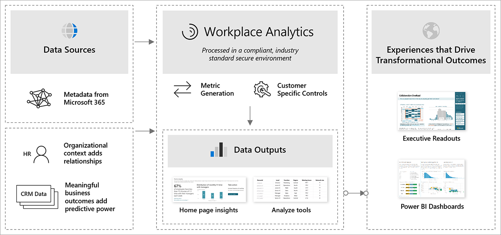
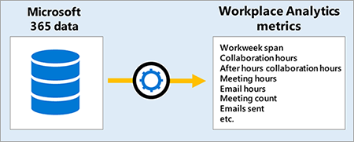
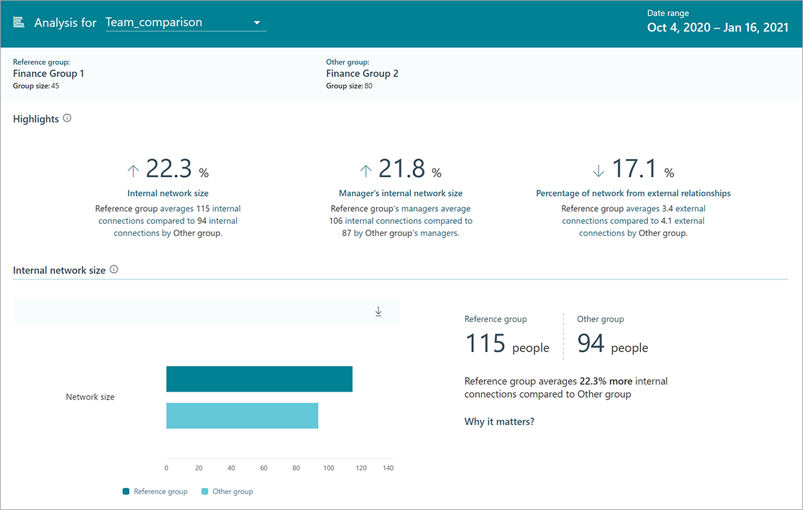

Workplace Analytics users can analyze and explore the data in multiple ways:

- The **Home** page displays the scope of your Workplace Analytics data and allows you to navigate to high-level insights, recommendations, and deeper analysis aligned to nine research-based behavioral outcomes.
- The **Analyze** page contains two valuable tools: Peer analysis lets you quickly compare base metrics between groups. Queries allow you to customize row-level data for more in-depth exploration.
- The **Plans** page works with MyAnalytics, where available, to provide targeted suggestions aimed at improving focus, collaboration, well-being, and seller success.
- The **Settings** pages allow you to validate collaboration data, organizational data, and optional CRM data. It also lets you define system defaults, privacy settings, manager settings, and which calendar activity, if any, to exclude from analysis.

> [!NOTE] 
> Click the **menu** icon at the top of the panel. It compresses the menu so you can see a full screen view. Click again to reveal the menu names.

The graphic below shows how these outputs can be used to create executive presentations and business intelligence tools to drive transformational outcomes.

> [!div class="centered"]
> 

## Workplace Analytics data sources

What’s under the hood? Workplace Analytics processes collaboration data from Microsoft 365. It then maps descriptive employee attributes, usually from the organization’s human resource information system (HRIS), onto the collaboration data. You can see the process illustrated in this flow path:

> [!div class="centered"]
> 

The descriptive employee attributes from HRIS are called **organizational data.** Organizational data is uploaded by your Workplace Analytics administrator. Employee roles and positions can change frequently, so analysts can get more accurate information when this data is updated monthly or quarterly.

You can use organizational data to group and filter employees and understand how behaviors correspond to employee attributes. Workplace Analytics only requires five columns of basic organizational data, but the more data your administrator adds, the more value added for analysis.

When Workplace Analytics processes collaboration data from Microsoft 365, it only processes metadata. Metadata is information **about** collaboration, like when and where items are sent (to and from), subject lines, and meeting attendee status. Workplace Analytics uses metadata to generate metrics related to email usage, meetings, Teams instant messages, and calls. The collaboration data refreshes weekly.

Workplace Analytics joins the organizational data to the collaboration data to generate its data model for out-of-the-box insights and queries.

## Workplace Analytics metrics

After the Workplace Analytics data sources are processed, the data is de-identified and filtered, creating a large library of behavioral base metrics related to workplace behaviors, time use, and networks. 

The Home page provides a high-level look at Workplace Analytics metrics for nine themed business outcomes aimed at giving leaders visibility into how work gets done.

The Peer analysis feature compares base metrics between groups, allowing you to use organizational attributes to filter each population. Queries allow you to go one step further and customize base metrics—for example, measuring “recurring meeting hours” instead of the base metric of “meeting hours.”

See the **Learn more** section below for a complete list of current Workplace Analytics metrics and terms.

## Workplace Analytics outputs

Each themed business outcome on the **Home** page leverages multiple key indicators to offer views of how work happens, with links to further explore the stats and evidence-based suggestions on how to drive change for business success.

The following is a snapshot of the **Protect employee wellbeing** view, which can be found by selecting the **Enhance organizational agility** outcome.

**Peer analysis** provides a way to help you discover differences in collaboration behavior between groups.

The following is an example of Peer analysis output. It provides highlights on metrics with the most variation and charts to compare metric averages between groups.

**Queries** give you access to row-level data and customizable metrics.

Below is an example of query output. It includes selected human resource attributes (level, function, type, and region), as well as selected Workplace Analytics metrics (external and internal collaboration hours, meeting hours, and network size).

Query output is available as a downloadable .csv file or as an OData link which can be loaded into business intelligence tools, such as Power BI, to create impactful reports and presentations. For some queries, you can also visualize the results directly within Workplace Analytics.

## Learn more

- [Workplace Analytics metric definitions](/workplace-analytics/use/metric-definitions?azure-portal=true)
- [Workplace Analytics glossary](/workplace-analytics/use/glossary?azure-portal=true)
