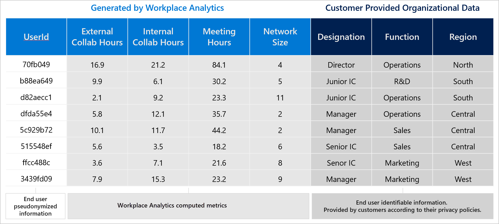

Workplace Analytics users can access metrics in two ways:

- **Explore dashboards**. Aggregated dashboards that give out-of-the-box insights.
- **Flexible queries**. Query output using row level data for more in-depth analysis.

> [!div class="centered"]
> 

Outputs from the queries and dashboards can be used to create executive presentations and business intelligence tools to drive transformational outcomes.

## Workplace Analytics data sources

What’s under the hood? Workplace Analytics processes collaboration data from Microsoft 365. It then maps descriptive employee attributes, usually from your organization’s human resource information system (HRIS), onto the collaboration data. You can see the process illustrated in this flow path:

> [!div class="centered"]
> 

The descriptive employee attributes from HRIS are called **organizational data.** Organizational is uploaded by your Workplace Analytics administrator. Employee roles and positions can change frequently, so analysts will get more accurate information when this data is updated monthly or quarterly.

You can use organizational data to group and filter employees and understand how behaviors correspond to employee attributes. Workplace Analytics only requires five columns of basic organizational data, but the more data your administrator adds, the more value you can get from it.

When Workplace Analytics processes collaboration data from Microsoft 365, it only processes metadata. Metadata is information **about** collaboration, like when and where items are sent (to and from), subject lines, and meeting attendee status. Workplace Analytics uses metadata to generate metrics related to email usage, meetings, instant messages, and calls. The collaboration data refreshes weekly.

Workplace Analytics joins the organizational data to the collaboration data to generate its data model for dashboards and queries. 

## Workplace Analytics metrics

Once the Workplace Analytics data sources are processed, the data is pseudonymized and filtered, creating a large library of behavioral base metrics related to workplace behaviors, time use, and networks. 

The Explore dashboards report base metrics while allowing you to use organizational attributes to regroup or filter the analysis population. Flexible queries allow you to go one step further and actually customize base metrics—for example, measuring “recurring meeting hours” instead of the base metric, “meeting hours.”

See the **Learn more** section below for a complete list of current Workplace Analytics metrics and terms.

## Workplace Analytics outputs

**Explore dashboards** are out-of-the-box summary pages that can identify potential problem areas through guided exploration. The screenshot below is a snapshot of the Workplace Analytics **Week in the life** dashboard which gives you a high-level look at collaboration time in meetings, emails, and after hours for the average employee in a given organization.

**Flexible queries** (or simply queries) give you access to row-level data and customizable metrics.

Below is an example of flexible query output. It includes selected human resource attributes (level, function type, and region), as well as selected Workplace Analytics metrics (external and internal collaboration hours, meeting hours, and network size).

Flexible query output is available as a downloadable csv file or as an OData link which can be loaded into business intelligence tools to create impactful reports and presentations. For some queries, you can also visualize the results directly within Workplace Analytics.

## Learn more

- [Workplace Analytics metric definitions](https://docs.microsoft.com/workplace-analytics/use/metric-definitions?azure-portal=true)
- [Workplace Analytics glossary](https://docs.microsoft.com/workplace-analytics/use/glossary?azure-portal=true)
