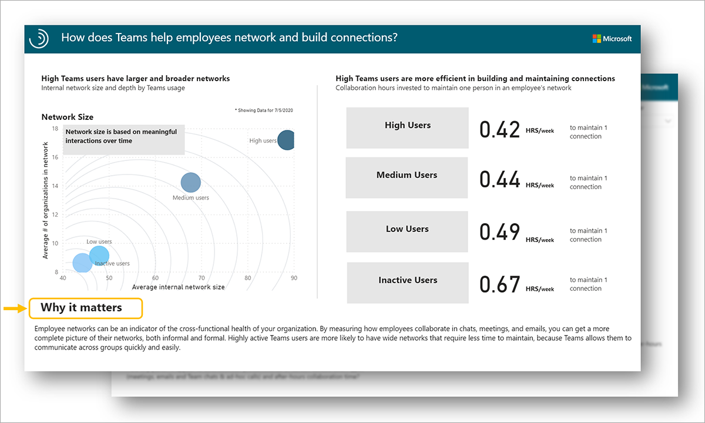
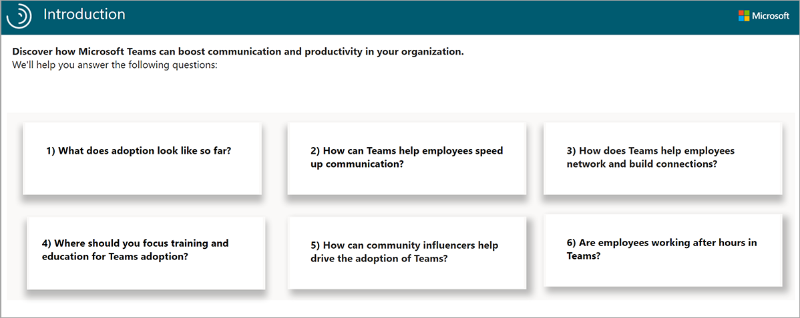
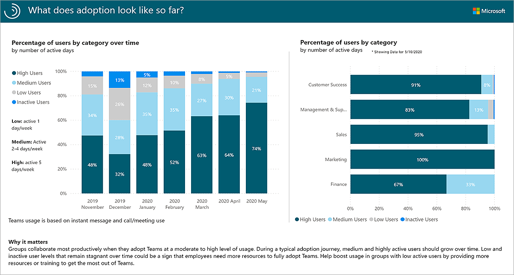
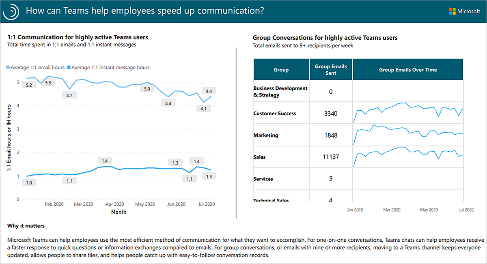
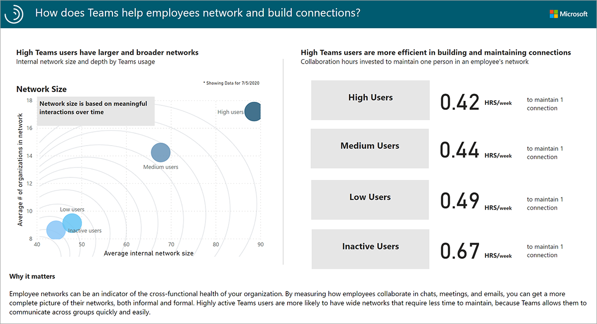
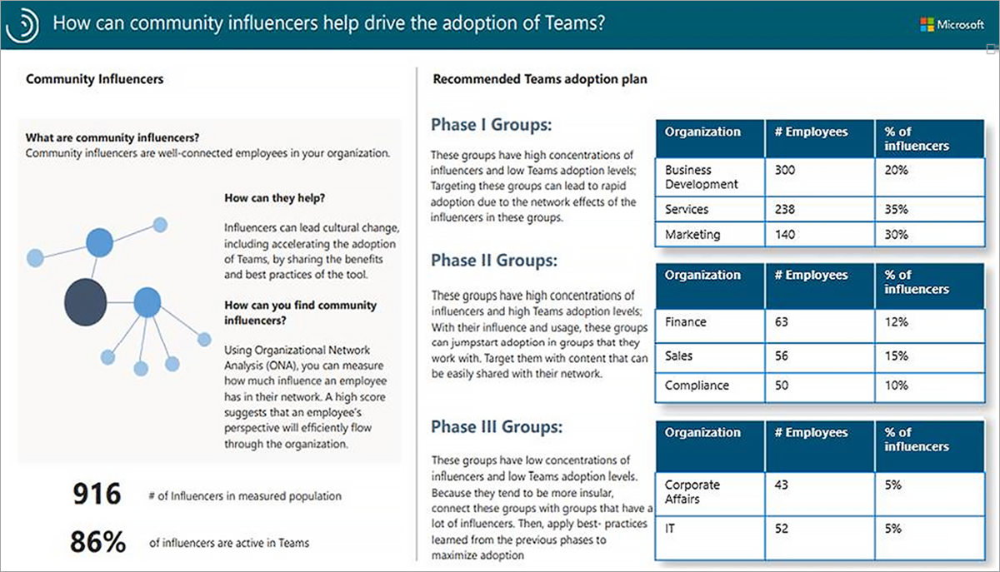
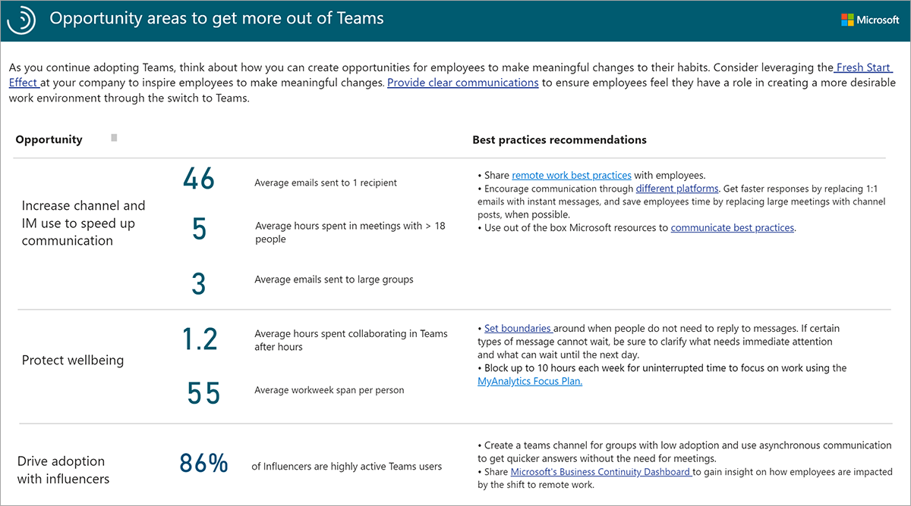

The Teams insights Power BI template provides a quick and easy way to conduct a broad diagnostic on Teams collaboration and adoption.

So how does it work? Each report page provides actionable data into one of the themes laid out on the introduction page. Embedded guidance helps users to uncover useful information and ground their findings in a business context. 

## The Introduction page

The introduction page of the report helps set up the context around what questions the Teams Insights dashboard addresses, as well as why it matters. 

This page provides an overview for dashboard recipients who are unfamiliar with data generated from Workplace Analytics.

## Report: What does adoption look like so far?

The State of Adoption report shows how Teams adoption is playing out in the organization in terms of the level of usage.
 
The chart on the left shows the share of inactive, low, medium, and high users by month for the selected time frame. In the example here, the percentage of High Users in the organization went from 48% to 74% over six months. The chart on the right shows the share of inactive, low, medium, and high users by category by group. In the example here, individuals in the Marketing team are 100% High Users.

> [!NOTE]
> Low Users are defined as being active on Teams 1 day/week. Medium Users are active 2-4 days/week. High Users are active on Teams at least 5 days/week. 
> 

As organizations progress through Teams adoption stages, the share of Medium and High users should grow, and the share of Inactive and Low users should shrink. If the share of Medium and High users does not grow, it could be a sign that employees need more resources or training.

Use the State of Adoption report to track changes in how employees are using Teams over time, and to quickly identify groups of employees that are quicker or slower to adopt Teams. Engage with groups that are doing well and share their best practices with the organization.

## Report: How can Teams help employees speed up communication?

The Speed up Communication report gives you a view into how Teams can help employees use the most efficient method of communication for what they want to accomplish. 

The chart on the left shows average one-on-one email and instant message (chat) communication for High Users over the selected time frame. In the example here, a decrease in email hours is offset by an increase in instant message hours over a six-month time frame. The chart on the right shows the total High User group emails sent per week and group emails sent over time by group. In this example, group emails sent for the Customer Success, Marketing, and Sales groups trended downward from February to July. 

> [!NOTE]
> In this report, group emails are defined as emails sent to 9 or more recipients. 
> 

Teams is a faster platform for answering short questions or confirming scheduling. Instant messages have faster response times and higher response rates than email. Employees take an average of 8 hours to reply to email, but only 5 minutes to reply to instant messages. As employees use Teams more and more, one-on-one email hours may begin to fall.
Group email conversations may also begin to migrate to Teams channels. Teams channels allow for efficient sharing of information to big groups around a single topic. Having all conversations in one place can allow individuals to search for information more efficiently, instead of trawling through long email chains or asking the same question multiple times.

## Report: How does Teams help employees network and build connections?

The Build Networks report shows how connected employees are to other individuals and groups in the organization in terms of the level of Teams usage. 

The chart on the left plots the average internal network size (x-axis) and average number of network groups (y-axis) by level of team usage (dots). In the example here, High Users have an average of 90 internal connections and connect with 18 different groups. The chart on the right shows the average number of collaboration hours invested in network connection a week. Here it takes Inactive Users nearly 60% more time to maintain one network connection (0.67 hours vs. 0.42 hours for High Users), demonstrating that Teams is the more efficient choice for this group to maintain connections. 

> [!NOTE]
> Network size is based on meaningful interactions. A meaningful interaction is any type of collaboration with at least two collaborators and at most eight collaborators.
> 

By measuring how employees collaborate, you can get a more complete picture of their networks, both informal and formal. Highly active Teams users are more likely to have wide networks that require less time to maintain, because Teams allows them to communicate across groups quickly and easily.

## Report: Where should you focus education and training for Teams adoption?

The Target Areas for Adoption report can help companies identify groups that lead and lag in Teams usage to optimize their Teams adoption rollout.

This report compares groups in four categories of Teams activity: 

- One-on-one instant messages
- Group instant messages
- Teams meetings
- Ad hoc calls 

Activity for each group is ranked and categorized by its usage level (Top 33%, Middle 33%, and Bottom 33%). 

In the example here, the Sales group ranks in the top 33% for one-on-one instant messages and ad-hoc calls, but in the middle 33% for group instant messages and Teams meetings. The Finance group ranks in the bottom 33% in all categories.

Use this report to identify groups that may be struggling to adopt Teams and that could benefit from additional training or guidance in specific areas. Identify groups that are doing well and engage with them to share their best practices.

## Report: How can community influencers help drive the adoption of Teams?

The Recommended Influencers report uses data science to identify and group people based on their degree of influence and creates a recommended Teams adoption plan for your organization.

The left side of the report shows the number of influencers in the organization and the percentage of those influencers active in Teams. In this example the organization has 916 influencers, 86% of whom are active in Teams. The right side of the report provides a Teams adoption plan based on each group’s number of influencers and level of Teams adoption.

- Phase I groups have high numbers of influencers and low Teams adoption. 
- Phase II groups have high numbers of influencers and high Teams adoption. 
- Phase III groups have low numbers of influencers and low Teams adoption.

Community influencers are well-connected employees in your organization. Influencers can lead cultural change, including accelerating the adoption of Teams, by sharing benefits and best practices. A high influence score suggests that an employee’s perspective will efficiently flow through the organization.

Target Phase I groups for rapid Teams adoption. Adoption should happen quickly due to high number of influencers in these groups. Phase II groups already have high users, so encourage them to share best practices with other groups they work with. To speed up adoption for Phase III users, connect them to groups with many influencers and high Teams usage. 

## Report: Are employees working after-hours in Teams?

The Protect Employee Wellbeing report shows what Teams collaboration looks like across the day and by group, giving users the ability to target groups that may need to take steps to improve work-life balance and encourage wellbeing.

The chart on the left shows how activity for Teams instant messages and calls is distributed across the average day for both the 8 am – 5 pm change in activity and the change in activity after-hours (before and after working hours). The chart on the right drills down to organizations that are spending the most time collaborating in Teams after-hours. In the example here, the sales group spends an average of 0.8 hours a week in after-hours unscheduled calls, 0.3 hours a week in scheduled calls, and 0.2 hours in after-hours instant messages.

As organizations transition to digital collaboration, it may be difficult for employees to create boundaries between work and life. Use the Protect Employee Wellbeing report to assess the amount of time spent in Teams after-hours and identify areas of opportunity to establish norms to protect work-life balance and promote wellbeing.

## Report: Opportunity areas to get more out of Teams

This view gives a population-level look at three opportunity areas to get more out of using Microsoft Teams.

**Increase channel and IM use to speed up communication**: employees that send a lot of emails and spend a lot of hours in meetings can make communication more efficient by switching to Teams instant messages and posts to Teams channels.

**Protect wellbeing**: employees spending too much time collaborating in Teams in after-hours may be having trouble balancing work and non-work activities. Creating expectations around collaboration norms and sharing best practices on boundaries may help maintain wellbeing.

**Drive adoption with influencers**: Groups with high numbers of influential employees that are doing well in terms of Teams adoption can share best practices to facilitate adoption in other groups. Connect influential Teams users with low adoption groups to accelerate Teams usage.

Employees may find it difficult to create boundaries between “work” and “life.” Creating team expectations around virtual collaboration norms and sharing best practices on creating boundaries may help maintain wellbeing. 

> [!NOTE]
> Workplace Analytics metrics in each of these areas can indicate potential opportunity but are not definitive.

Click on the Best practices recommendations links for training videos, tips, and tool usage suggestions for improving Teams adoption.

## Learn more

- [Workplace Analytics metrics](https://docs.microsoft.com/Workplace-Analytics/use/metric-definitions?azure-portal=true)
