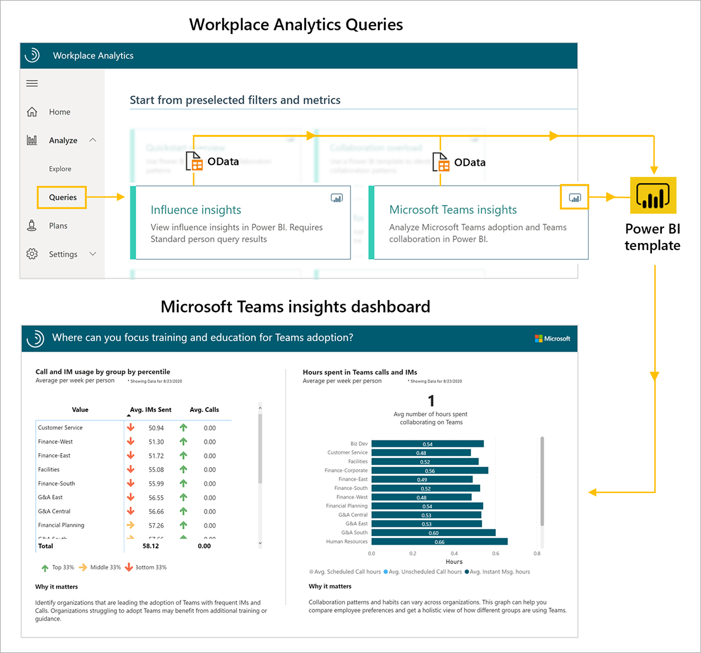
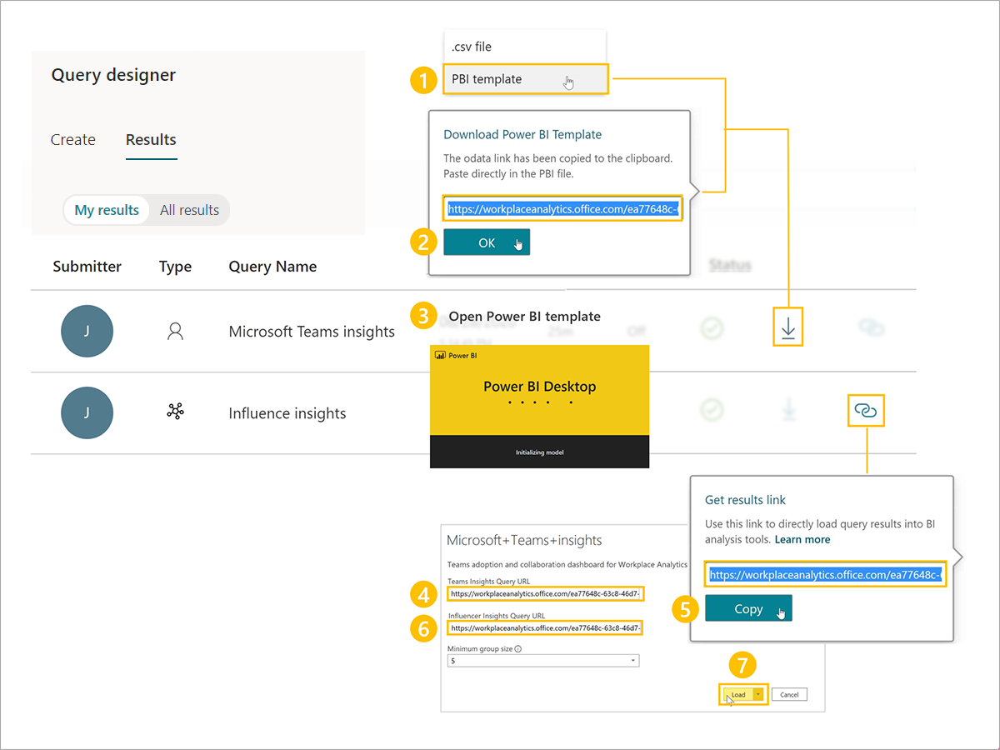
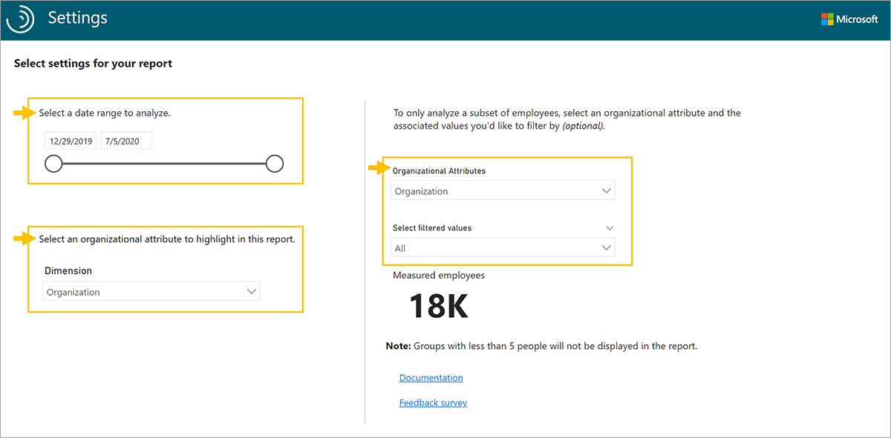

The Teams insights dashboard uses a prebuilt Power BI template populated by output (OData) from two Workplace Analytics queries, *Teams insights* and *Influence insights*. 

To set up the Teams insights dashboard:

1. Run the Teams insights and Influence insights queries.
2. Download the Teams insights Power BI template and load the query output.
3. Select your settings in the Teams insights dashboard.

After the data is loaded, the dashboard reports generate automatically. This results in multiple pages of Workplace Analytics reports that give a broad, diagnostic view of Teams adoption.

1. **Run the Teams insights and Influence insights queries**. The Teams insights dashboard reports require output from two Workplace Analytics queries. On the Queries page, under **Start from preselected filters and metrics**, begin by running the Teams insights and Influence insights queries.

In the upper right corner of the query card, you'll notice a Power BI icon. This icon means there's a download option for a Power BI template that you can use to generate the reports in the dashboard.

> [!IMPORTANT]
> Be sure to download and install the most recent version of Power BI to avoid issues setting up and loading data into the dashboard.
> 

As you run each query, give it a descriptive name. Then select your date range and meeting or attendee exclusions (use the same date range and filters for both queries). To create a report that updates weekly, you can choose to enable **Autorefresh** for each query.

Some things to keep in mind when running the queries to populate the Teams insights dashboard:

- For best results, select the **Last 6 months** as a date range.
- Under **Select metrics**, keep all preselected metrics, and don't delete any of them. The dashboard uses them to create the charts, graphs, and actionable data in the report pages. 
- Under **Select filters**, if you'd like, filter using the attributes from the organizational data to further refine the population.
- If you'll be filtering for a subset of the population, you'll need to edit all the preselected metrics in the Influencer insights query. If you want to view collaboration activity for Human Resources, you'll need to select the pencil icon and filter on **Organization = Human Resources** for each metric.
- In the Teams insights query, under **Select Organizational attributes**, you can leave the default attributes, or add any other attributes. Be sure to select the attribute that identifies people managers in your organization. If you cannot find a manager indicator field in the dropdown menu, contact your Workplace Analytics Admin to confirm it was included in the data. 
- In the Influence insights query, under **Select Organizational attributes**, leave the default attributes selected. Don't delete them as they're needed to populate meeting-related charts and graphs in the report pages.

**2. Download the Teams Insights Power BI template and load the query output**. Once the queries have finished running, you can access the template and data via OData URL by clicking the **Results** tab on the Queries page. 

To load the data into the Teams insights Power BI (PBI) template:

1. Download the Power BI (PBI) template from the Teams insights result.
2. When prompted to paste the OData link directly in the Power BI file, select **OK**.
3. Open the downloaded Power BI template.
4. Paste the Teams Insights OData link into the Teams Insights Query URL field.
5. Return to your results in Workplace Analytics. In the Teams Insights query result, copy the OData link to the Teams Insights query output.
6. Return to Power BI and paste the Influence Insights query OData link into the Influence Insights Query URL field.
7. Load the data.

The dashboard visualizations on each page of the report will populate with Workplace Analytics data, starting with the Settings page. 

**3. Select your settings in the Teams insights dashboard**. After you've loaded the data to generate the report, you can adjust some settings on the Settings page.

- Select the time period for your report. 
- Select an organizational attribute to view the report by.
- To filter out employees, select the organizational attribute and values you’d like to filter by.

Once you've selected the settings for your population, you can start analyzing the results from the dashboard. The populated dashboard includes report pages on the state of adoption by group, how Teams is changing ways of working, and how to speed adoption using community influencers.

## Learn more

- [Detailed step-by-step instructions and troubleshooting for the Teams insight Power BI template](https://docs.microsoft.com/workplace-analytics/tutorials/power-bi-teams?azure-portal=true)

