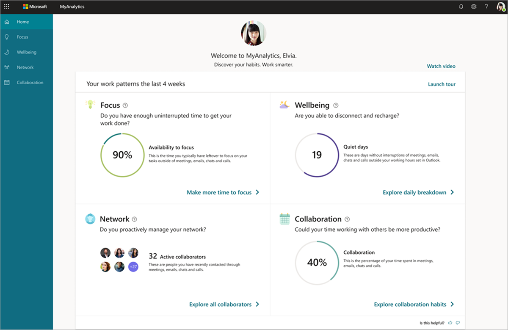
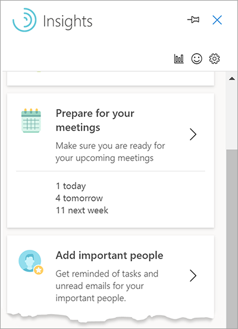
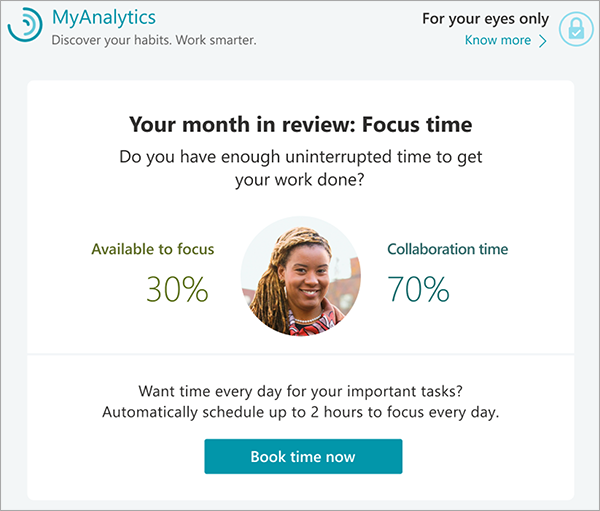
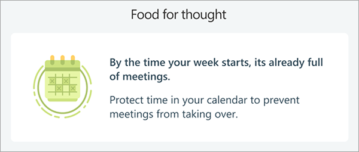
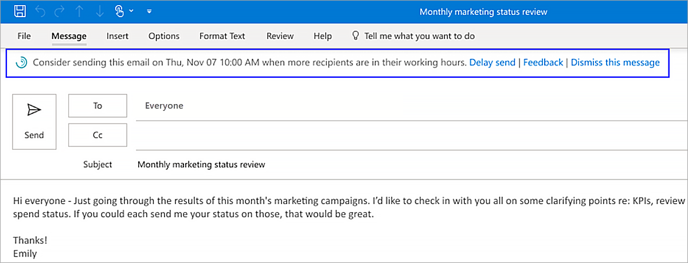
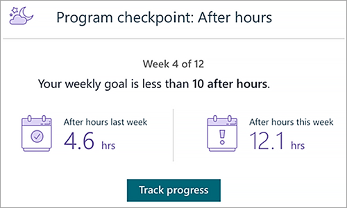
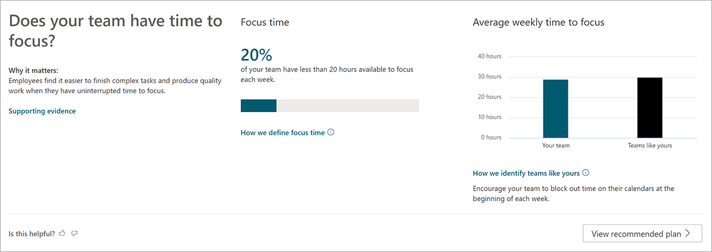
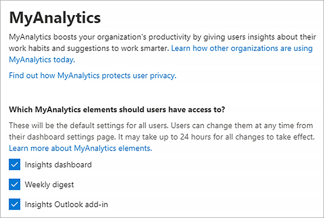
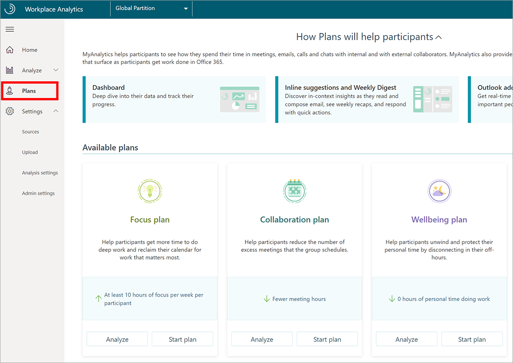
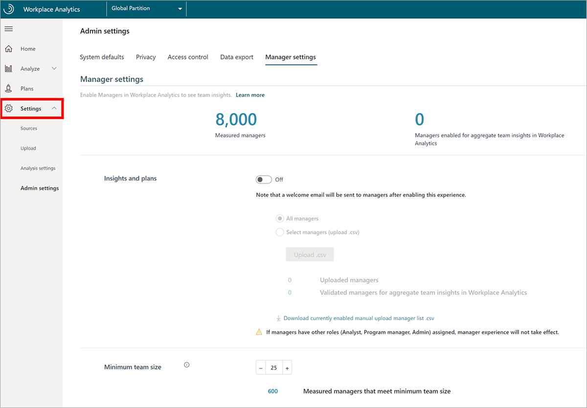

Technology can assist you in driving change. These Microsoft 365 features can be tools for your change initiative.

- **MyAnalytics**. Enable personal dashboards, an Outlook add-in, digests, and inline suggestions.
- **Plans**. Transform your knowledge into targeted change plans.
- **Insights for People Managers**. Provide team leaders with metrics and insights that you can act on.

## What is MyAnalytics?

MyAnalytics generates data regarding two of the key factors in personal productivity: how people spend their time and who they spend it with. MyAnalytics presents you with insights through these tools:

- **MyAnalytics dashboard**. The dashboard shows how you spent your time over the past month, productivity insights about your work patterns, helpful suggestions for improvement, and information about your network, top collaborators, and collaboration activities.
- **Outlook Insights add-in**. The Insights add-in for Outlook presents you with activity cards that are based on your recent work experience with options to respond or follow up, based on the activity.
- **Weekly Digests**. Receive a weekly digest that gives you highlights about your previous week.
- **Inline suggestions in Outlook**. See contextual data-driven recommendations to improve your work patterns.

### Access your MyAnalytics dashboard

Users can access their personal MyAnalytics dashboard by visiting myanalytics.microsoft.com. The MyAnalytics dashboard shows you statistics about your work patterns over the past month. Statistics include your focus and collaboration time, how many days you were able to disconnect from work, and how effectively you're networking with your coworkers.

> [!IMPORTANT]
> Information available in the MyAnalytics dashboard is private and personal metrics are only available for individual access. Users will need the appropriate Microsoft 365 license to access this dashboard.
>

Along with metrics, the MyAnalytics dashboard contains *productivity insights* that show trends from recent work habits.

Finally, *educational cards* give you work productivity and wellbeing tips. MyAnalytics refreshes these cards periodically to reflect your most recent work patterns.

These statistics about work patterns, productivity insights, and educational tips become the key components that make up the MyAnalytics dashboard.

### Outlook Insights add-in

You can access the Outlook Insights add-in as follows:

On the Windows Outlook desktop:

1. Open the **Home** ribbon of Microsoft Outlook.
2. Select **Insights**.

   

In Outlook on the web:

1. Open an email message.
2. Select the **ellipsis (…)** in the top-right corner of your email message, and then select **Insights**.

   

3. After you open the Insights add-in, you'll see a number of cards in the Insights pane.

   

   These cards cover the following topics:

   - **Prepare for your meetings**. Prepare for your meetings and then drive more effective meetings.
   - **Track email and document open rates**. Track readership of emails that you've sent by viewing the percentage open rate or the percentage attachment click rate.
   - **View outstanding tasks**. Make sure nothing is forgotten by seeing reminders of tasks that you've agreed to do.
   - **Follow up on your requests**. Receive reminders to follow up on commitments made by your colleagues or on requests that you've made.
   - **Book time to focus**. Protect your calendar by reserving focus time before meetings take over.
   - **Catch up on email**. Cut through the clutter with a summary of unread email from your more important contacts.
   - **Catch up on documents**. See a list of shared OneDrive and SharePoint documents that you need to catch up on.
   - **Add important people**. Manage your list of important contacts. You'll see reminders when you have tasks to complete for these people or unread emails from them.
   - **Set lunch hours**. Use this card to protect your lunch hours and personalize your insights.
   - **Plan your time away**. Use this card to plan your time away from work.
   - **Catch up with your team**. Stay on top of your team's needs with insights for 1:1 meetings, outstanding tasks, etc.
   - **Meeting suggestions**. Grow and nurture your network by staying connected with important colleagues.
   - **Check quiet hours impact**. Help your team achieve work-life balance by reviewing the impact of sending email outside of working hours.

### Weekly digests

MyAnalytics participants receive a weekly digest email with suggestions to help understand and improve work patterns. Each week the digest focuses on one of the following work patterns:

- **Focus**. Find ways to increase your focus hours, so you can accomplish deep work and unleash your creativity.
- **Wellbeing**. See if you're getting good balance between work and personal time. Then find ways to disconnect and unwind after hours.
- **Network**. See who's in your network and make sure you're keeping up with important contacts and relationships.
- **Collaboration**. Get tips on how to plan your calendar, spend less time in low-quality meetings, and write more effective emails.

Here's an example of a digest about focus time:

Here's an example of an insight included in a digest:

### Inline suggestions in Outlook

Inline suggestions in Outlook are brief data and AI-driven notifications that appear in Outlook while you're either reading or composing an email or meeting invitation.

Broadly available inline suggestions include the following:

- Delay email delivery. Here's an example:

  

- Suggested outstanding tasks
- Get more time to focus
- Plan your time away
- Protect your focus time
- Shorten a meeting
- Track email open rate

## What are plans?

You can use the plans feature of Workplace Analytics to create improvement plans for employees, with the goal of changing their work habits for the better. By using the plans feature, you can:

- Identify groups whose workplace effectiveness could be improved.
- Set up 12-week plans for the identified group.
- Measure the progress of the plan while it's underway.

If you have the analyst, limited analyst, or program manager role, you can open Workplace Analytics and select **Plans > New Plan**. There you can learn about the types of plans that you can create.

You can then either select a known group of employees to enroll in the plan or use analysis to find a group of employees to enroll. After enrolling participants in a plan, you can track their progress on key metrics over time.

In addition to its standard weekly digest, the digest for plan participants includes a section that summarizes their progress in the plan. They can visit their MyAnalytics dashboard to see a page dedicated to their enrolled plan.

## What are Insights for people managers?

Insights for people managers provide team leaders with behavioral measures of employee experience and team effectiveness. Managers can leverage a dashboard to track progress, view suggested actions, and launch a plan for their team.

> [!NOTE]
> Managers cannot access data on individuals. Managers who are assigned access can only see data on their team in an aggregate view. The default group size threshold is ten, including the manager.
>

Here's the Insights for people managers **Home** page:

Here's some examples of how you can track progress:

After identifying an opportunity, the manager can take action by enrolling team members into a plan.

## How do you enable these features?

**Enable MyAnalytics**: You as the Microsoft 365 admin can sign into the admin center, select MyAnalytics on the **Settings > Org settings > Service** tab, and then enable the elements of MyAnalytics.

**Enable Plans**: Workplace Analytics analysts, limited analysts, and program managers can create a plan by visiting the **Plans** section of Workplace Analytics.

**Enable Insights for People Managers**: Workplace Analytics admins can assign manager roles on the Settings page.

## Learn More

- [More about MyAnalytics](/workplace-analytics/myanalytics/use/mya-elements?azure-portal=true)
- [MyAnalytics deployment guide](/workplace-analytics/myanalytics/setup/deployment-guide?azure-portal=true)
- [More about Plans](/workplace-analytics/tutorials/solutionsv2-intro?azure-portal=true)
