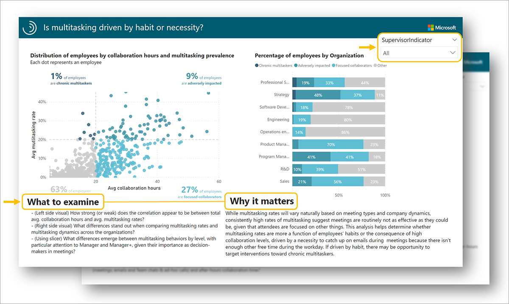
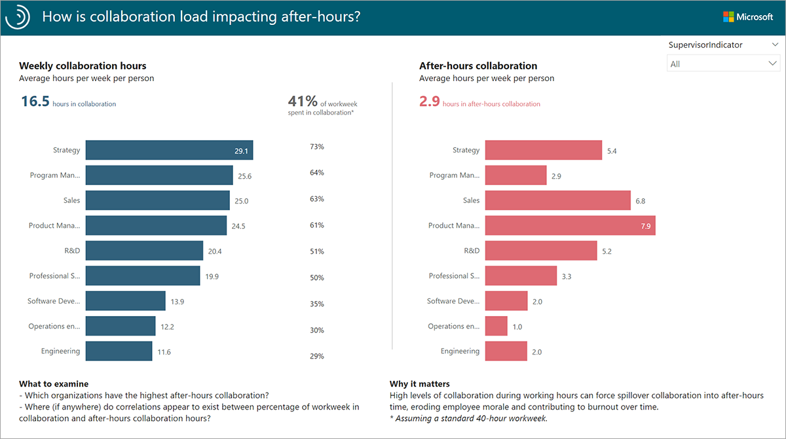
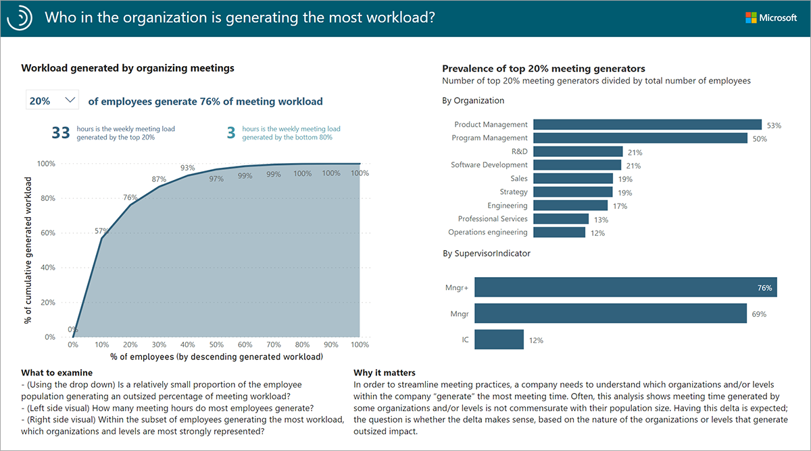
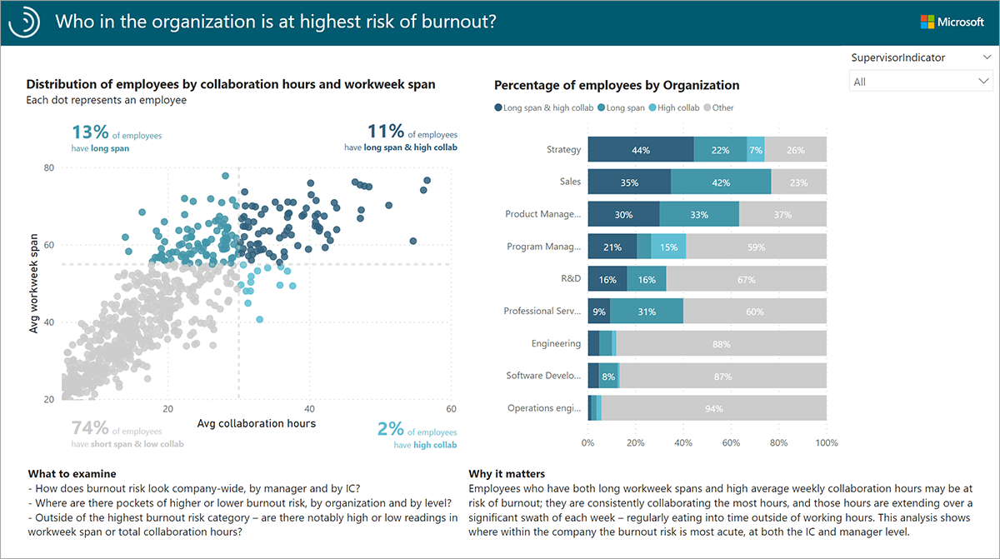
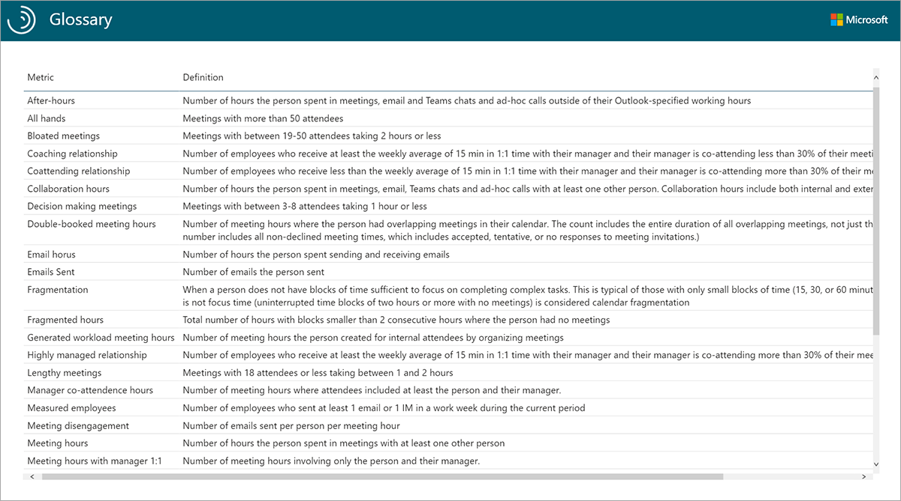

The Ways of working assessment Power BI template provides a quick and easy way to conduct a broad diagnostic on two themes: *Collaboration culture* and *Employee experience*.

## So how does it work?

Each report page provides views into one of the themes laid out on the introduction page. Dynamic filtering and embedded guidance let users uncover useful insights quickly:

- Data filtering by managerial level and organization enables analysts to drill down to root drivers of collaboration behaviors.
- Embedded analysis guidance within each page helps users to systematically identify the most significant insights.
- Broader contextual guidance within each page helps users ground their findings in business context.

## The Introduction page

The Introduction page of the report helps create the context around what questions the Ways of working Assessment will address, and why it matters.

The Introduction page sets the stage for dashboard recipients who are unfamiliar with insights generated from Workplace Analytics.

The pages related to *Collaboration culture* will shed light on employee collaboration practices, including email and meeting behavior. The *Employee experience* pages show insights on employee wellbeing, including time spent after hours and employee-manager relationships.

## Report: How is collaboration load impacting after hours?

The *Collaboration & after-hours* report helps you uncover how much time each team spends collaborating outside working hours. It shows how after-hours time differs by level.

- The metrics across the top of the page display the average weekly hours spent in collaboration during the analyzed time period.
- The chart on the left displays the average weekly collaboration hours for each Organization.
- The chart on the right displays the average weekly after-hours collaboration hours for each Organization.
- In the example here, employees in the Strategy team spend about 73% of their workweek in collaboration. It also looks like a significant chunk of that collaboration, 5.4 hours, is being pushed into after hours.

> [!NOTE]
> The percentage of workweek spent in collaboration is calculated using a standard 40-hour workweek.
>

> [!TIP]
> Use the drop-down menu in the top-right corner to filter by managerial level.
>

High levels of collaboration coupled with high after-hours collaboration can indicate opportunities to make collaboration more efficient in the organization. The *Collaboration & after-hours* report helps you identify groups of employees who may need to improve meeting practices and streamline communication.

## Report: How does the organization spend its meeting time?

The *Meeting culture* report gives insight into how an organization spends time in meetings by breaking them down into categories defined by meeting size and duration. This report shows how much meeting time is consumed by large and/or long meetings as well as what proportion of the most “expensive” meetings (in terms of attendee hours) are recurring.

- The chart on the left shows the percentage of total meeting hours spent in each meeting type. Meeting types include All hands, Bloated, Lengthy and Workshop meetings, and are created using the number of attendees and duration.
- Above and to the right of the meeting type chart, the report shows the total number of hours spent in long or large meetings annually, and for comparison, the number of equivalent full-time employees (FTEs) that would work the same number of hours.
- The chart on the right shows the percentage of recurring meeting hours for each meeting type by group.

Too much time in long and/or large meetings can signal an opportunity to make meetings more efficient and effective. Meetings that are longer than one hour can make it difficult for attendees to maintain focus, and meetings with too many attendees can make it difficult to make decisions.

The *Meeting culture* report allows you to identify and quantify pockets of large and long meetings. Recurring large and long meetings offer a high-value starting point to improve meeting culture and reduce collaboration overload.

## Report: Who in the organization is generating the most workload?

The *Generated workload* report helps organizations understand the source of meeting overload by looking at who is generating the most meetings.

> [!NOTE]
> Generated workload meeting hours are the number of meeting hours an employee created for internal attendees by organizing meetings.

- The drop-down menu on the top allows you to play with the “prevalence of top X% meeting generators.” In the example here, the slider is set to 20%, meaning that 20% of the employees generate 76% of the meeting workload in the organization.
- The chart on the left shows the distribution of employees by Generated workload meeting hours, e.g., 50% of employees generate 97% of meeting hours.
- The charts on the right display the percentage of top meeting generators—as defined by the slider—by Organization and by Supervisor Indicator. In the example here, Product Management and Program Management have the highest representation of meeting generators, at 53% and 50%, respectively.

The *Generated workload* report helps you answer questions about whether meeting time reflects widespread company scheduling behavior or if it's the result of the behaviors of a subset of employees who schedule lots of meetings. It also provides the predominant functions and levels of the biggest meeting load generators.

## Employee Experience

The *Employee Experience* related pages relay information on employee wellbeing, including time spent after hours and the amount of time employees spend in meetings with their manager. The Employee Experience reports let you visualize and explore the following business questions:

- When does collaboration start impacting after hours?
- **Who in the organization is at risk of burnout?**
- How is manager double-booking impacting employees?
- Are employees receiving sufficient one-on-one coaching time?
- Are managers co-attending too many meetings?
- **What managerial behaviors exist across the organization?**

These reports can help identify workplace behaviors that may be impacting employee engagement. The insights they generate can be used to target areas to improve employee-manager relationships and reduce the risk of burnout.

The two Employee Experience reports in bold above are highlighted here.

## Report: Who in the organization is at highest risk of burnout?

The *Burnout risk* report helps you identify groups that may be at risk for burnout by giving an organization-wide look at average collaboration hours and workweek span.

> [!NOTE]
> Workweek span is the time between the person's first collaboration activity (email, Teams call/chat, meeting) and the last collaboration activity of each day, summed over the work week.

- The chart on the left is a scatterplot of employees by average collaboration hours (X-axis) and workweek span (Y-axis). Each dot represents an employee. Employees are classified into four categories:

  - High collab: employees with high collaboration hours but short workweek span
  - Long span: employees with long workweek span but low collaboration hours
  - Long span & high collab: employees with high collaboration hours and high workweek span
  - Other: employees with low collaboration hours and short workweek span

- The chart on the right shows the distribution of employees by collaboration hours and workweek span by group. In the example here, 44% of employees in the Strategy organization have both long workweek spans and high average weekly collaboration hours.

> [!TIP]
> Tip: Click on any bar on the right to filter the chart on the left by the data in the selected bar (this filter is only applied in the context of this report page).
>

If employees have consistently high collaboration hours and not enough time to complete tasks, work can spill over into after hours, resulting in a longer workweek. These employees may have difficulty managing their workloads, which may lead to stress and eventual burnout. The *Burnout risk* report provides a starting-point for organizations to identify at-risk groups who may benefit from task prioritization and workload balancing.

## Report: What managerial behaviors predominate in the organization?

The *Manager relationship* report provides a view of managerial behaviors in terms of one-on-one coaching time and manager co-attendance in meetings.

- The chart on the left is a scatterplot of employees by average weekly minutes in one-on-one meetings with their manager (X-axis) and average co-attendance in meetings with their manager (Y-axis). The combination of one-on-one time and co-attendance for each employee classifies them into one of four manager relationship categories:

  - Coaching: employees who have managers who regularly meet with them one-on-one but otherwise allow them to operate autonomously.
  - Highly managed: employees who have managers who both meet one-on-one with them and co-attend meetings regularly.
  - Coattending: employees who have managers who seldom meet with them one-on-one but frequently co-attend in meetings.
  - Undercoached: employees who have managers who seldom meet with them one-on-one and seldom co-attend in meetings.

- In the example here, only 13% of employees throughout the organization have a “coaching” relationship with their managers. These employees have sufficient one-on-one time with their managers and are empowered to operate autonomously in most of their meetings.

- The chart on the right shows the percentage of employees in each of these manager relationship categories by group. In the example here, Strategy has the highest proportion of employees with a coaching relationship on the team, but at 41% there is still significant room left for improvement.

The most engaged and successful employees get plenty of coaching time with their managers, but are also empowered to operate autonomously in meetings.

The *Manager relationship* report helps answer questions about the managerial practices that predominate across an organization, allowing you to identify where the most effective manager practices are occurring, and where opportunities exist to increase coaching and delegation.

## Report: Glossary

A *Glossary* is also included in the dashboard, providing a reference for the metrics and terminology used across the Ways of working assessment.

## Learn more

- [Workplace Analytics metrics](/Workplace-Analytics/use/metric-definitions?azure-portal=true)
- [About the reports](//Workplace-Analytics/tutorials/power-bi-collab-assess#about-the-reports?azure-portal=true)
