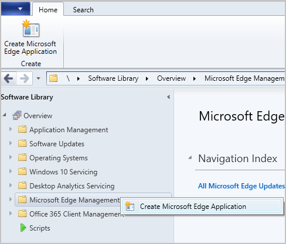
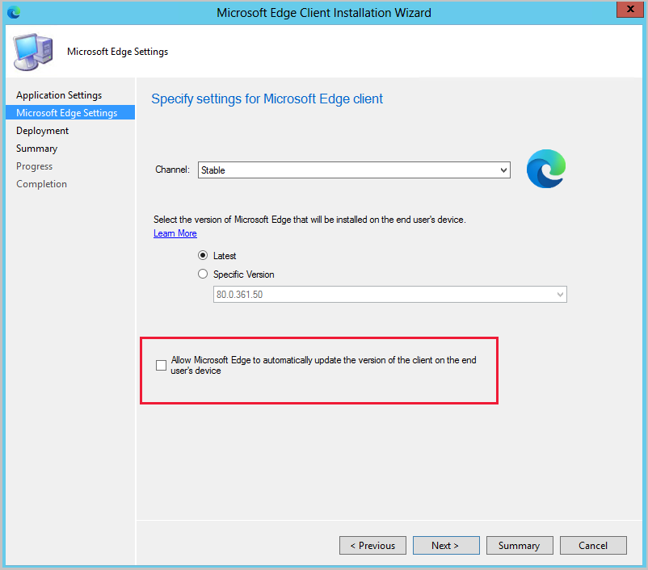
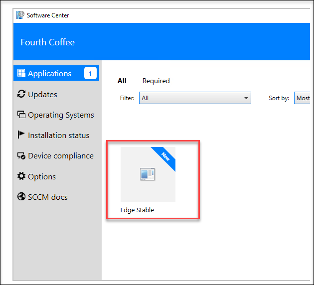
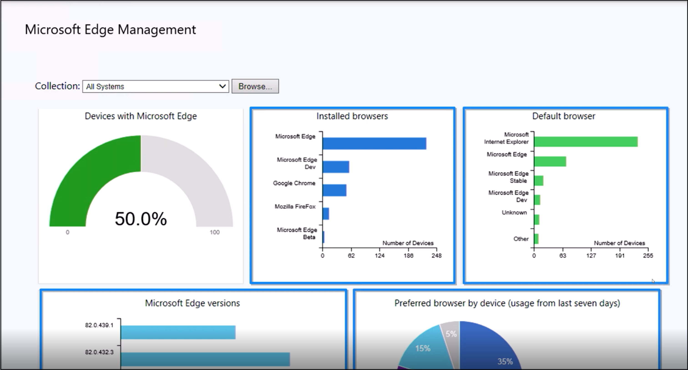

Microsoft Endpoint Manager combines the services and tools you use to manage and monitor mobile devices, desktop computers, virtual machines, embedded devices, and servers; including Configuration Manager and Intune. In this unit, we will walk you through the steps to configure and deploy Microsoft Edge using Configuration Manager.

>[!VIDEO https://www.microsoft.com/videoplayer/embed/RE4xR91]

To recap, Configuration Manager offers the following deployment capabilities for Microsoft Edge:

- Integrated package creation so that admins no longer have to download MSI packages (version 1910 or newer)

- The option to select the channel and release to deploy 

- The option to choose to manage updates for Microsoft Edge with Configuration Manager or allow Microsoft Edge to automatically update the client, on the end user’s device (supported as of Configuration Manager version 2002)

- The option to target specific machines for deployment

 

Follow the steps below to create a Microsoft Edge application using the built-in application experience, in Microsoft Configuration Manager, which makes Microsoft Edge easier to manage.

1) In the console, under **Software Library**, there's a new node called **Microsoft Edge Management**.

2) Select **Create Microsoft Edge Application** from either the ribbon, or by right-clicking on the **Microsoft Edge Management** node.

    

   *How ow to add Edge in Microsoft Edge Management*

 

 

3) On the **Application Settings** page of the wizard, specify a name, description, and location for the content for the app. Ensure the content location folder you specify is empty.

4) On the **Microsoft Edge Settings** page, select:

	- The channel to deploy

	- The version to deploy

	- If you want to **Allow Microsoft Edge to automatically update the version of the client on the end user's device** (added in version 2002)

 

    

   *Select Microsoft Edge settings*

 

 

5) On the **Deployment** page, decide if you want to deploy the application. If you select **Yes**, you can specify your deployment settings for the application. For more information about deployment settings, see [Deploy applications](https://docs.microsoft.com/mem/configmgr/apps/deploy-use/deploy-applications).

6) In **Software Center** on the client device, the user can see and install the application.

 

    

   *Edge Application available for download in software center*

 

 

 

The dashboard is where you can track Microsoft Edge KPIs. Starting in Configuration Manager 2002, the Microsoft Edge Management dashboard provides you insights on the usage of Microsoft Edge and other browsers. In this dashboard, you can:

- See how many of your devices have Microsoft Edge installed

- See how many clients have different versions of Microsoft Edge installed

	- This chart doesn't include the Canary Channel

- Have a view of the installed browsers across devices

- Have a view of preferred browser by device

	- Currently for the 2002 release, this chart will be empty

 

   *The Microsoft Edge Management dashboard*

