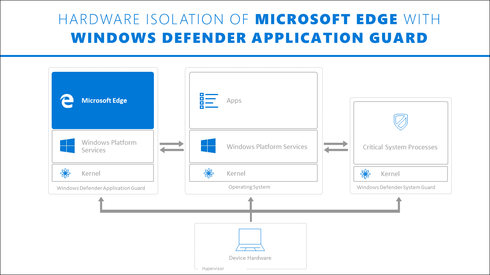

Microsoft Defender Application Guard (Application Guard) is designed to help prevent old and newly emerging attacks to help keep employees productive. Using a unique hardware isolation approach, the goal is to destroy the playbook that attackers use by making current attack methods obsolete.

Designed for Windows 10 and Microsoft Edge, Application Guard helps to isolate enterprise-defined untrusted sites, protecting your company while your employees browse the Internet. As an enterprise administrator, you define your trusted web sites, cloud resources, and internal networks. Everything not on your list is considered untrusted.

If an employee goes to an untrusted site through either Microsoft Edge or Internet Explorer, Microsoft Edge opens the site in an isolated Hyper-V-enabled container, which is separate from the host operating system. This container isolation means that if the untrusted site turns out to be malicious, the host PC is protected, and the attacker can't get to your enterprise data. For example, this approach makes the isolated container anonymous, so an attacker can't get to your employee's enterprise credentials.

Check out the video below for a detailed look at how Application Guard not only prevents attacks but protects the environment in the event of an exploit.

> [!VIDEO https://www.microsoft.com/videoplayer/embed/RE4F998]

As you saw in the video, Microsoft Edge with Application Guard takes process isolation to another level, helping to keep users, data, and environments secure.
