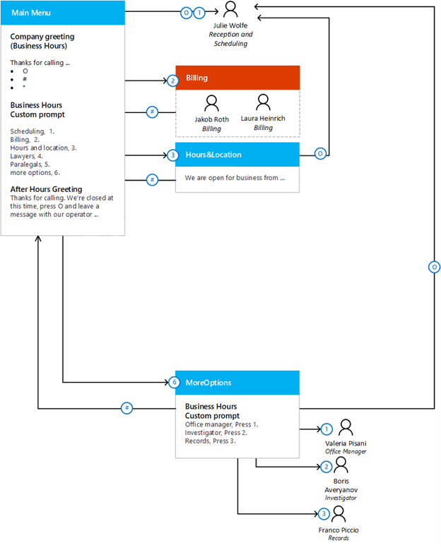
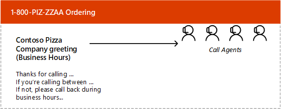
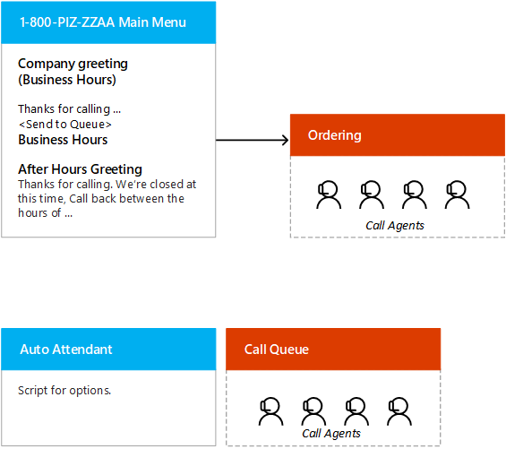

## Auto attendants

Organizations often want to automate the direction of incoming calls to the right team or call queue. They may also want to complete an interaction by gathering information from a caller's keypad. You can use auto attendants for these tasks.

Suppose you've decided, in your digital camera company, to gather information about callers' technical issues by asking them to select from menus using their keypad. You'll use this information to route the call to the right support team, who each specializes in a different camera series. You've planned a set of menus, and you want to know if you can implement them in Microsoft Teams.

Here you'll plan, design, and create auto attendants that are tailored to specific business needs.

## Assess the business need

The first stage of auto attendant planning is to assess the business requirements. Take a moment to answer these questions about your situation:

- Who are the people in the business?

- Why are the customers calling?

- What special considerations does each job function in the office have?

- What language requirements do the customers have?

- What are the business hours, non-business hours and holidays?

- For each of the job functions in the office, what issues do they handle for customers?

### Who are the people in the business?

Create a list of users within the business and identify their roles.

### Why are the customers calling?

The most frequent customer needs should get addressed first. Imagine that Julie is acting as the Operator for the support desk until the auto attendant system is implemented. She should be in the best position to tell you what customer needs generate calls. Ask her to keep a record of the calls the business gets and which users she transfers the calls to in response to customer inquiries. This record could look something like this:

:::row:::
:::column:::

**Caller issue**

:::column-end:::
:::column:::

**Number of calls**

:::column-end:::
:::column:::

**Action**

:::column-end:::
:::row-end:::
:::row:::
:::column:::

Scheduling/rescheduling/cancelling appointments

:::column-end:::
:::column:::

45

:::column-end:::
:::column:::

No transfer, receptionist handles the call

:::column-end:::
:::row-end:::
:::row:::
:::column:::

Billing questions

:::column-end:::
:::column:::

22

:::column-end:::
:::column:::

Transfer to Jakob or Laura in billing

:::column-end:::
:::row-end:::
:::row:::
:::column:::

Inquiry about hours and business location

:::column-end:::
:::column:::

20

:::column-end:::
:::column:::

No transfer, receptionist handles the call

:::column-end:::
:::row-end:::
:::row:::
:::column:::

Want to speak to the office manager

:::column-end:::
:::column:::

12

:::column-end:::
:::column:::

Transfer to the office manager

:::column-end:::
:::row-end:::

### What special considerations does each job function in the office have?

Have some discussions with people in each of the job functions in the office about what they need from the Auto Attendant.

### What language requirements do the customers have?

The countries/regions where you do business are likely to influence the languages spoken by your customers.

Suppose we discover that there were only two callers in the whole week who spoke what seemed like English as a second language. They spoke good enough English to make their inquiries, and they didn't seem to speak the same native language. If you confirm this with the business partners, you might decide that menus can be implemented in English only, but bear in mind that you may lose customers who don't speak English well.

### What are the business hours, non-business hours and holidays?

You may want distinct initial greetings for business hours, after-hours, weekends, and holidays.

### For each of the job functions in the office, what issues do they handle for customers?

You may be surprised by what issues the various office workers usually handle. For example, it's possible that Julie, the receptionist, can answer many questions you assume need the input of the billing department.

## Design and mockup

To complete the initial design, you'll need a flexible and easy way to work out hierarchies and structures of users and auto attendants. You can do this on any blank wall or whiteboard, using several colors of pen and some sticky notes or index cards. Below are some steps that are worth considering as you design:

1. Write on a note or card the name and phone number of each person with a voicemail account in the business. You may need several notes for the operator. It might help to distinguish users and auto attendants with different colored notes.

1. Mark one note as the main auto attendant, which will include a business hours initial greeting, an after-hours greeting, and a main menu. You may also want an auto attendant to represent the hours and location recording and additional auto attendants to cover the needs of your callers. If possible, use a different color of note to represent auto attendants.

1. Place the main auto attendant note on your board space. If any of the top options go directly to a single employee, put their note to the right of the note representing the attendant.

1. It's unlikely all the options will fit on the main auto attendant menu, so think about which additional attendants might be needed and how they might nest under the main attendant.

1. If you have an option that leads to a call queue, create a note using a third color and place it below and to the right of the attendant that connects to the call queue.

> [!div class="mx-imgBorder"]
> 

## Call Queues

A call queue can organize many incoming calls and make sure that they are answered in turn. Callers don't like to spend a lot a time waiting in a queue, so plan your queues carefully to minimize long waits.

You want to plan the use of call queues in your digital camera manufacturer. You're going to use queues to ensure that calls are not dropped, even during busy times, but you want to avoid callers getting bored by long waits and dropping their call. Here, you'll learn what questions to answer when you plan call queues.

## Assess business need

The first stage in planning a call queue is to understand the business needs. This can be done by using the following steps.

| **Business need**| **Considerations**|
| :--- | :--- |
| How many call agents will you assign to the queue?| Imagine that your company has 25 call agents in their existing call center. There are typically 12-20 agents active at one time. Often organizations have a 50 percent available to total number of agents; however, this can change drastically depending upon the organization.  There is no set number of agents to available and this can be catered to though call queues and hold times.|
| How is the existing system setup, and what changes do you want to make?| Suppose there's an auto attendant system for the company office and there's an option in that system that routes to retail ordering, but it only connects one or two calls a day. You have a 1-800 number for placing orders for delivery and advertise it heavily. The legacy call queue service provides a single auto attendant node in front of the call queue to provide a different caller experience during business hours and outside business hours. You must decide whether to implement this arrangement in Teams or to replace it with a more efficient configuration.|
| Will the call center be active 24 hours a day, or only during business hours?| For example, the queue might need to be in use from 11am to 11:30pm, seven days a week.|
| Do you want distinct initial greetings for business hours, after-hours, weekends, or holidays?| For example, if the call rate outside of their business hours is low, you can consider using special greetings.|
| How are the agents compensated?| Suppose the agents that receive call are paid on an hourly basis plus a performance bonus, and their performance is tracked in the ordering system. There was a perception that one agent was getting favored by the queue's distribution of calls. Ensure your agents know that calls are distributed fairly.|
| What is the usual size of the call queue in the existing call center?| Suppose that, depending on the hour, the call queue can vary from 5 to 30 callers. Wait times are known to be up to 3 minutes most of the time, and 5 minutes at peak times. Consider carefully whether callers are likely to put up with these times.|
| Do you want to play hold music?| Hold music can help to reassure queuing callers but must be carefully chosen to avoid irritation and fit with your brand.|

## Design and mockup

A cloud call queue has a limited number of options. The main decisions to make for the queue are:

- Organization should decide whether to assign a number directly to the queue or to have callers connect to an auto attendant first.

- Organization should decide whether to have an initial greeting as part of the call queue. Alternatively, an auto attendant can provide a greeting.

- Organization should decide what hold music to use.

- Organization should decide how to distribute the calls among the available agents.

The following diagram shows an example call queue design without an attendant:

> [!div class="mx-imgBorder"]
> 

The following diagram shows an example call queue design with an attendant.

> [!div class="mx-imgBorder"]
> 

## Write the scripts

As for auto attendants, make sure your scripts are planned carefully and consider having them professionally recorded. The goal is to connect the caller to a live person as efficiently as possible.

**Greetings**

Best Practices

- Start with an appreciation of their call and business

- Greetings should be kept short so returning callers are not delayed each time they call.

- Ensure any tagline, company slogan, website, or all of them are used if they are available.

Things to avoid

- Using more than two or three sentences to greet the callers.

- If your website doesn't promote anything of value to the customers don't mention it.

- If you don't currently have a slogan or tagline, do not make it up to fill the greeting.

**Auto Attendants**

Best Practices

- Use commonly accepted options, such as "Press zero to reach the Operator."

- Make the callers aware early on if there have been changes to the menu.

- Arrange the frequently called options up front.

- Give a description first, "For Sales Support, Press 5"

Things to avoid

- Refrain from using the word "please" before you announce each option, "Please press 1…Please press 2"

- Keep things simple, refrain from using more than six options at a time.

**Rehearse and validation**

Before you record the auto attendants and greetings, be sure to read it and rehearse it several times. Ensure that your pronunciation and annunciation are finely tuned. Once the recordings are applied, check the recording for any errors and make sure the solution works as attended.

