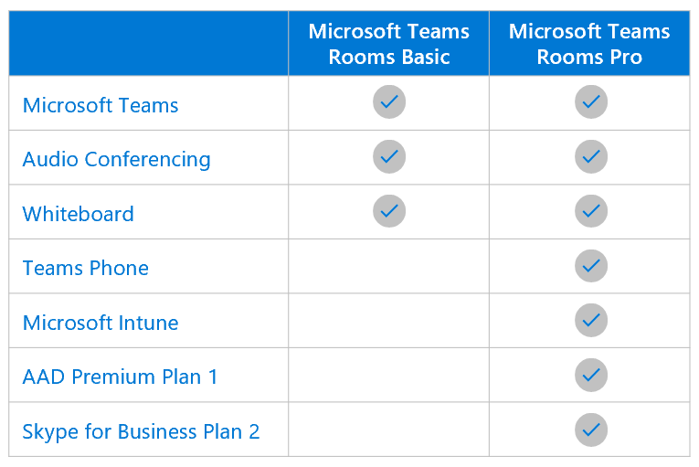
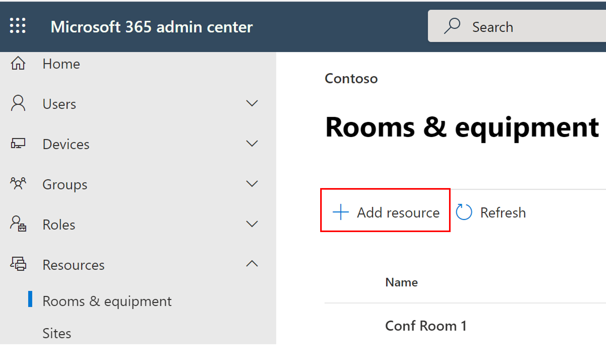
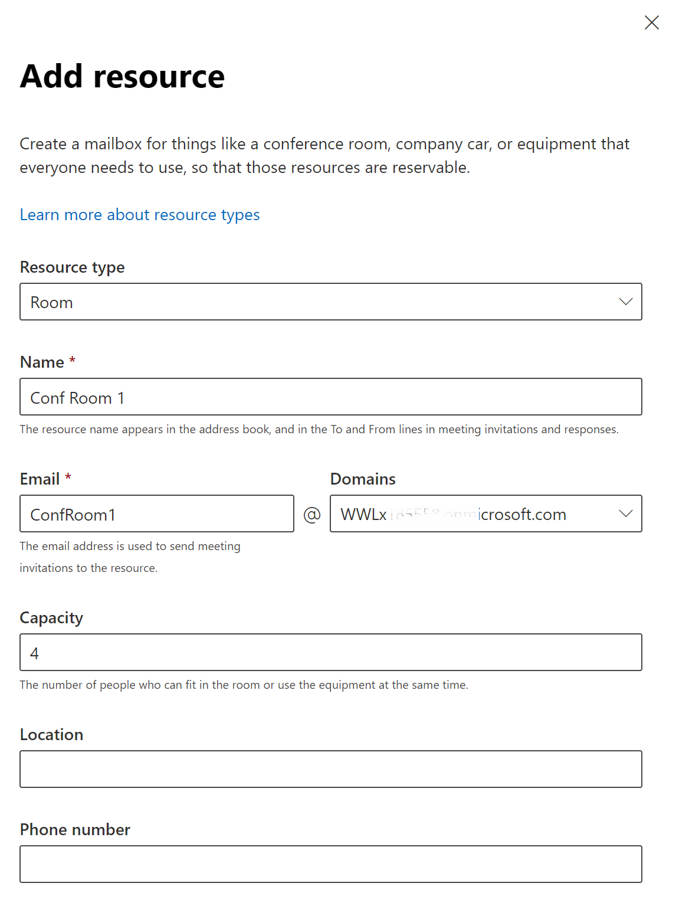
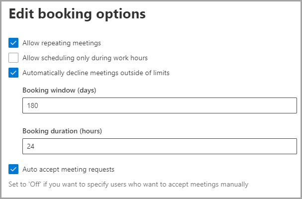
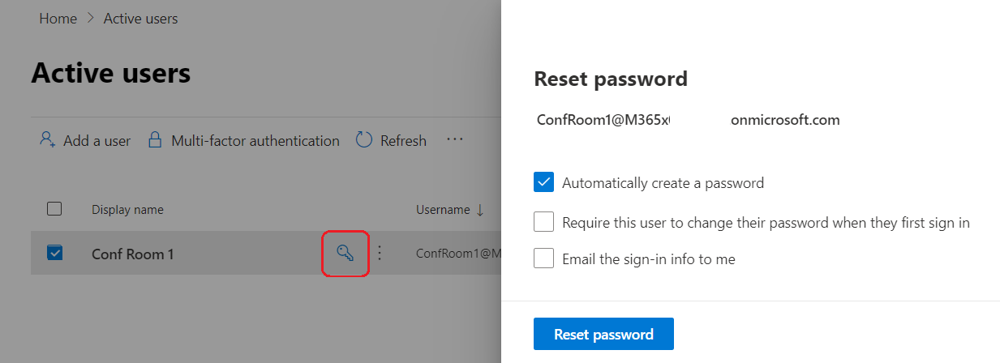

Microsoft 365 resource accounts are mailbox and Teams accounts that are dedicated to specific resources, such as a room, projector, and so on. These resource accounts can automatically respond to meeting invites using rules you define when they're created. For example, if you have a common resource such as a conference room, you can set up a resource account for that conference room that will automatically accept or decline meeting invites depending on its calendar availability.

When a person schedules a room, it's this resource mailbox that's invited to the meeting. This mailbox will accept or decline the meeting invite for the room. 

This resource account is also the account that signs into the Microsoft Teams Rooms app. The account must be enabled for Skype for Business and Microsoft Teams. It's recommended that organizations establish a naming convention for resource accounts, particularly when organizations move to Azure Active Directory (Azure AD) and employ dynamic groups. A resource account can automatically be added to Azure AD groups based on the organization's naming convention.

## Assign Teams Rooms licenses

It's recommended that organizations assign the Teams Rooms Standard or Teams Rooms Premium license to all Teams Rooms resource accounts. 

- **Teams Rooms Standard license**. This license is a cost-effective license that includes all the core components needed for Teams Rooms.

- **Teams Rooms Premium license**. This license includes everything in the Standard license, plus an advanced set of features. For example, it includes a Microsoft-managed service that helps with everything from planning your rooms to monitoring and troubleshooting them. 

    

## Create a resource account using Microsoft 365 admin center

Complete the following steps to create a new resource account using the Microsoft 365 admin center. These instructions will create a user account record for the resource account, and then assign it a password and a license.

1. Navigate to the Microsoft 365 admin center (admin.microsoft.com) and sign in with an admin account. 
1. In the left-hand navigation pane, select **Show all**, select **Resources**, and then select **Rooms & equipment**.

   

1. On the **Rooms & equipment** window, select the **+Add resource** option on the menu bar to add a new resource account. 

   

1. In the **Add resource** pane that appears, update the following fields:

   

   1. Select **Room** as the **Resource type**. 
   1. Add a friendly name in the **Name** field. This value is what users will see when scheduling the room in Outlook or Microsoft Teams. 
   1. The **Email** address is automatically populated. Edit this address as necessary to conform to your organization's naming standard for Teams Rooms. Select the appropriate **Domain** for your organization.
   1. The **Capacity**, **Location**, and **Phone number** fields are all optional.

1. Select **Save**.

1. After the resource account has been created, you’ll receive an acknowledgment that the Room mailbox is ready to use.

   


1. Once you've created a resource account, you can edit its booking options. On the acknowledgment window that you received in the prior step, under the **Next steps** section, select **Edit booking options**.

    If you closed the acknowledgment window before selecting **Edit booking options**, then select the resource account on the **Rooms & equipment** window. In the detail pane that appears for the account, select **Edit** under the **Booking options** section.  

    Both methods described in this step will open the **Edit booking options** pane. 

   

1. In the **Edit booking options** pane, update the following settings:

   - **Allow repeating meetings**. This option, which controls recurring appointments, is enabled by default.
   - **Allow scheduling only during work hours**. If this option isn't selected, the room can be scheduled any time of day. If this option is selected, then the room can only be scheduled during work hours.
   
       To set the work hours for this resource account, sign in as the resource account into Outlook on the web to change its working hours.
   - **Automatically decline meetings outside of limits**. This option is enabled by default. If this option is selected, the resource account won't accept meetings that are scheduled to last longer than the value entered in the **Booking duration (hours)** field or that are scheduled beyond the value entered in the **Booking windows (days)**.

    - **Auto accept meeting requests**. This option is selected by default. Most organizations will leave this option selected. This option is only unselected if the room requires human intervention to accept or decline meeting requests.

1. Select **Save changes**. 

1. Now that you've created the resource account and configured its booking options, it's time to assign it a password. In the **Microsoft 365 admin center**, in the left-hand navigation pane, select **Users** and then select **Active users**.
1. On the **Active users** window, either hover your mouse over the new resource account that you created, or select the check box to the left of the account's display name. A **Key** icon (Reset a password) will appear to the right of the display name. Select the **Key** icon to set the password.

   

1. On the **Reset password** pane that appears, enter the following information:
    1. Unselect the **Automatically create a password** check box. 
    1. By unselecting this option, a **Password** field will appear. Enter the password for this room in this field.  
    1. Unselect the **Require this user to change their password when they first sign in** check box. There's no way to force a password change interactively within the Teams Rooms app. As such, this check box shouldn't be selected for a resource account.
    1. You can select the **Email the sign-in info to me** check box if you want to receive an email with the password information you just entered.
1. Select **Reset password**, and then select **Close** once the password has been reset.

1. To complete the resource account configuration, you must assign a license to the resource account. On the **Active users** window, select the room’s display name to open the properties pane for this account.

   

1. In the properties pane that appears, note the tabs that appear across the top of the pane. The **Account** tab is displayed by default. Select the **Licenses and apps** tab. 
1.  In the **Licenses and apps** tab, select the check box next to the appropriate license for this resource account. 
1. Select **Save changes** and then close the properties pane.

## Create a resource account using PowerShell

PowerShell can also be used to create resource accounts. PowerShell is the fastest way to create accounts in bulk. If you need to create multiple accounts, you can create a PowerShell script to automate the account creation. There are also some features and settings that are only available through PowerShell.

There are two mandatory PowerShell modules that must be installed to create a resource account. One is the **Microsoft Online** module, which is the Azure Active Directory PowerShell module. The other is the **Exchange Online** PowerShell module.

1. To connect to Microsoft 365, run the **Connect-MsolService** and **Connect-ExchangeOnline** cmdlets. Enter your credentials when prompted.
2. Verify that you have enough licenses by running the following PowerShell cmdlet:


   ```powershell
   Get-MsolAccountSku | where-object {$_.AccountSkuID -like "*meeting*"}
   ```

   

   In this example, there are 25 Meeting Room licenses and 19 of them have been consumed (or assigned). That leaves six licenses available to be assigned to resource accounts.

   When creating accounts through PowerShell, it's advantageous to use variables to store values. Throughout the following cmdlets, you'll reuse the same values several times. Storing these values in a variable will make these commands easier to run successfully. It also sets the stage for writing your own script if you need to create multiple resource accounts at one time. 

3. In this example, you'll create several variables, such as UPN, mailbox name, mailbox alias, and password. 

   **Account name**

   ```powershell 
   $acctUpn=mtrfocusroom1@contoso.com
   ```

   **The unique name of the mailbox**
 

   ```powershell
   $MailBoxName 'focusroom'
   ```

    **Specify the Exchange alias** (also known as the mail nickname) for the recipient


   ```powershell
   $MailBoxAlias='focusroom'
   ```

    **Define the password for the account**


   ```powershell
   $Password='ThisIs1ReallyLongPassword!'
   ```

    **Set the license to assign**


   ```powershell
   $ADLicense='teamsdevicesdemo:MEETING_ROOM'
   ```

    **Two letter ISO code** for the country where the tenant is registered


   ```powershell
   $UsageLocation='US'
   ```

   - The password is in clear text. If you set the password using this method, be sure to immediately go into the Microsoft 365 Admin Center and change the password to something else.

4. As mentioned earlier, the resource account is just an Exchange mailbox. Here's the command to create the mailbox as a resource account.

   ```powershell
   New-Mailbox -MicrosoftOnlineServicesID $acctUpn -Name $DisplayName -Alias $MailBoxAlias -Room -EnableRoomMailboxAccount $true -RoomMailboxPassword (ConvertTo-SecureString -String $Password -AsPlainText -Force)
   ```

5. The next thing you need to do is enable calendar processing. You do this using the **Set-CalendarProcessing** cmdlet.


   ```powershell
   Set-CalendarProcessing -Identity $MailBoxAlias -AutomateProcessing AutoAccept -AddOrganizerToSubject $false -DeleteComments $false -DeleteSubject $false ‐RemovePrivateProperty $false
   ```

   - After identifying the account that was created in the previous command, the *AutomateProcessing* parameter is set to **AutoAccept**. This setting directs the resource account to automatically process meeting invites instead of waiting for human intervention.  
   - *AddOrganizerToSubject* is set to **False**.  That means when the meeting is shown on the center of table console, it will only show the meeting name and not *both* the organizer and meeting name. For example, it will display "Weekly Status Meeting" instead of "Sara Perez Weekly Status Meeting."
   - The *DeleteComments* parameter is set to **False**. This setting means the body of the e-mail won't be deleted. This parameter MUST be False when using third-party guest join (for example, joining Cisco or Zoom meetings through Teams Rooms).
   - You can choose to delete the Subject of the meeting invite using the *DeleteSubject* parameter. In doing so, the meetings on Teams Rooms will be called by the name of the meeting organizer, such as "Sara Perez." This setting is a security feature that prevents someone from walking through a restricted area and seeing meeting subjects that might leak information, such as "Meeting About Acquisition of Tailspin Toys." If you enable deleting the subject, the meeting title would be "Sara Perez Meeting" and you would have no idea what the meeting is about.

6. If the meeting is flagged as private, set *RemovePrivateProperty* to **False**.
7. Set the resource account password to never expire and then assign the license.


   ```powershell
   Set-MsolUser -UserPrincipalName $acctUpn -PasswordNeverExpires $true ‐UsageLocation $UsageLocation

   Set-MsolUserLicense -UserPrincipalName $acctupn -AddLicenses $ADLicense
   ```


## Knowledge check<br>

Choose the best response for the following question. Then select “Check your answers.”