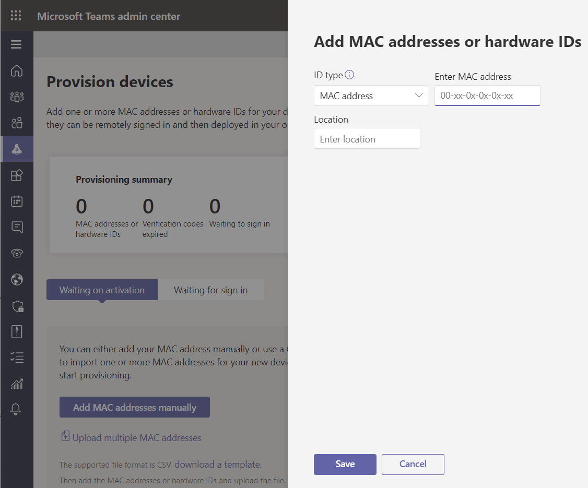

IT admins can remotely provision and sign in to a Teams Android device. To provision a device remotely, the admin must upload the MAC IDs of the devices being provisioned and create a verification code. The entire process can be completed remotely from the Teams admin center.

## Add device MAC addresses

Complete the following steps to provision a new device:

1. Sign in to the Teams admin center.
1. In the left-hand navigation pane, select **Devices**, and then select **IP Phones**.
1. On the **IP Phones** window, select the **Actions** drop-down arrow that appears in the upper-right side of the screen. In the drop-down menu that appears, select **Provision devices**.

1. In the **Provision devices** window, you can either add the MAC address manually or upload a file. The following sections cover each approach.

### Manually add a device MAC address

1. There are two tabs on this screen - **Waiting on activation** (which is displayed by default) and **Waiting for sign in**. In the **Waiting on activation** tab, select **Add MAC addresses manually**.

   

1. Enter the MAC addresses.
1. Enter a location, which helps technicians identify where to install the devices.
1. Select **Apply** when finished.

### Upload a file to add a device MAC address

1. In the **Waiting on activation** tab, select **Upload multiple MAC addresses**.
2. Download the file template.
3. Enter the MAC addresses and location, and then save the file.
4. **Select file**, and then select **Upload**.

## Generate a verification code

A verification code is required for each device. The verification code is generated in bulk or at the device level and is valid for 24 hours. Complete the following steps to generate a verification code.

1. In the **Waiting on activation** tab, select an existing MAC address.
   A password is created for the MAC address and is shown in the **Verification Code** column.

2. Provide the list of MAC addresses and verification codes to the field technicians. You can export the detail directly in a file and share the file with the technician who is doing the actual installation work.

## Provision the device

When the device is powered on and connected to the network, the technician provisions the device. These steps are completed on the Teams device.

1. The technician selects **Provision device** from the **Settings**.  

   
  
2. The technician enters the device-specific verification code in the provided input field.

   

   Once the device is provisioned successfully, the tenant name appears on the sign-in page.

   

## Sign in remotely

The provisioned device appears in the **Waiting for sign in** tab. Start the remote sign-in process by selecting the individual device.

1. Select a device from the **Waiting for sign in** tab.

   

2. Follow the instructions in **Sign in a user**, and then select **Close**.

   

## Knowledge check 

Choose the best response for the following question. Then select “Check your answers.”