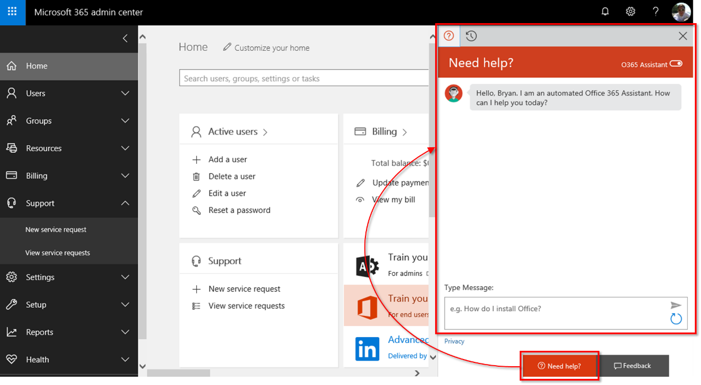
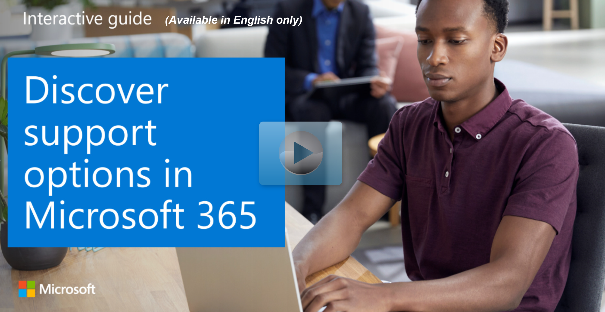

As a Microsoft 365 subscriber you have a variety of support options, but the details depend on your specific situation:

- Which subscription do you have? Does it include a service package?
- Which service or tool do you need support for?
- What kind of support do you need?
 
Here are the different ways and channels to get support for Microsoft 365:

- **FastTrack**. Get direct access to Microsoft 365 planning materials and dedicated Microsoft FastTrack project managers and engineers to help you deploy Microsoft 365.
- **Support Assistant**. The Microsoft 365 admin center has an automated assistance bot, the Support Assistant, that’s designed to help you find answers to support questions. Accessed from the **Need help** button, the bot offers a chat-based user experience.

   
*The Support Assistant in Microsoft 365 admin center*

- **Premier Support**. Microsoft Premier Support Services is well suited for large and global enterprises with strategic and critical dependence on Microsoft products, including Microsoft 365 and Microsoft Azure. If you're a Premier Support Services member, you'll be assigned a technical account manager and can add additional benefits like advisory services and on-site support. Premier support engineers are assigned customer issues and can call in any Microsoft expertise that’s needed to solve the problem. 
- **Cloud Service Provider Tier 1 support**. If you purchased your Microsoft 365 subscription through a certified tier 1 Cloud Solution Provider (CSP), contact them directly for technical support. Your Tier 1 CSP is your first point of contact for all service-related issues. Tier 1 providers will escalate any issues they can’t resolve directly to Microsoft to ensure that you get the help you need.
- **Telephone support**. Some Microsoft 365 components provide phone support. 
- **Microsoft 365 Tech Community**.  Connect to and collaborate with other customers, share your experiences and problems, and learn from experts. Available at https://techcommunity.microsoft.com/t5/Microsoft-365/ct-p/microsoft365, get access to Microsoft blog posts, announcements, and forum posts from other Microsoft 365 users.
- **Microsoft 365 support forums**. Microsoft offers official support forums where you can ask questions and get answers from both Microsoft and community members. Different technologies and services in Microsoft 365 have their own forums. Some of the more popular ones:

   [**Azure forums**](https://azure.microsoft.com/support/community/)  

   [**Windows forums**](https://answers.microsoft.com/windows/forum?sort=LastReplyDate&dir=Desc&tab=All&status=all&mod=&modAge=&advFil=&postedAfter=&postedBefore=&threadType=All&isFilterExpanded=false&page=1) 

   [**Office forums**](https://answers.microsoft.com/msoffice/forum?sort=LastReplyDate&dir=Desc&tab=All&status=all&mod=&modAge=&advFil=&postedAfter=&postedBefore=&threadType=All&isFilterExpanded=false&page=1)

### Explore your Microsoft 365 support options

View a [video version](https://www.microsoft.com/videoplayer/embed/RE44izJ) of the interactive guide (captions available in more languages).

  

Be sure to click the full-screen option in the video player. When you're done, use the **Back** arrow in your browser to come back to this page. 
