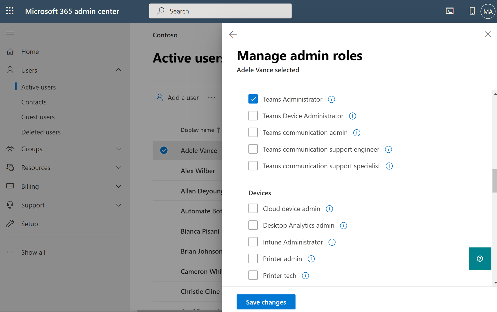
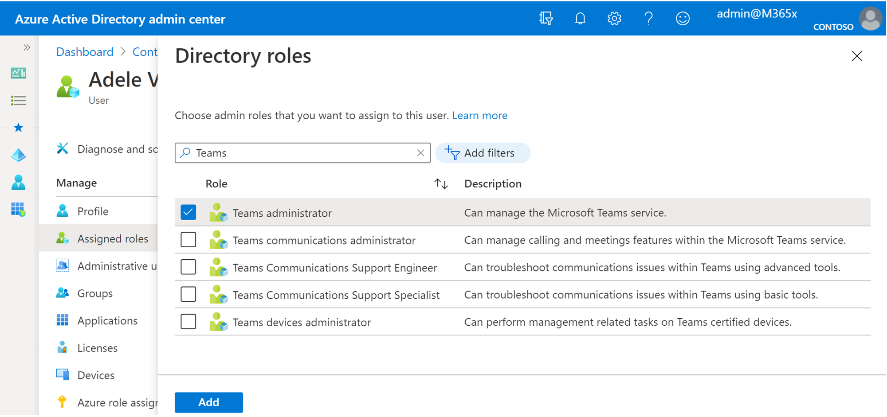

Microsoft 365 provides various preconfigured administrative role groups so that selected users can receive elevated access to administrative tasks within the Office 365 services. The role groups are assigned through different portals, such as the Microsoft 365 Admin Center, the Azure portal, and PowerShell. 

Several administrative roles have full access to all of the Teams' service settings, such as the Global Administrator and the Teams admin. Other roles only provide access to certain parts of Microsoft Teams to perform recurring tasks, such as troubleshooting call quality problems and managing telephony settings.

The specialized Teams admin roles include:

- Teams Administrator

- Teams Device Administrator

- Teams Communications Administrator

- Teams Communications Support Engineer

- Teams Communications Support Specialist


> [!NOTE]
> Even if Teams consists of different workloads from Office 365, the team-specific administrator roles do not grant permissions to other services, such as Exchange Online or SharePoint in Microsoft 365.

## Teams roles and capabilities

The following table identifies the tasks that each role can perform, and the tools the administrator can use in the Microsoft Teams Admin Center and in PowerShell.

| Role  | Can do these tasks | Can access the following tools   |
|-----|-------|-----------------|
| Teams Administrator          | Manage the Teams service, and manage and create Microsoft 365 Groups.        | Everything in the Microsoft Teams admin center and associated PowerShell controls, including:<br/><br/>-  Manage meetings, including meeting policies, configurations, and conference bridges.<br/><br/>- Manage voice, including calling policies and phone number inventory and assignment.<br/><br/>- Manage messaging, including messaging policies.<br/><br/>- Manage all org-wide settings, including federation, teams upgrade, and teams client settings.<br/><br/>- Manage the teams in the organization and their associated settings, including membership (group management supported via PowerShell, team management in the Teams admin center).<br/><br/>- Manage Teams-certified devices and set up and assign configuration policies.<br/><br/>- View user profile page and troubleshoot user call quality problems using advanced troubleshooting toolset. <br/><br/>- Access all reports in the Microsoft Teams admin center<br/><br/>-  Access, monitor, and troubleshoot tenant's call quality and reliability using data exposed in Call Quality Dashboard (CQD) down to the users impacted by poor call quality. Create new call quality reports, update, and remove call quality reports as needed. Upload and update CQD building data.<br/><br/>-  Publish apps to the tenant app catalog in the Microsoft Teams admin center |
| Teams Device Administrator              | Manage devices configured for use with the Teams service.                    | Manage device configuration and updates, review device health and status of connected peripherals, set up and apply configuration profiles, and restart devices.<p>The Teams Device Administrator role doesn't provide access to call quality data or call analytics. To view call quality data or call analytics, you need to be assigned the Teams Communications Administrator role. |
| Teams Communications Administrator      | Manage calling and meetings features within the Teams service.               | Manage meetings, including meeting policies, configurations, and conference bridges.<br><br> Manage voice, including calling policies and phone number inventory and assignment.<br><br> View user profile page and troubleshoot user call quality problems using the advanced troubleshooting toolset.<br><br>Access the Teams PSTN blocked users report, PSTN minute pools report, and PSTN usage report in the Microsoft Teams admin center. <br><br> Access, monitor, and troubleshoot tenant's call quality and reliability using data exposed in Call Quality Dashboard (CQD) down to the users who are impacted by poor call quality. Create new call quality reports, update, and remove call quality reports as needed. Upload and update CQD building data.|
| Teams Communications Support Engineer   | Troubleshoot communications issues within Teams by using **advanced** tools. | View user profile page and troubleshoot user call quality problems using advanced troubleshooting toolset.<br><br> Access, monitor, and troubleshoot tenant's call quality and reliability using data exposed in Call Quality Dashboard (CQD) down to the users who are impacted by poor call quality. |
| Teams Communications Support Specialist | Troubleshoot communications issues within Teams by using **basic** tools.    | Access user profile page for troubleshooting calls in Call Analytics. Can only view user information for the specific user being searched for.<br><br> Access, monitor, and troubleshoot tenant's call quality and reliability using data exposed in Call Quality Dashboard (CQD). |


The Teams Administrator role in the Azure portal is the same role as the Teams service admin in the Microsoft 365 Admin Center. If you assign this role to a member in the Azure portal, you can also see it in the Microsoft 365 Admin Center (and vice versa).

## Assign Teams admin roles in Microsoft 365 admin center

To assign Teams admin roles in the Microsoft 365 admin center, you will need to perform the following steps:

1. Sign-in to the **Microsoft 365 admin center** using a **Global administrator** account.

2. Select **Users**, and then select **Active Users.**

3. Search for a user and then select the user getting the role assignment. 

4. On the user page, under **Roles** section, select **Manage Roles**.

5. Select **Admin center access**.

6. Select the role to assign to the user (for example, **Teams service admin**), and then select **Save changes**. 

    

You can also assign admin roles in Microsoft 365 admin center by selecting **Roles** in the left navigation pane, and then select the appropriate admin role, for example **Teams communications support engineer.** On the **Teams communications support engineer** page, select **Assigned admins**, and add the users you want to assign the role.


## Assign Teams admin roles in Azure AD

To assign Teams admin roles in Azure AD, you will need to perform following steps:

1. Sign-in to the **Azure portal** using a **Global administrator** account for the directory.

2. Select **Azure Active Directory**, and then select **Users.**

3. Search for a user and then select the user getting the role assignment. 

4. On the user page, select **Assigned Roles,** select **Add assignment**.

5. In the **Directory role** page, in the search box, type **Teams**.

6. Select the role to assign to the user (for example, **Teams Administrator**), and then select **Add**. 

7. The **Teams Administrator** role is assigned to the user and it appears on the user’s Assigned roles page.



## Assign admin roles with PowerShell

Assigning admin roles with PowerShell is used when you want to automate the process of assignment or you need to perform bulk assignments in Azure AD. To assign an admin role, you need to run ```Add-AzureADDirectoryRoleMember``` cmdlet in **Azure Active Directory PowerShell for Graph** module in Windows PowerShell. For example, if you want to assign [LynneR@contoso.com](mailto:LynneR@contoso.com) the admin role Teams Service Administrator, run the following cmdlets:

```powershell
$userName="LynneR@contoso.com"
$roleName="Teams Service Administrator"
$role = Get-AzureADDirectoryRole | Where {$_.displayName -eq $roleName}

Add-AzureADDirectoryRoleMember -ObjectId $role.ObjectId -RefObjectId (Get-AzureADUser | Where {$_.UserPrincipalName -eq $userName}).ObjectID
```

For additional information, see 

* [Use Microsoft Teams administrator roles to manage Teams](/microsoftteams/using-admin-roles)

* [Assign roles to Microsoft 365 user accounts with PowerShell](/microsoft-365/enterprise/assign-roles-to-user-accounts-with-microsoft-365-powershell)


