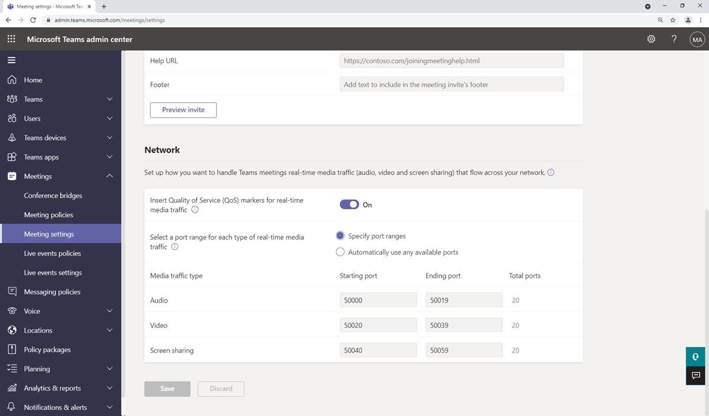
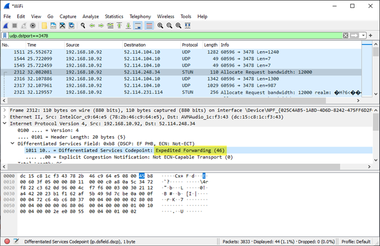
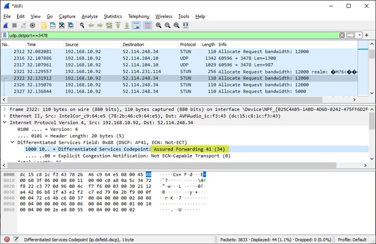

Quality of Service (QoS) is a network technology that allows network traffic that is sensitive to delays, such as real-time voice or video streams to be prioritized over other network traffic types. QoS can be used on organizational networks with limited bandwidth to ensure that Teams real-time traffic is prioritized over other types of traffic.

This unit explains how to design and configure QoS for Microsoft Teams

## Design organization quality of service (QoS) requirements and policies

Quality of Service is a technology to prioritize certain traffic when a link is congested. QoS works by network packets being marked for prioritization, called DSCP (Differentiated Services Code Point) marking. This packet marking can either be done by network equipment based on the port range of the packets or by the endpoint, the operating system, or Teams device (in the case of IP phones for example). Endpoint marking in windows is managed by Group Policy.

Microsoft recommends a combination of DSCP marking at the endpoint and port-based ACLs (Access Control Lists) on routers, if possible. Using endpoint marking for Windows clients (usually the majority) and using port-based DSCP tagging at the network level to mark traffic from mobile, Mac, and other clients. This is to mark both outbound from the client traffic and traffic inbound to the corporate network: for example from the Teams Service.

Due to variables in Teams clients, networks, and equipment it is hard to configure perfect QoS for Teams for all media flows in all directions. QoS only optimizes traffic internal organizational network and only if you specifically configure your network to respect and optimize the route for packets with these markings. It has no impact on traffic on internet links, as the internet does not respect QoS markings

The network equipment configuration is beyond the scope of this module. This module will show how to configure Teams for QoS marking. Use your network requirements gathering to understand how much bandwidth you should reserve for QoS marked Teams traffic on your various network paths.

## Configure Teams for QoS

The first step of configuring Teams for QoS is to configure the Client source port range. By default, teams will use any available ports within the 1024-65535 range. If we want to mark for QoS, we need to configure specific port ranges for each media type.

Microsoft recommends the following settings for QoS on the organizations network:

| **Media traffic type**| **Client source port range**| **Protocol**| **DSCP value**| **DSCP class**|
| :--- | :--- | :--- | :--- | :--- |
| Audio| 50,000–50,019| TCP/UDP| 46| Expedited Forwarding (EF)|
| Video| 50,020–50,039| TCP/UDP| 34| Assured Forwarding (AF41)|
| Application/Screen Sharing| 50,040–50,059| TCP/UDP| 18| Assured Forwarding (AF21)|

These are configured by performing the following steps:

1. Navigate to the Microsoft Teams admin center at [https://admin.teams.microsoft.com](https://admin.teams.microsoft.com/)

1. Select **Meetings** and **Meeting settings.**

1. Turn on "**Insert Quality of Service (QoS) markers for real-time media traffic**"

By default, teams will use UDP 3478 for Audio, Video, and Sharing, but when you turn on the "Insert Quality of Service (QoS) markers for real-time media traffic" the client UDP ports will be broken out to UDP 3479 for Audio, 3480 for Video and 3481 for Sharing.

The following picture shows the port settings with "**Insert Quality of Service (QoS) markers for real-time media traffic**" turned off and then turned on:

[!div class="mx-imgBorder"]

[  ](../media/quality-markers-ports.png#lightbox)

Next, you should specify your port ranges. The port ranges you assign can't overlap and should be adjacent to each other. It is recommended to use the ranges in the table above.

All clients, including mobile clients and Teams devices, will use these port ranges. The only clients that will continue to use dynamic ports are the browser-based clients. You cannot configure the ports these clients use.

[!div class="mx-imgBorder"]

[  ](../media/quality-meeting-settings.png#lightbox)

You should configure Windows and your network equipment to mark packets in line with the defined client port ranges. Configuring these settings in Teams does not actually mark the packets. Just setting these settings will not mean your packets are marked or optimized. DSCP tagging on the network is typically done via Source Ports and UDP traffic routing to Teams Transport Relay with destination port of 3478.

> [!TIP]
> If your company requires tagging on destination ports, please contact support to enable communication to the Transport Relay with UDP ports 3479 (Audio), 3480 (Video), and 3481 (Sharing).

If you do not configure, your network and clients to mark the traffic and only rely on Windows client marking using group policy, only a subset of your traffic will be marked and prioritized.

## Apply QoS for Windows Teams clients using group policy

As well as marking packets at the network layer based on port range, Windows can mark the packets of Teams clients directly. This is configured by pushing a group policy to Windows machines.

To create a QoS audio policy for domain-joined Windows 10 computers, first sign in to a computer on which Group Policy Management has been installed. Open Group Policy Management (select Start, point to Administrative Tools, and then select Group Policy Management), and then complete the following steps:

1. Open the **Group Policy Management** snap-is on one of your AD DS domain controllers.

1. In **Group Policy Management**, locate the container where the new policy should be created. For example, if all your client computers are located in an OU named 'Clients', the new policy should be created in the Clients OU.

1. Right-click the appropriate container, and then select Create a GPO in this domain, and link it here.

1. In the New GPO dialog box, type a name for the new Group Policy object in the Name box, and then select OK.

1. Right-click the newly created policy, and then select Edit.

1. In the Group Policy Management Editor, expand Computer Configuration, expand Windows Settings, right-click Policy-based QoS, and then select Create new policy.

1. In the Policy-based QoS dialog box, on the opening page, type a name for the new policy in the Name box. Select Specify DSCP Value and set the value to 46. Leave Specify Outbound Throttle Rate unselected, and then select Next.

1. On the next page, select Only applications with this executable name and enter the name Teams.exe, and then select Next. This setting instructs the policy to only prioritize matching traffic from the Teams client.

1. On the third page, make sure that both Any source IP address and Any destination IP address are selected, and then select Next. These two settings ensure that packets will be managed regardless of which computer (IP address) sent the packets and which computer (IP address) will receive the packets.

1. On page four, select TCP and UDP from the Select the protocol this QoS policy applies to drop-down list. TCP (Transmission Control Protocol) and UDP (User Datagram Protocol) are the two networking protocols most commonly used.

1. Under the heading Specify the source port number, select From this source port or range. In the accompanying text box, type the port range reserved for audio transmissions. For example, if you reserved ports 50000 through ports 50019 for audio traffic, enter the port range using this format: 50000:50019. Select Finish.

1. Repeat steps 5-10 to create policies for Video and Application/Desktop Sharing, substituting the appropriate values in steps 6 and 10.

The new policies you've created won't take effect until Group Policy has been refreshed on your client computers. Although Group Policy periodically refreshes on its own, you can force an immediate refresh on each computer for which you want to refresh Group Policy or open a Command Prompt as administrator (Run as administrator).

At the command prompt, enter:

```console
gpupdate /force

```

You have now configured Group Policy to tell Windows to add DSCP Packet markings to packets that meet those rules.

## Validate your QoS implementation

Once your port ranges are set and QoS policies applied, you can validate your markings are being applied.

You can do this by either capturing traffic on the network with a port mirror or tap or perform a network capture on a PC with a tool like Wireshark. Microsoft no longer maintains a client network capture tool.

1. Download **Wireshark** onto the client machine and install, be sure to leave Npcap ticked at install. This will require you to reboot the client machine.

1. Run **Wireshark** as an administrator.

1. Select the network connection you are using. This will be the relevant LAN or Wi-Fi connection.

1. Start a network capture but pressing the top-right shark fin “start capturing packets.”

1. You will see a running list of packets being captured.

1. From the client machine, join a Teams meeting from the Teams Desktop client, use audio and video, stay joined for around a minute then disconnect from the meeting.

1. In Wireshark, stop the capture (red stop button top right).

1. In Wireshark use the filter to filter by destination port 3478. When Teams first talks to the transport relay, it will be going to port 3478.

```console
Wireshark filter

udp.dstport==3478

```

9. Pick a STUN protocol packet and expand the Internet Protocol Version 4 header information if DSCP markings are being applied.

In this picture, we can see DSCP Expedited Forwarding 46 is being applied for audio traffic.

[!div class="mx-imgBorder"]

[  ](../media/wireshark-audio-traffic.png#lightbox)

In this picture, we can see DSCP Assured Forwarding 34 is being applied for video traffic.

[!div class="mx-imgBorder"]

[  ](../media/wireshark-video-traffic.png#lightbox)

If you are not seeing marking in Wireshark, revisit your configuration and ensure it is correct.

> [!NOTE]
> To fully validate that marking aren’t stripped or replaced somewhere in the managed enterprise network, it is good practice to take a network trace at both the client and the managed network edge to see that the DSCP markings are not removed between the network edge and the client.

