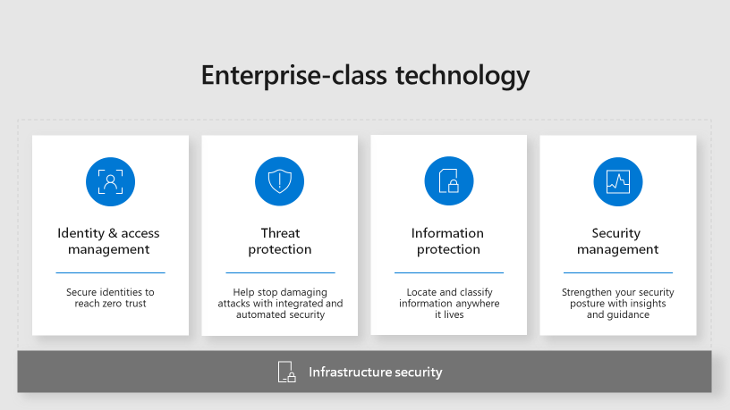

Learn about the different Microsoft solutions for managing security in your organization. Microsoft 365 provides a holistic approach to security, helping you to protect identities, data, applications, and devices across on-premises, cloud, and mobile.

## Learning objectives

In this module, you will learn:
- The key pillars of security.
- How Microsoft 365 helps protect identity and access.
- How Microsoft 365 helps you protect against threats.
- How Microsoft 365 helps you protect information.

## Pre-requisites
- None

> [!VIDEO https://www.microsoft.com/videoplayer/embed/RE2YppU]

The sophistication and capabilities of cyberattacks are evolving at a rapid pace. Cyberattacks are now a weapon of choice for both large-scale organized crime and nation states. Coupled with these emerging threats, the proliferation of devices in our connected world increases the surface area of attacks. Cyberattacks can be devastating—and the people with the security skills to meet the challenge are in short supply. 

When it comes to defending against cyberattacks, companies need to consider their digital estate. Your digital estate is all the assets you need to help protect. This is a bit different now than it was five or 10 years ago - you're now responsible for protecting a set of technologies you might not own, like user-owned mobile devices that access corporate data. The digital estate also includes systems and devices that your partners and customers use to access your information. Any one of these points can be a point of vulnerability. When it comes to security, you can no longer draw perimeters around your organization. 

Microsoft provides a holistic approach to security, helping you to protect identities, data, applications, and devices across on-premises, cloud, and mobile. Foundational to the security of every computer system are the following:

- Identity and access management
- Threat protection
- Information protection
- Security management

*Core components of security*

Next, let's look at identity and access management and, specifically, how you secure users.